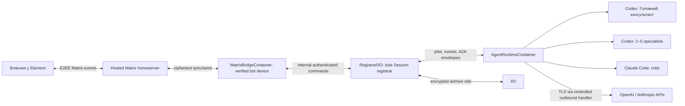

# Architecture

- Продукт: `Personal Consultant`
- Версія: V1 proposed Matrix architecture
- Дата: 15.08.2026
- owner_invocation_id: `207ebc4d-cafd-4845-af91-e38c8af4dd00`

## Source References

Порядок істини успадковано з `docs/guardrails.md`. Архітектура не робить старі WhatsApp-прототипи поточним дизайном і не розширює V1.

| Джерело | SHA-256 | Спожиті фрагменти |
|---|---|---|
| `docs/product-idea.md` | `bb6392c8762ebad8ad50be8da4cfc69cb925bc59a37fc993d5b75a8900b8ba73` | Element/Matrix, E2EE, живий дослівний консиліум, Cloudflare, Codex, Claude Code, A2A, архів, витрати |
| `docs/prd.md` | `196af1b75e9a8b89bb581203403cbb9a986c1dca5630639150fa192cd04f01ec` | `US-001`–`US-023`, `FR-001`–`FR-036`, `NFR-001`–`NFR-015`, `AC-001`–`AC-011` |
| `docs/project-context.md` | `19bc260c395412d5332e7bae62f60e4befea79fcf60b876fdd18db2e19e514c0` | платформи, сценарії, межі, ризики |
| `docs/canonical-terms.md` | `e9555a092cd994ec120013b62ac79615ac2f85b45c4180b1b1e9c505b82d105f` | ролі, Сесія, Реєстратор, A2A, Канонічний порядок |
| `docs/guardrails.md` | `64a1e0998ac811202d96de532a04b70912a2ed6ad288295d1f4ffbb0f6d559db` | автономність, дозволи, секрети, зупинка, evidence |
| `docs/user-journey.md` | `a9b39c4102c2715622a77973069eb0adbc722a04382083e1f975cc72b880a7d3` | основний, recovery, failure, control і final paths |
| `docs/screen-map.md` | `36b6c720adc3edb819027610e5eecbbdd05d987670b096e9bc2e4e3759a0e786` | `SUR-01`, `MG-01`–`MG-13`, `SS-01`–`SS-27` |
| `docs/wireframes.md` | `b078bdcaf96b7f0f5fc822e842ae3339c93d3816875e8396b4df3a48eff37e83` | нативна хронологія Element, повні репліки, Matrix replies |
| `docs/design-brief.md` | `1840c78c92d6ef665528602b70dc854d4e59e05180753c613af2671ed2a29ba4` | Candidate B, native Element inheritance, proposed visual baseline, без власного звуку |
| Existing repository code | read-only evidence | `consilium/live/*`, scripts і тести — локальний історичний evidence, не production runtime |

Перевірені 15.08.2026 первинні технічні джерела:

- [Matrix E2EE](https://matrix.org/docs/matrix-concepts/end-to-end-encryption/) і [Matrix elements](https://matrix.org/docs/matrix-concepts/elements-of-matrix/) — homeserver, client, bot, Olm/Megolm і device keys.
- [Matrix Client-Server API](https://spec.matrix.org/v1.19/client-server-api/) — room creation, `m.federate`, membership, events, replies і sync.
- [matrix-rust-sdk](https://github.com/matrix-org/matrix-rust-sdk) — SDK із Matrix-криптографією для bot/client runtime.
- [Cloudflare Containers architecture](https://developers.cloudflare.com/containers/platform-details/architecture/), [Container API](https://developers.cloudflare.com/durable-objects/api/container/), [outbound traffic](https://developers.cloudflare.com/containers/platform-details/outbound-traffic/) і [pricing](https://developers.cloudflare.com/containers/pricing/).
- [Cloudflare secrets](https://developers.cloudflare.com/workers/configuration/secrets/) і [R2 data security](https://developers.cloudflare.com/r2/reference/data-security/).
- [A2A v0.3.0](https://a2a-protocol.org/v0.3.0/specification/) — Task, Message, Part, Agent Card і streaming contracts.
- [Codex CLI](https://developers.openai.com/codex/cli/reference/) і [Claude Code CLI](https://docs.anthropic.com/en/docs/claude-code/cli-usage) — окремі non-interactive process contracts.

## Architecture Decision

V1 працює через одну приватну invite-only E2EE Matrix-кімнату в Element. Власник і один bot-account зареєстровані на одному керованому hosted homeserver. Власник користується штатними Element-клієнтами на Mac, iPhone, Android і Windows; окремого browser UI немає.

У Cloudflare працюють два різні runtime-рівні:

1. `MatrixBridgeContainer` — постійний легкий Matrix-клієнт. Він тримає `/sync`, розшифровує events як перевірений bot-device, перевіряє room invariants і публікує підтверджені events.
2. `AgentRuntimeContainer` — on-demand обчислювальний процес лише на час Сесії. У ньому працюють окремі процеси Codex для Головного консультанта та 2–5 спеціалістів і окремий Claude Code-критик.

Один fixed-name `RegistrarDO` є єдиним власником Active Session, Канонічного порядку, A2A-маршрутизації, idempotency, permissions, `Стоп`, deadlines, outbox і Витрат сесії. Жоден агент не надсилає повідомлення іншому агенту або в Matrix напряму.

## System Context

## Trust And Encryption Boundaries

| Відрізок | Захист | Хто потенційно бачить plaintext |
|---|---|---|
| Element ↔ homeserver ↔ bot-device | Matrix E2EE; homeserver зберігає ciphertext | перевірені пристрої Власника і bot-device |
| Bot crypto store at rest | application-layer encryption; ciphertext у R2/DO | bridge runtime після unwrap |
| Bridge ↔ RegistrarDO ↔ AgentRuntime | Cloudflare internal bindings/TLS + scoped auth | довірений Cloudflare runtime |
| AgentRuntime ↔ OpenAI/Anthropic | TLS; мінімально потрібний контекст | відповідний AI-провайдер |
| Session archive in R2 | application-layer AEAD поверх Cloudflare at-rest encryption | authorized archive path після unwrap |

E2EE закінчується на bot-device. Homeserver не читає зміст, але Cloudflare runtime мусить розшифрувати його для роботи агентів. Локальний runtime прибрав би Cloudflare з trust boundary, але не OpenAI/Anthropic; V1 не залежить від увімкненого Mac.

Metadata — room ID, Matrix IDs, IP/service timestamps, event sizes і delivery timing — не стає невидимою через E2EE. Система мінімізує її, але не обіцяє metadata privacy.

## Hosted Homeserver And Room Contract

Початковий найменш болісний PoC-вибір — акаунти на `matrix.org`, але лише після живої перевірки bot/account policy, SLA, room-creation capabilities і стабільності. `HomeserverAdapter` не прив’язує систему до одного оператора; інший керований провайдер можна підставити без зміни доменної моделі. Власний VPS або власний homeserver у V1 не потрібен.

Перед кожною робочою Сесією `RoomInvariantGate` підтверджує:

- exact `room_id` та exact `owner_mxid`;
- E2EE увімкнено до першого робочого повідомлення;
- invite-only membership;
- рівно два joined members: Власник і bot;
- немає pending invites, guests, bridges, widgets або application services;
- `history_visibility = joined`;
- devices Власника й bot не revoked; bot-device verified;
- кімнату створено з `m.federate: false`, якщо оператор це підтримує.

`m.federate` задається під час створення кімнати і не виправляється постфактум. Якщо provider не дозволяє `m.federate: false`, production блокується до вибору іншого hosted provider або явного security exception Власника. Інші room invariants не мають silent exception.

## Modules And Ownership

| Компонент | Володіє | Не має права володіти |
|---|---|---|
| `MatrixBridgeContainer` | sync token, E2EE crypto machine, decrypt/encrypt, room checks, native reply, send receipt | Session truth, agent orchestration |
| `BridgeDO` | bridge health, encrypted crypto-store checkpoint refs, sync lease | agent messages або canonical order |
| `RegistrarDO` | Active Session, permissions, dedupe, canonical log, A2A, leases, deadlines, outbox, costs | model reasoning або Matrix keys |
| `PolicyGate` | secrets rejection, sensitive-data permission, allowed transitions, `Стоп` | зміна confirmed body |
| `AgentRuntimeContainer` | isolated processes, bounded workspaces, event parsing, cancellation | Matrix/R2 credentials або direct publication |
| `A2ARegistrarAdapter` | A2A v0.3.0 validation і canonical envelope conversion | direct peer channel |
| `CryptoArchive` | per-session keys, AEAD, hash manifests, verified delete | plaintext long-term content |
| R2 | encrypted inputs, transcript archive, integrity manifest | root keys або plaintext |
| Worker outbound handlers | host allowlist, signing, credential injection, size limits | session decisions |

## Core Contracts

| Contract | Producer → consumer | Required fields |
|---|---|---|
| `MatrixInboundEvent` | bridge → registrar | room/event/sender IDs, relation, type, decrypted body/blob ref, time, invariant result, idempotency key |
| `RegistrarCommand` | head → registrar | session generation, lease, action, role/task/recipient, permission/finalization data |
| `RuntimeJob` | registrar → runtime | session, role, objective, minimal context refs, deadline, lease, provider profile |
| `A2AEnvelopeDraft` | agent → registrar | A2A message/task ID, sender/recipient roles, immutable body, reply-to, usage |
| `ConfirmedEnvelope` | registrar → target/outbox | unchanged body, canonical sequence, confirmed time, predecessor/hash |
| `MatrixOutboxIntent` | registrar → bridge | session/sequence, body, role, `HH:MM`, native reply event ID, retry policy |
| `MatrixSendReceipt` | bridge → registrar | intent ID, Matrix event ID or failure, attempt, time |
| `RuntimeEvent` | runtime → registrar | started, heartbeat, draft, usage, completed, cancelled або failed |
| `ArchiveManifest` | registrar/crypto → R2 | version, session, object hashes, algorithm/key version, canonical head hash, deletion state |

Confirmed agent body є append-only. Виправлення — нова `ConfirmedEnvelope`. Hidden chain-of-thought, system prompts, tool traces, secrets і credentials не є репліками агентів і не публікуються.

## End-To-End Flow

1. Bridge receives encrypted events through `/sync`, decrypts locally and rejects unknown room/sender/device or failed invariants.
2. Bridge sends an idempotent `MatrixInboundEvent` to fixed `RegistrarDO`.
3. Registrar applies secret/permission/session rules and persists acknowledgement intent.
4. Registrar starts AgentRuntime; separately launched Codex head chooses direct or Консиліум mode.
5. For a Консиліум, registrar launches 2–5 Codex specialists and one Claude Code critic. Process identity, lease and heartbeat are evidence; labels are insufficient.
6. Кожне actual assignment, intermediate result, addressed challenge, critique and correction is submitted as `A2AEnvelopeDraft`.
7. Registrar persists unchanged body, assigns canonical sequence and creates target-routing plus Matrix outbox intents atomically.
8. Bridge publishes each confirmed message immediately in the same room using `Роль · HH:MM` and native Matrix reply. It does not batch or summarize the visible stream.
9. Critique and revision use the same register-before-route path.
10. Head produces the final synthesis only after evidence/critique gates.
11. On completion, encrypted archive is written to R2; AgentRuntime sleeps. Bridge remains active.

## Runtime And A2A Rules

- A2A uses official v0.3.0 semantics over private authenticated internal HTTP/SSE adapters.
- Agent Cards are internal allowlisted definitions; public discovery is off.
- Direct agent-to-agent sockets, shared chat files and hidden peer channels are invalid.
- Each process has an isolated workspace and bounded context.
- Registrar rejects stale generation/lease, duplicate ID, unknown role, late response after `Стоп` and body mutation.
- `Стоп` atomically cancels leases/processes and rejects later drafts; confirmed bodies remain.
- Якщо substantive progress is absent at the deadline, the room receives a factual delay/failure state, not synthetic content.

## Persistence, Keys And Deletion

- DO storage keeps small canonical metadata, state, dedupe, outbox and costs.
- R2 keeps only application-encrypted large blobs and closed-session bundles.
- Container filesystem is disposable and never the sole copy of crypto state, sync cursor, transcript or archive.
- Bot crypto checkpoints are encrypted before R2/DO persistence; one writer holds the lease.
- Per-session data keys are random; wrapping key lives in Cloudflare secret/key boundary, not R2 or chat.
- Export decrypts only after exact owner/room/device checks.
- Delete is session-wide: tombstone → remove R2 objects → verify absence → remove permitted metadata → report provider-retention limits.
- Matrix events already delivered cannot be promised physically erased by R2 deletion; redaction is separate and requires explicit permission.

## Network And Secrets

- `enableInternet = false` for containers by default.
- Outbound handlers allow only homeserver, OpenAI, Anthropic and explicit research gateways.
- Handlers inject scoped API credentials so long-lived provider tokens do not enter agent workspaces.
- Matrix tokens exist only in bridge crypto boundary; agents never receive them.
- R2/key access exists only through internal bindings.
- Consumer login cookies are not automated; commercial/API credentials are required.
- Secrets, full payment data, government IDs, medical data and recovery keys are rejected before storage and dispatch.

## Availability And Recovery

- One fixed registrar serializes all state changes.
- Matrix `event_id` + room ID deduplicate input; stable transaction ID deduplicates output.
- Bridge restart restores encrypted crypto store and sync cursor before accepting work.
- Missing keys produce `SS-25`, not plaintext fallback; invariant failure produces `SS-27`.
- AgentRuntime crash leaves canonical log/outbox intact; retry never republishes confirmed bodies.
- If bridge health is lost, no false delivered status is emitted.

## Capacity And Cost Model

| Runtime | Starting profile | Lifecycle | Cost driver |
|---|---|---|---|
| Matrix bridge | `basic` 1 GiB / 4 GB | always on; test `lite` later | memory, disk, small CPU/egress |
| Agent runtime | `standard-3` 2 vCPU / 8 GiB | per Session, sleeps after bounded idle | vCPU, memory, model APIs |
| Registrar/bridge DO | one named instance each | persistent | requests, storage, duration |
| R2 | encrypted archive/blobs | retention policy | storage, operations, egress |

At published Cloudflare rates, continuously provisioned `lite` bridge is approximately USD 6.7/month and `basic` approximately USD 11.9/month before CPU, DO, R2, egress and AI calls. Це planning arithmetic, не прогноз рахунку. `Витрати` показує actual metered usage та явно позначені оцінки.

## Observability

Content-free telemetry: bridge sync lag and crypto restore; room invariant result; registrar transition latency, dedupe and outbox age; per-role process lifecycle; acknowledgement/first-message/critique/final timing; cost by session/provider; archive hash/delete verification. Logs never contain bodies, keys, tokens, recovery keys or attachments.

## Deployment And Rollback

1. Provision Worker, DO, R2, containers and secrets outside production.
2. Create bot and new compliant Matrix room; verify devices and recovery before work content.
3. Validate E2EE, restart/crypto restore and exact room invariants on real Element clients.
4. Deploy bridge dark without agent dispatch.
5. Enable synthetic direct-answer flow, then real A2A agents, archive and costs.
6. Promote exact image/config hashes. Old WhatsApp transcripts are not current Matrix history.

Rollback stops new intake, cancels AgentRuntime, keeps bridge read-only for status/export, restores the last compatible image/schema reader and preserves confirmed bodies. Key/schema migrations must support the declared rollback window.

## Security And Failure Evidence

- unauthorized mxid/room/device rejected before protected processing;
- E2EE verified on Mac, iPhone, Android and Windows; recovery and revoked-device denial;
- federation, membership, invites, guests, bridges/widgets and history invariants checked;
- no plaintext fallback on missing keys;
- separate Codex and Claude Code critic process identity proven;
- every visible A2A body exists byte-for-byte in canonical log before routing/publication;
- duplicate sync/outbox/restart does not duplicate messages;
- `Стоп`, permission denial, timeout, crash and late reply are safe;
- full bodies, roles, `HH:MM`, native replies and order survive clients/export;
- encrypted R2 objects, deletion and archive hashes verified;
- arbitrary egress blocked and credentials absent from agent environment;
- cost ledger reconciles with provider usage;
- no custom sound or browser product surface exists.

## Decision Record

1. **Element/Matrix replaces WhatsApp.** Native multi-device UX, Matrix E2EE and programmable bot access.
2. **Managed homeserver, not own VPS.** Lowest operational burden; capability/policy is a release gate.
3. **Same homeserver and non-federated room where supported.** Fewer servers and metadata paths.
4. **Always-on bridge, on-demand agents.** `/sync` needs persistence; expensive compute does not.
5. **One registrar.** Deterministic order, permissions, stop and immutable record.
6. **Real isolated processes.** A консиліум is not simulated role labels.
7. **A2A through registrar only.** Full actual conversation stays visible and auditable.
8. **Application-layer encryption in R2.** Managed at-rest encryption is not the product key boundary.
9. **No local production dependency.** All device families work without an awake Mac.
10. **No product-authored sound.** Element/OS owns messenger notifications.

## Traceability

| Architecture area | Primary requirements |
|---|---|
| exact Matrix room/device access | `FR-001`–`FR-005`, `NFR-006`, `AC-001`, `SS-01`–`SS-08`, `SS-25`–`SS-27` |
| one Active Session and commands | `FR-006`–`FR-014`, `AC-002`–`AC-004` |
| real live consilium/A2A | `FR-015`–`FR-024`, `NFR-001`–`NFR-005`, `AC-005`–`AC-007` |
| final, failures, external actions | `FR-025`–`FR-030`, `AC-008`–`AC-009` |
| archive, deletion, costs | `FR-031`–`FR-036`, `NFR-007`–`NFR-012`, `AC-010`–`AC-011` |
| native cross-device UX | `NFR-013`–`NFR-015`, `SUR-01`, `MG-01`–`MG-13`, Candidate B |

## Open Questions And Release Gates

1. Which managed homeserver passes bot policy, uptime, `m.federate: false` and pricing tests? `matrix.org` is conditional PoC default, not guaranteed production choice.
2. Which Codex and Claude models/profiles meet quality, streaming and cost thresholds?
3. What retention period and wrapping-key service are approved?
4. What Matrix-native rendered Candidate B receives whole-design approval?
5. What measured bridge profile is safe after a 7-day soak: `basic` or `lite`?

These questions block production where stated, but do not require a local server, own VPS/homeserver, WhatsApp integration, custom browser UI or product-authored sound.
