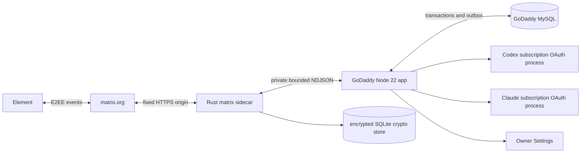

# Архітектура Personal Consultant

## Метадані

- `status`: reconciled all-GoDaddy target; implementation and destructive cleanup remain separately gated
- `architecture_owner`: `to-architecture`
- `owner_invocation_id`: `3a6b70d5-d73f-414f-8f06-3a004cc1c66e`
- `updated_at`: `2026-09-04`
- `runtime_host`: existing GoDaddy Node 22 application
- `matrix_sdk`: `0.18.0`
- `approved_baseline`: `PC-MATRIX-CANDIDATE-B-V2-20260816-R1` with scoped `DB-D17` owner-login override

Цей документ задає цільову production-архітектуру, а не твердження про завершене розгортання. Нативні Element/Matrix UX та ізольовані subscription-OAuth контури Codex і Claude збережено. Cloudflare Workers, Durable Objects, R2, Cloudflare Access і Google OAuth більше не є production-компонентами.

## 1. Джерела правди (Source References)

Хеші зафіксовано на момент цієї owner-інвокації; пізніші зміни джерел вимагають reconciliation, а не тихого наслідування.

| Джерело | SHA-256 | Використаний фрагмент |
|---|---|---|
| `README.md` | `540a76cb67521d9f3652ec15604f9dc7657f865af639baf13df506f07288c81b` | межі репозиторію і запуску |
| `docs/product-idea.md` | `ecc16d6b81c0019f462947b52c013b96636577bd3a14503638102004c7058c8a` | GoDaddy-напрям, дві поверхні |
| `docs/prd.md` | `32d42a752cae06c4a5dd09a9fce408b537ae06cf6c8fd2fceb7e40773b0c3b94` | FR-001–FR-046; NFR-005–008, 016–019 |
| `docs/project-context.md` | `1b1268b1055984b5c142740196d3473a3c68518b47db7e1a1645fd8684e3ed15` | середовище і межі runtime |
| `docs/canonical-terms.md` | `e94b5540ac769b72fa454d364fcd708cbfa4b2a7d6fd19a3ed0a184fc4f253da` | канонічні сутності й стани |
| `docs/guardrails.md` | `4705073ab9e4ccefb3ebc9abd48762fe549f7d529def86aa70f2ad5bf092fa48` | fail-closed і cleanup gates |
| `docs/user-journey.md` | `dda85ac0e9a82152aa0c7b121c624341e2628381fa8d1aff2ffe7fe4b85b0e77` | Matrix і Settings journeys |
| `docs/screen-map.md` | `385708ad8bff541db37d265297d458c5c473a0053f0051cc2d908342bddacd52` | `SUR-01`, `SUR-02` і GoDaddy owner-login states |
| `docs/wireframes.md` | `49fc8ede68901b6e9be1548a162c13177c1a245bc19bf6f3bb73fe8dfc8324ca` | approved interaction contracts і GoDaddy owner-login reconciliation |
| `docs/design-brief.md` | `719a32b4ea4fef9f9eaa0ee08864f00fa57f9637be530e67c404d58d1c2e5608` | Candidate B visual baseline і GoDaddy owner-login reconciliation |
| `forge/design/evidence/candidate-b/v2/approval-receipt.json` | `1b39065b05a2c9b987ab8bf88c118f92e144190769c4ebb9e8a039f21540c300` | immutable whole-design approval provenance |
| `docs/development-plan.md` | `f888032705479f2dcc2a9d9adb8fb4180fc95f63b7b3bf0d6664334bf6cc2e52` | U-06 Rust sidecar and release evidence |
| `docs/g00-feasibility-receipt-2026-09-03.md` | `352d3974ece6f53877aa8bd3596c004fde4a554fa5eacb60846163c2219c6744` | synthetic Published host/store/process receipt |
| `package.json` | `37c436772007d340d21c4b7b8c5d2c9c384262e758e935c949b6160752674614` | Node 22 build/start conventions |
| `src/godaddy/server.mjs` | `36f3e24258d17de6d4a9d4b38076bb4eb74b33a4ea0b7aab23fc79aad5699976` | current supervisor/health seam |
| `src/godaddy/mysql-storage.ts` | `f947d132ab6f154e2d5ad0590daf85e79d87623d8ee3424f2e8a1df36131ba09` | MySQL state adapter |
| `src/godaddy/mysql-archive-storage.ts` | `c00b5c3c7c2c5f2e87324e52e2bf43ddfd03be4a15ce293b21d0b9e3b5b3d60e` | encrypted archive adapter |
| `src/godaddy/owner-password-auth.ts` | `5d3fd315dd69c206e7ad8aecac8d4210806294cb256efb109d0b736b0c0ce57b` | current local auth seam and known gaps |
| `scripts/godaddy-state-schema.sql` | `ad0e44a17c9544154c6117933af9876d6654d519a69e6fbc045d10f03a53a723` | explicit, non-automatic schema |

## 2. Архітектурний висновок (Architecture Overview)

V1 має дві поверхні: `SUR-01`, приватну invite-only E2EE Matrix-кімнату в нативному Element; і `SUR-02`, Settings у тому самому GoDaddy Node 22 app, захищені локальним сильним owner-password і підписаною session cookie.



GoDaddy Node є єдиним HTTP/runtime host і supervisor. Rust sidecar є єдиним власником Matrix client, E2EE crypto store, sync і Matrix send/receive. MySQL є єдиною durability boundary для settings, registrar state, archive ciphertext і ordered outbox. Preview не має окремого state: через спільну provider DB вона повністю stateless.

## 3. Незмінні межі (Architecture Principles)

1. Один Власник, один bot identity, одна затверджена кімната, одна активна сесія.
2. Element лишається штатним клієнтом; Settings не стає браузерним чатом чи архівом.
3. Codex ChatGPT subscription OAuth і Claude subscription OAuth працюють в окремих процесах і credential domains. API/PAYG/Fast/credits fallback заборонено.
4. Credentials, Matrix plaintext, archive keys і crypto-store passphrase не потрапляють у Git, MySQL plaintext, stdout/stderr чи browser document.
5. Unknown, stale, malformed, unsupported, quota-exhausted або partially verified state fail closed.
6. Settings snapshot незмінний протягом сесії; зміни діють лише на наступну.
7. Ніякого автоматичного DDL, automatic store reset, silent fallback або destructive cleanup.

## 4. Модулі і власність (Module And Boundary Map)

| Компонент | Власність | Не має права |
|---|---|---|
| GoDaddy Node app | HTTP, Settings auth/UI, orchestration, MySQL transactions, sidecar supervision | decrypt Matrix E2EE store; підміняти Matrix readiness liveness-статусом |
| Rust sidecar | Matrix SDK, E2EE, sync, room/device validation, media spool, Matrix transaction IDs | слухати TCP/HTTP; звертатися до MySQL; запускати agent OAuth |
| MySQL | settings versions/snapshots, session/registrar state, ingress receipts, archive ciphertext/tombstones, durable outbox | зберігати Matrix crypto state або archive plaintext |
| Codex process | primary agent under subscription OAuth | бачити Claude credential чи Matrix store secrets |
| Claude process | critic under subscription OAuth | бачити Codex credential чи Matrix store secrets |

### 4.1. Rust workspace

```text
native/matrix-sidecar/
  Cargo.toml
  Cargo.lock
  rust-toolchain.toml
  src/
    main.rs
    config.rs
    protocol.rs
    store.rs
    lock.rs
    client.rs
    room_policy.rs
    ingress.rs
    egress.rs
    media_spool.rs
    telemetry.rs
```

`matrix-sdk = "=0.18.0"`, `default-features = false`, features `e2e-encryption` і `bundled-sqlite`; exact dependency graph фіксує committed `Cargo.lock`. Sidecar приймає лише cross-signed trusted, non-revoked devices. History-key sharing вимкнено.

## 5. Стан, порядок і відновлення (Data And State Model)

### 5.1. MySQL

Production role `published` використовує явно створену схему; app не створює і не мігрує її автоматично. MySQL тримає versioned Settings і immutable session snapshots; registrar/session state і cancellation generation; deduplicated inbound receipts; confirmed visible messages; durable ordered outbox; encrypted archive objects і tombstones.

Registrar в одній транзакції створює confirmed visible message і outbox row з monotonic session order та deterministic Matrix transaction ID. Restart відновлює найраніший pending item. Retry використовує той самий transaction ID. Late result за obsolete cancellation generation не може enqueue.

Перед кожним send sidecar заново перевіряє поточну room/device policy; кеш не авторизує відправлення. Outbox state розрізняє `pending`, `accepted` (homeserver повернув Matrix event ID), `device_delivered` (лише за окремого доказового device-level сигналу) і `read` (лише за валідного read receipt Власника). `accepted` ніколи не називається доставленим на пристрій або прочитаним.

Inbound event спочатку отримує локальний pending receipt sidecar, потім передається Node. Лише durable ACK Node очищує receipt. Після crash подія replay-иться з тим самим Matrix event ID, а MySQL dedupe робить повтор безпечним.

### 5.2. Matrix crypto store

Encrypted SQLite crypto store знаходиться під provider-persistent private path поза Git і static/public output. До відкриття store процес бере non-blocking OS lifetime lock на exact store root; другий процес негайно завершується. Після lock store відкриває тільки один SDK process.

Допустимі лише два device/store сценарії:

1. Fresh production bot device створюється з підтверджено порожнім exact production store.
2. Існуючі access token/device ID відновлюються тільки разом з exact encrypted store snapshot, що належить саме цьому device.

Старий token/device з новим, іншим або втраченим store заборонено. Missing/corrupt/wrong-passphrase/migration/device-mismatch переводить readiness у blocked і quarantine; app не logout, не видаляє, не перейменовує і не перестворює store автоматично.

## 6. Приватний bounded NDJSON protocol

Sidecar не відкриває socket або HTTP route. Один supervisor керує stdin/stdout NDJSON; stderr містить лише redacted operational diagnostics. Versioned типи: `hello`, `ready`, `request`, `response`, `event`, `ack`, `status`, `shutdown`. Unknown version/type/field, duplicate ID, malformed UTF-8/JSON або перевищення межі завершує handshake чи конкретний request fail closed. IDs — ASCII до 64 bytes.

Архітектурні defaults, які release evidence може лише зменшити; збільшення потребує load/memory evidence:

| Межа | Default |
|---|---:|
| NDJSON line | 256 KiB |
| concurrent outstanding requests | 32 |
| unacked ingress events | 64 |
| plaintext body | 64 KiB |
| formatted body | 128 KiB |
| handshake/control timeout | 5 s |
| Matrix send timeout | 30 s |
| graceful shutdown | 5 s |
| media objects/request | 4 |
| media object | 20 MiB |
| aggregate media/request | 64 MiB |
| spool TTL | 15 min |

Binary media ніколи не входить у NDJSON. Sidecar пише його у private per-boot spool directory (`0700`; file `0600`) і повертає opaque handle, declared MIME, length та SHA-256. Node може resolve лише handle поточного supervisor instance; повторно перевіряє size, hash і MIME/magic. ACK або TTL видаляє файл тільки з exact spool root. Cleanup не слідує symlink і не приймає caller path.

## 7. Matrix authorization і outbound policy

На кожному ingress і безпосередньо перед кожним send перевіряються exact `room_id`, `owner_mxid`, `bot_mxid`, homeserver `matrix.org`, E2EE, invite-only, рівно owner+bot у joined membership, відсутність pending invites, history visibility `joined`, відсутність public listing/alias, guests, bridges і widgets, а також trusted cross-signed non-revoked owner/bot devices. Unknown або stale стан блокує дію.

Device revocation не відкликає вже розкриті history keys. Якщо exposure правдоподібний, incident recovery вимагає нової verified device/room boundary, а не лише видалення device.

Matrix outbound має fixed production homeserver URL та exact HTTPS-origin allowlist. Caller-controlled discovery, URL, host, downgrade і proxy заборонені. Redirects вимкнено; якщо SDK transport технічно вимагає redirect handling, приймається тільки exact allowlisted HTTPS target після повторної перевірки. Media URL не розширює allowlist.

## 8. Settings authentication і consistency

Google OAuth і Cloudflare Access замінені локальним owner-password лише для `SUR-02`. Published secret приймається через same-origin one-time challenge. Password порівнюється constant-time; session підписує окремий HMAC key, cookie має `Secure`, `HttpOnly`, `SameSite=Strict`, bounded idle та absolute expiry, rotation після login/sensitive change і server-side logout invalidation. State-changing requests вимагають origin allowlist і CSRF token; fail-closed headers забороняють cache.

PRD вимагає приймати щонайменше 64-character owner-password та throttling. Поточний auth seam має 32-character minimum і 12-hour absolute cookie без повного throttling/idle/rotation/logout контракту; це implementation gap, а не дозволене спрощення. Settings save/reset є full-object validation + version/CAS + idempotency key в одній MySQL transaction. Конфлікт не робить partial write.

Відсутність MFA не відповідає заявленому ASVS L2 control `v5.0.0-6.3.3`; production security gate потребує або другого фактора, або явного owner residual-risk acceptance з відповідним коригуванням assurance claim.

## 9. Integration Map: orchestration і archive

Node створює immutable effective settings snapshot перед стартом. Preflight перевіряє Matrix readiness, MySQL, capability catalog та обидва subscription-OAuth процеси без витоку credentials. Видимими є лише дозволені ролі, джерела і фактичні статуси. Source-backed твердження мають пройти source gate до публікації.

Archive формується тільки після закриття сесії, шифрується application-layer key поза MySQL і записується як ciphertext + IV/nonce + authenticated manifest. Export/delete/restore є окремими audited flows. Tombstone і видалення ciphertext атомарні. Preview не читає і не пише state/archive.

## 10. Configuration And Binding Contract

Names only:

- host: `RUNTIME_MODE`, `PORT`, `GODADDY_ALLOWED_ORIGINS`, `GODADDY_TRUSTED_PROXY_MODE`;
- MySQL: `GODADDY_STATE_DATABASE_ROLE`, `DB_HOST`, `DB_PORT`, `DB_NAME`, `DB_USER`, `DB_PASSWORD`;
- Settings: `SETTINGS_OWNER_PASSWORD`, `SETTINGS_SESSION_HMAC_KEY`, `SETTINGS_CSRF_HMAC_KEY`;
- catalogs: `CAPABILITY_CATALOG_JSON`, `SPEED_POLICY_CATALOG_JSON`;
- sidecar: `MATRIX_SIDECAR_PATH`, `MATRIX_SIDECAR_SHA256`, `MATRIX_PROTOCOL_VERSION`;
- store/media: `MATRIX_STORE_DIR`, `MATRIX_STORE_PASSPHRASE`, `MATRIX_MEDIA_SPOOL_DIR`;
- Matrix: `MATRIX_HOMESERVER_URL`, `MATRIX_ALLOWED_HTTPS_ORIGINS`, `MATRIX_BOT_MXID`, `MATRIX_BOT_DEVICE_ID`, `MATRIX_ACCESS_TOKEN`, `MATRIX_ROOM_ID`, `MATRIX_OWNER_MXID`;
- archive: `ARCHIVE_ENCRYPTION_KEY`, `ARCHIVE_KEY_ID`;
- agents: isolated provider-owned Codex subscription state; `CLAUDE_CODE_OAUTH_TOKEN` only in Claude process.

Secrets і їх значення не входять у Git, logs, health, browser або archive. Forwarded host/proto довіряються лише за explicit provider mode; effective origin має належати fixed allowlist.

## 11. Build і packaging

CI будує `x86_64-unknown-linux-musl` у pinned toolchain/builder командою `cargo build --release --locked --frozen`, strip-ить binary та публікує immutable artifact, SHA-256 manifest, SBOM і license inventory. Promotion кладе binary у fixed non-public app path. Node до spawn перевіряє exact checksum, executable ownership/mode і protocol version. Runtime compilation/download заборонені.

До U-06 репозиторій не має production Rust workspace, committed lockfile чи CI artifact workflow; наведене тут є обов’язковим design contract, не evidence of implementation.

## 12. Production-path gate, readiness і recovery

До provisioning будь-якого Matrix credential exact final production store і spool roots мають пройти non-retrievability gate: контрольний marker у кожному exact path існує для процесу, але повертає `404` і за `/assets/<relative>`, і за `/public/assets/<relative>`. Synthetic path з G-00 довів host feasibility, але не замінює перевірку exact production paths.

`/healthz` означає лише Node process liveness і не заявляє Matrix/MySQL/OAuth readiness. Внутрішня, content-free Matrix readiness окремо вимагає: checksum і protocol handshake; exclusive lock; store decrypt/open; exact device/store match; sync до встановленого freshness threshold; fresh room/device revalidation; MySQL/outbox availability; egress policy pass. Не-ready стан блокує нові сесії, але не запускає crash/restart loop і не reset-ить store.

Backup вважається придатним лише після isolated restore exact encrypted store + matching device material і окремого MySQL reconciliation drill. Невдала перевірка залишає production blocked.

## 13. Спостережуваність і SLO

Логи structured і content-free: correlation ID, event/transaction ID hash, state transition, latency bucket, retry count, SDK/error class. Заборонені message body, media path/content, access token, passphrase, archive key, owner-password і OAuth material. Метрики: sync freshness, outbox age/depth, retry rate, lock contention, spool bytes/age, readiness reasons, settings conflict rate. Alert не містить контенту.

## 14. Product-security mapping

`security_coverage`:

| PRD ref | Архітектурне покриття | Release evidence |
|---|---|---|
| `NFR-005` | §§5.2, 7: verified E2EE bot, encrypted SQLite store, device/store binding | real-room encrypt/decrypt/restart/restore and revocation drill |
| `NFR-006` | §§3, 4, 9, 10: secret/OAuth process isolation, no API fallback | process-env and negative fallback tests |
| `NFR-007` | §§5.1, 7: exact event/room/user/device authorization before ingress/send | adversarial wrong-room/member/device tests |
| `NFR-008` | §§6, 9, 13: bounded/minimized context, media and redacted telemetry | protocol limits, log scan and source/privacy gate tests |
| `NFR-009` | §§5.1, 6: event/transaction idempotency, bounded concurrency, replay і cleanup | duplicate/replay, oversized/slow input, retry-storm and resource-cleanup tests |
| `NFR-010` | §5.1: persisted canonical order, transactional confirm/outbox and restart recovery | concurrent append/send, crash/restart, retry and order-correlation tests |
| `NFR-011` | §9: authenticated archive manifest and verification before read/export | ciphertext/manifest tamper, wrong-key and restore-integrity tests |
| `NFR-012` | §§9, 13: truthful provider/cost state, content-free security events and observable failures | log injection/redaction, failure/status and cost-source reconciliation tests |
| `NFR-016` | §8: local password, signed bounded session, origin/CSRF and fail-closed access | auth bypass, throttle, expiry, rotation/logout tests; MFA resolution |
| `NFR-017` | §§5.1, 8: atomic Settings/snapshot, CAS/idempotency and rollback | concurrency, replay and transaction-failure tests |
| `NFR-019` | §§7, 10, 12: fixed host/redirect policy, minimal exposure, stateless Preview | SSRF/redirect/forwarded-host and Preview write-denial tests |

### 14.1. Clause і journey coverage

`docs/user-journey.md` не визначає `UC-*` identifiers, тому архітектура мапить його канонічні stages, не вигадуючи UC IDs.

| Journey / PRD clauses | Реалізаційна boundary |
|---|---|
| stages 1–4; `FR-001`–`FR-007`; `NFR-001`, `NFR-005`, `NFR-007`–`NFR-009`, `NFR-013`, `NFR-015` | Rust ingress/room policy/media spool + Node consent/data gates + MySQL dedupe/session transaction |
| stages 5–8; `FR-008`–`FR-025`, `FR-028`–`FR-030`; `NFR-002`–`NFR-004`, `NFR-006`, `NFR-008`–`NFR-010`, `NFR-012` | Node preflight/orchestrator, isolated OAuth processes, registrar transaction, cancellation generation і ordered outbox |
| stage 9; `FR-026`–`FR-030`, `FR-034`–`FR-036`; `NFR-010`, `NFR-012`, `NFR-014` | source/privacy/permission gates + confirmed message registration + Matrix egress formatter |
| stage 10; `FR-031`–`FR-032`; `NFR-011` | MySQL application-encrypted archive, integrity manifest, export/delete/tombstone flows |
| active-session costs; `FR-033`; `NFR-012` | provider-reported usage adapters і Settings-owned declared cost inputs; unknown stays unknown |
| Settings journey; `FR-037`–`FR-046`; `NFR-016`–`NFR-019` | Node local auth/CSRF, typed catalog validation, atomic MySQL settings version і immutable session snapshot; responsive/accessibility presentation remains baseline-owned |

## 15. Architecture Decision Log

| ID | Рішення | Статус/наслідок |
|---|---|---|
| AD-01 | Element/Matrix є основною UX boundary | retained |
| AD-02 | один bot identity, verbatim role-labelled conversation | retained |
| AD-03 | Google OAuth/Cloudflare Access для Settings | superseded локальним owner-password |
| AD-04 | Cloudflare є runtime host | superseded існуючим GoDaddy Node 22 app |
| AD-05 | Durable Objects володіють state/order | superseded MySQL transactions/outbox |
| AD-06 | subscription OAuth domains ізольовані | retained |
| AD-07 | immutable effective settings snapshot | retained |
| AD-08 | fail-closed capability/source/security gates | retained |
| AD-09 | Candidate B і native reply semantics | retained |
| AD-10 | один durable registrar визначає visible order | revised як MySQL transaction + ordered outbox |
| AD-11 | archive encrypted at application layer | retained |
| AD-12 | explicit destructive recovery gate | retained |
| AD-13 | R2 archive | superseded MySQL ciphertext/tombstones |
| AD-14 | Preview | stateless через shared provider DB |
| AD-15 | Settings access | local strong owner-password + signed bounded session |
| AD-16 | Matrix crypto | Rust `matrix-sdk` 0.18.0 sidecar owns encrypted SQLite |
| AD-17 | production private path | exact non-retrievability gate precedes credentials |
| AD-18 | identity recovery | fresh device/empty store або exact device+store restore; no hybrid |
| AD-19 | delivery truth | durable order; accepted, device-delivered і read — різні стани |
| AD-20 | IPC/network | bounded private NDJSON/media spool і fixed outbound allowlist |
| AD-21 | operations | liveness окремо від readiness; no automatic store reset |

## 16. Ризики та пом'якшення (Risks And Mitigations)

1. Exact provider-persistent production store/spool paths ще треба встановити й перевірити до secrets.
2. G-00 не доводить real Matrix E2EE sync, room/device trust, send idempotency чи restore.
3. Втрата або mismatch device/store блокує runtime; потрібен tested isolated restore, не reset.
4. Media spool тимчасово містить plaintext; defaults потребують release memory/disk/cleanup evidence.
5. Shared MySQL робить Preview виключно stateless; будь-який Preview write є release blocker.
6. MySQL schema/outbox lease/index design має формально довести ordering, dedupe і fencing під concurrency/restart.
7. Local Settings auth має implementation gaps і невирішений MFA/ASVS residual risk.
8. Revocation device не відкликає історичні keys; incident runbook має передбачити нову room boundary.
9. Pinned SDK/dependencies потребують vulnerability monitoring і контрольованого upgrade path.
10. `wireframes.md`, `design-brief.md`, `project-context.md` і `canonical-terms.md` можуть ще містити історичні Cloudflare/Google формулювання; цю topology визначають новіші PRD/guardrails і цей документ.
11. Legacy Git/source, secrets і database cleanup заборонено до immutable rollback, encrypted backup, isolated restore/reconciliation, exact destructive manifest і action-time owner confirmation.

## 17. Відкриті питання (Open Questions)

Перед implementation/release треба визначити: exact private paths; остаточні media limits після evidence; фізичну outbox/lease schema; isolated restore target; MFA або residual-risk рішення; точний upstream content-classifier/command allowlist.

## 18. Поза scope (Out Of Scope)

Власний homeserver, VPS, browser chat, multi-owner/multi-room, Matrix bridges/widgets, API/PAYG AI credentials, автоматичний store reset, stateful Preview і destructive legacy cleanup без окремої авторизації не входять у V1.
