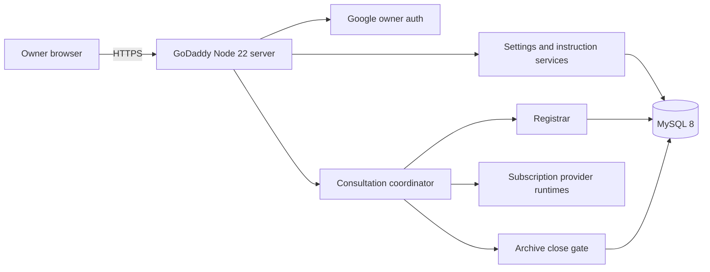

# Architecture

## Composition

The GoDaddy application is the current composition root. Domain services depend on narrow interfaces, but host extraction is intentionally deferred.

## State boundaries

- `owner-google-access-v1`: hashed owner/session/OAuth transaction state; verifier ciphertext is application encrypted.
- `owner-settings-v1`: revisioned owner model and speed selections.
- `runtime-capability-v1`: provider-confirmed capability receipts.
- `runtime-credentials-v1`: encrypted subscription runtime credentials.
- `instruction-documents-v1`: encrypted instruction versions and the transactional revision pointer.
- `registrar-v2`: active session, generations, confirmed messages, delivery projection, and consensus state.
- `browser-consultation-v1`: task hash, status, generation, outcome, and archive reference; no task plaintext.
- archive tables: AES-GCM ciphertext, content-free manifest, and irreversible tombstones.

## Consultation lifecycle

1. Authenticate owner and validate same-origin mutation token.
2. Validate request bounds, consent, and secret-like content.
3. Acquire the database-namespaced leadership lock.
4. Resolve and pin current settings, capability, and instruction snapshots.
5. Start the registrar generation and persist the operation record.
6. Run intake, then direct/clarification or consilium execution.
7. Append only confirmed messages in registrar order.
8. Commit the encrypted whole-session archive.
9. Close the registrar session and mark the operation complete.
10. Release leadership.

On stop or process recovery, fence the generation, archive the partial transcript where possible, and mark the operation stopped or failed. Provider calls without a proven exactly-once result are not replayed.

## Cryptography

- Owner session/action signing, OAuth transaction encryption, provider credential encryption, instruction encryption, and archive encryption use separate purposes.
- Archive, instruction, and runtime credential root keys are distinct production secrets.
- AES-GCM records bind their metadata and fail closed on tampering or the wrong key.
- Keys never enter MySQL, browser responses, logs, archives, or AI prompts.

## Concurrency

MySQL row locks serialize revisioned state. A connection-owned advisory lock permits one active consultation per database namespace. The process also serializes local admission so concurrent requests cannot share one acquired lock. The process-wide pool is bounded and shutdown waits for active HTTP work before provider and database teardown.
