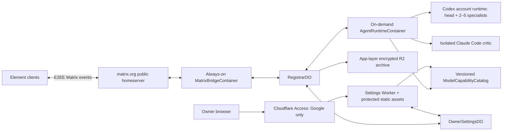

# Архітектура Personal Consultant

## Метадані

- `status`: all-GoDaddy target recorded; Node 22 runtime scaffold locally verified; production feasibility blocked
- `architecture_owner`: `to-architecture`
- `owner_invocation_id`: `e05a1a53-1bfe-4a6b-a6db-a3ba80de9266`
- `updated_at`: `2026-09-02`
- `design_direction`: Candidate B для живого дослівного консиліуму
- `product_surfaces`: 2 (`SUR-01`, `SUR-02`)
- `requirements`: 29 user stories, 46 FR, 19 NFR, 16 AC
- `screen_contracts`: `MG-01–MG-13`, `SG-01–SG-05`, `SS-01–SS-46`

Цей документ фіксує архітектурну базу для затвердженого visual baseline, а не опис уже реалізованої системи. Поточний код репозиторію підтверджує лише локальний legacy live-chat прототип; Cloudflare, `matrix.org`, subscription OAuth runtime і `SUR-02` ще не є production implementation.

## 1. Джерела правди

### 1.1. Перевірений SDD-ланцюг

| Джерело | SHA-256 | Архітектурне значення |
|---|---|---|
| `README.md` | `540a76cb67521d9f3652ec15604f9dc7657f865af639baf13df506f07288c81b` | межі репозиторію й запуску консиліуму |
| `docs/product-idea.md` | `0773d6f4af97aecd24db28399c9839dd6e547af83b73cdc8c975f0f93be9c6a8` | продуктовий намір і підтверджені рішення |
| `docs/prd.md` | `524572b88574933f8df3ba4f1d2987f94285e676ef11a779aecf4582218caa2d` | 29 US, 46 FR, 19 NFR, 16 AC |
| `docs/project-context.md` | `192375d5251c53cdfa9b310d7bf76bd663b82148aa38c5d638a99e2dcf4774d7` | технічний і операційний контекст |
| `docs/canonical-terms.md` | `716dae08e4fdbc8f00f63e80868a1625aa648b72e4ce4685d5d554631384d86a` | канонічні сутності й стани |
| `docs/guardrails.md` | `8f4489de9f7a7ecce64bab29b1b8bf273747a995bcc1460b61f01d98d4e1f7c0` | незмінні обмеження та fail-closed межі |
| `docs/user-journey.md` | `e4dfa9801ef0eab241c4b768719732628e37aebb068a8fd8067eeedbe1a6d7cd` | основна й settings-подорожі |
| `docs/screen-map.md` | `5f138005cf9b6c9b347cc8d876bd74f6f9c977503ad6dc53436ccd35e75f0a5b` | 2 surfaces, 13 MG, 5 SG, 46 SS |
| `docs/wireframes.md` | `df7ca5c68e238416d16541e765b6a062bd29ab1328de06dc0f064f0600fb2edc` | low-fi interaction contracts |
| `docs/design-brief.md` | `110ae5b96032214a487269d2c0c4c9688de072e4900c4853c093683dad01d5cd` | approved baseline `PC-MATRIX-CANDIDATE-B-V2-20260816-R1`, Candidate B v2 та візуальні constraints |

### 1.2. Pattern evidence, не product scope

Поточні `scripts/consilium-*` і `consilium/live/*` є лише доказом історичного локального чату. Вони не визначають production topology чи веб-продукт.

З `/Users/ingwar/Projects/DAS Forge 4` повторно використовуються тільки патерни: typed schema, allowlist, валідація цілого об'єкта, транзакційне збереження, defaults/reset та окремий показ effective values. Не переносяться сім груп, sound/motion, free-text model input, partial patch, per-key storage, per-agent або per-unit overrides і сам UI.

### 1.3. Офіційні технічні джерела

- Cloudflare: [Google IdP](https://developers.cloudflare.com/cloudflare-one/integrations/identity-providers/google/), [Access policies](https://developers.cloudflare.com/cloudflare-one/access-controls/policies/), [self-hosted applications](https://developers.cloudflare.com/cloudflare-one/access-controls/applications/http-apps/self-hosted-public-app/), [JWT validation](https://developers.cloudflare.com/cloudflare-one/access-controls/applications/http-apps/authorization-cookie/validating-json/) і [Workers caching](https://developers.cloudflare.com/workers/cache/configuration/).
- OpenAI: [Codex models](https://learn.chatgpt.com/docs/models), [Codex configuration reference](https://learn.chatgpt.com/docs/config-file/config-reference), [Codex app-server model capabilities](https://learn.chatgpt.com/docs/app-server) і [Codex authentication](https://learn.chatgpt.com/docs/auth).
- Anthropic: [Claude Code authentication](https://code.claude.com/docs/en/authentication), [model and effort configuration](https://code.claude.com/docs/en/model-config) і [Fast Mode](https://code.claude.com/docs/en/fast-mode).
- Matrix: [Client-Server API](https://spec.matrix.org/latest/client-server-api/), [E2EE implementation guide](https://matrix.org/docs/matrix-concepts/end-to-end-encryption/), [public homeserver](https://matrix.org/homeserver/), [pricing](https://matrix.org/homeserver/pricing/) і [room version 11](https://spec.matrix.org/v1.11/rooms/v11/).
- Agent interoperability: [A2A Protocol v0.3.0](https://a2a-protocol.org/latest/specification/).
- Cloudflare runtime: [Containers](https://developers.cloudflare.com/containers/), [Durable Objects](https://developers.cloudflare.com/durable-objects/) і [R2](https://developers.cloudflare.com/r2/).

Версії моделей і їхні capabilities є змінними зовнішніми даними. Вони не хардкодяться з цього документа: release-managed catalog звіряється з фактичним subscription runtime перед показом і перед кожною новою сесією.

## 2. Архітектурний висновок

V1 має дві й лише дві продуктові поверхні:

1. `SUR-01` — щоденна приватна invite-only E2EE Matrix-кімната у штатних клієнтах Element.
2. `SUR-02` — рідкісні responsive `Налаштування власника`, розміщені у Cloudflare, для параметрів лише майбутніх сесій.

`SUR-02` не є браузерною консультацією: там немає чату, архіву, execution status, живих реплік, витрат або dashboard. Після save/reset/cancel Власник повертається до Element. Candidate B залишається базовим напрямом для `SUR-01`: кожне реальне призначення, проміжна відповідь, критика і корекція з'являються дослівно від одного Matrix bot identity з роллю та `HH:MM`; адресування використовує native Matrix reply.

Approved-baseline topology була `matrix.org` + Cloudflare. 02.09.2026 Власник направив V1 до існуючого GoDaddy Node.js app. Це supersedes Cloudflare як цільовий hosting direction, але не робить GoDaddy production topology схваленою: її feasibility, security-equivalence і recovery gates наведені у §25. Локальний Mac, власний VPS, власний homeserver і платний Matrix-hosting не є production компонентами V1.

## 3. Незмінні принципи

1. Один Власник, один перевірений бот, одна кімната, одна активна сесія.
2. Один `RegistrarDO` є єдиним реєстратором і автором порядку підтверджених реплік.
3. Один `OwnerSettingsDO` є єдиним автором версійного settings state.
4. Google Access session, Codex ChatGPT OAuth і Claude subscription OAuth — три ізольовані credential domains.
5. Нуль `OPENAI_API_KEY`, `ANTHROPIC_API_KEY`, API/PAYG, usage-credit або cloud-provider fallback.
6. Unsupported, unknown, stale, expired або quota-exhausted state завжди fail closed; мовчазної заміни немає.
7. Налаштування не можуть послабити critic, A2A, E2EE, verbatim visibility, source, safety, privacy чи permission guards.
8. Активна сесія має immutable effective settings snapshot; пізніші saves діють лише на наступну.
9. UI не приймає довільних model slug і не показує жодного AI OAuth credential.
10. Visual baseline — approved; runtime status лишається not implemented, доки production topology не розгорнуто та не підтверджено.

## 4. Системний контекст

`matrix.org` транспортує ciphertext між Matrix-пристроями, але бачить службові метадані. E2EE закінчується на Element і bot crypto client. `MatrixBridgeContainer`, `AgentRuntimeContainer` та provider runtimes бачать потрібний plaintext; це чесна межа E2EE, а не твердження про наскрізне шифрування всередині orchestration backend.

`SUR-02` має окрему TLS + Cloudflare Access boundary. Його дані не надсилаються до Matrix і не успадковують Matrix E2EE.

## 5. Компоненти та відповідальність

| Компонент | Роль | Не має права |
|---|---|---|
| Element clients | native Matrix UX, E2EE, replies, notifications | виконувати orchestration або settings writes |
| `matrix.org` public homeserver | room transport, membership, joined history | бачити E2EE plaintext або додавати учасників поза інваріантом |
| `MatrixBridgeContainer` | постійний `matrix-rust-sdk` client, encrypted crypto store, ingest/delivery | синтезувати agent output або змінювати settings |
| `RegistrarDO` | dedupe, session lifecycle, ordered append, A2A register-before-route, snapshot commit | викликати незареєстрованого агента або переписувати transcript |
| `AgentRuntimeContainer` | одна ephemeral consultation runtime | переживати завершення сесії або володіти довгостроковими secrets |
| `CodexAccountRuntime` | один trusted account runtime, head + 2–5 окремих real threads/workspaces | клонувати `auth.json` або мати кількох credential writers |
| `ClaudeCriticRuntime` | окремий process із subscription OAuth і обов'язковою критикою | bare mode, API key, cloud provider або Fast Mode |
| `ArchiveService` | AEAD-encrypted immutable session bundle у R2 | редагувати окрему завершену репліку |
| Cloudflare Access | Google authentication і exact-email edge policy | замінювати origin JWT validation або AI OAuth |
| `SettingsAccessGateway` | origin JWT, same-origin, CSRF, method/body enforcement | довіряти лише cookie/header presence |
| `SettingsStaticHandler` | захищені HTML/CSS/JS assets для `SUR-02` | створювати chat/dashboard/live-status surface |
| `SettingsAPI` | read, full-object save, explicit reset | partial patch або довільне поле |
| `OwnerSettingsDO` | revision/CAS/idempotency/audit, atomic state | мутувати active session snapshot |
| `ModelCapabilityCatalogService` | versioned typed allowlists і provider mapping | мовчки додавати slug чи downgrade effort |
| `SessionSettingsResolver` | preflight і immutable snapshot для Registrar | стартувати з unknown/stale capabilities |

## 6. Matrix room і консультаційний runtime

Room invariant перевіряється до приймання кожного нового запиту:

- invite-only E2EE room із рівно двома joined members: Власник і один verified bot;
- обидва акаунти на `matrix.org`;
- history visibility — joined members; public address/listing, guests, bridges, widgets і outstanding invites — off/none;
- bot device verified, crypto store persistent і encrypted;
- будь-який drift блокує нову сесію, але не переписує вже підтверджені повідомлення.

Для V1 обрано публічний `matrix.org` на його поточному безкоштовному плані. Власний VPS, власний homeserver і платний Matrix-hosting поза scope. Публічний homeserver не дає Власнику server-level контролю federation, тому V1 не заявляє та не вимагає `m.federate: false`. Release gate — живий доказ private-room controls, server-side bot operation, E2EE device lifecycle, exact membership/allowlist, data boundary і наявного на дату запуску безкоштовного плану. Якщо будь-який room invariant порушено, нові сесії блокуються; вибір іншого provider потребує нового явного рішення Власника.

`MatrixBridgeContainer` працює завжди. `AgentRuntimeContainer` запускається на одну сесію після preflight і завершується після finalization/checkpoint. Власник завжди пише лише боту; внутрішні агенти не мають Matrix identities.

Codex використовує один authoritative mutable ChatGPT OAuth state із managed refresh та рівно одним активним credential-writer/runtime lease. State checkpoint шифрується в durable Cloudflare storage, розшифровується лише в ephemeral file mode `0600`, ніколи не клонується як `auth.json` і не потрапляє в Matrix, prompt, log або archive. Head і specialists є окремими реальними Codex sessions/threads/workspaces через підтриманий SDK/app-server layer; credential lifecycle серіалізований, а provider turns серіалізуються, якщо цього вимагають актуальні safety constraints.

Claude critic працює в окремому process/container з `CLAUDE_CODE_OAUTH_TOKEN`, отриманим out-of-band через `claude setup-token`. API/provider credential variables відсутні й блокуються policy; bare mode заборонений, бо офіційна документація не читає цей token у bare mode. Перед запуском перевіряється subscription auth status. Expiry/revocation/quota зупиняють залежну роботу без fallback.

Кожен агент реєструється в A2A v0.3.0 через Registrar до першого route. A2A message envelopes, native Matrix replies і один transcript order пов'язуються стабільними internal IDs; технічні IDs не показуються користувачеві.

## 7. `SUR-02`: доступ, маршрути й HTTP-контракт

`SUR-02` розміщується на окремому Cloudflare hostname як static-assets Worker + `/api/settings` за однією self-hosted Access application. Захищається весь hostname, включно з HTML, CSS, JS і API; public asset exception і public health route у V1 немає.

Access configuration:

- єдиний login method для application — Google IdP, з instant authentication;
- єдина Allow policy — exact allowlisted owner email + Google login method;
- OTP, password, magic link, Cloudflare default IdP, інші IdP, bypass, service-auth і public registration не прикріплюються до application;
- default deny лишається чинним; wrong account не отримує protected content;
- Google OAuth client ID/secret, Access application AUD, team domain і owner allowlist живуть у Cloudflare secret/config boundary, не в repo.
- Google credential/session material, Access JWT/cookie та AI OAuth credentials ніколи не потрапляють у repo, Matrix, application logs або R2 archive.

| Метод і route | Контракт | Успішний результат |
|---|---|---|
| `GET /settings` та protected assets | Access + Worker JWT validation | responsive Settings shell; `Cache-Control: no-store` |
| `GET /api/settings` | Access + JWT; без mutation | defaults, stored, effective, revision/ETag, catalog/capability metadata, safe active snapshot summary |
| `PUT /api/settings` | full object, `If-Match`, `Idempotency-Key`, same-origin + CSRF | одна нова revision або жодної зміни |
| `POST /api/settings/reset` | explicit reset, `If-Match`, idempotency, same-origin + CSRF | defaults як нова atomic revision |

Інші methods отримують `405`; не-JSON mutation — `415`; завеликий body — `413`; schema/capability error — `422`; stale revision або reused idempotency key з іншим body — `409`; auth failure — generic `403`. Відповіді не розкривають allowlisted email, JWT claims, catalog internals, OAuth state чи secrets.

Усі HTML/API responses мають `Cache-Control: no-store`; omission не допускається, бо Workers може застосувати heuristic caching. CORS вимкнено. State-changing request приймається лише з точним `Origin` settings hostname, same-origin fetch metadata, дозволеним method, `Content-Type: application/json`, body size limit і короткоживучим CSRF token, криптографічно прив'язаним до Access identity, application AUD, origin і expiry. CSRF token не логується і не зберігається як довгостроковий credential.

## 8. Defense in depth для Access JWT

Наявність `CF_Authorization` cookie або `Cf-Access-Jwt-Assertion` header сама по собі нічого не дозволяє. Worker вимагає саме `Cf-Access-Jwt-Assertion` і на кожному request виконує:

1. відхиляє missing, malformed або unexpected-algorithm JWT;
2. знаходить `kid` у remote JWKS `https://<team>.cloudflareaccess.com/cdn-cgi/access/certs`;
3. перевіряє signature; на unknown `kid` один раз оновлює JWKS для штатної rotation;
4. exact-порівнює `iss` із configured team domain;
5. перевіряє membership configured application `aud`;
6. перевіряє `exp`, `nbf` і допустимий малий clock skew;
7. нормалізує email через trim + Unicode NFC + lowercase, без Gmail dot/plus alias folding, і exact-порівнює з так само нормалізованим configured owner email;
8. лише після всіх перевірок створює internal principal `owner`.

JWKS кешується з bounded TTL. За недоступного JWKS можна використати тільки ще чинний кешований key set; unknown `kid` або expired cache закінчується `403`, а не bypass. Cloudflare прямо вимагає origin validation навіть коли Access стоїть перед Worker, тому edge policy й Worker validator є двома незалежними gates.

## 9. Settings state і атомарність

`OwnerSettingsDO` має один fixed instance для одного Власника. Durable state зашифрований at rest у Cloudflare boundary; application secrets і OAuth credentials до нього не входять.

Логічний `SettingsDocument` містить:

- `schema_version`, `revision`, `defaults_version`, `catalog_version`;
- typed `codex_model_id` і typed `claude_model_id` з окремих allowlists;
- спільний `reasoning_depth`: `low | medium | high | xhigh`;
- `speed_preset`: `швидко | збалансовано | ретельно`;
- `created_at`, `updated_at` і actor label `owner`.

Стан не містить token, JWT, setup-token, `auth.json`, Matrix content або raw email. Exact owner email існує лише в Access/Worker config boundary; audit використовує actor `owner`.

`GET` повертає окремо:

- `defaults` — versioned source-backed release values;
- `stored` — останній atomic document;
- `effective` — stored-or-default, лише якщо весь set сумісний з поточним catalog;
- capability metadata — catalog version, provider availability, supported model/effort pairs і safe incompatibility reason;
- active session snapshot summary, якщо сесія є, лише для пояснення незмінності, не як live status.

`PUT` завжди передає повний object. `OwnerSettingsDO` спочатку перевіряє schema, exact keys, allowlists, всі cross-field capabilities і mandatory invariants, потім у одній transaction порівнює revision і записує цілу нову version. Partial writes і per-key persistence заборонені.

`POST reset` після явного client confirmation валідовує актуальні defaults і записує їх як одну нову revision. Reset не обходить catalog validation.

`If-Match`/ETag дає CAS. `Idempotency-Key` + canonical request hash зберігаються у bounded dedupe ledger: точний retry повертає попередній result; той самий key з іншим body відхиляється. Audit містить timestamp, operation, before/after revision, catalog version, request hash і result; не містить body, email, headers або secrets.

Offline UI може показати останній load лише як stale. Mutation не queue-иться локально і не оголошується успішною. Retry після reconnect використовує той самий idempotency key; за `409` клієнт робить fresh GET і просить Власника повторно підтвердити нову повну версію.

## 10. Versioned `ModelCapabilityCatalog`

Catalog — signed/release-managed immutable artifact з `catalog_version`, created/effective timestamps і двома окремими typed sections:

- Codex allowlist: stable product ID, supported Codex runtime model ID, supported reasoning values, subscription/runtime constraints;
- Claude allowlist: stable product ID, supported Claude Code model/alias pin, supported reasoning values, subscription/runtime constraints;
- provider-specific mapping для кожного shared `low/medium/high/xhigh`;
- explicit availability state і provenance timestamp.

UI показує тільки перетин release allowlist з фактичними capabilities поточного subscription runtime. Для Codex джерелом runtime truth є app-server `model/list`/provider capabilities; офіційний app-server повертає `supportedReasoningEfforts`. Для Claude release allowlist звіряється з installed Claude Code version, subscription identity та актуальною model/effort metadata.

Невідомий slug, hidden/deprecated/retired model, provider mismatch, unavailable subscription entitlement або stale catalog є invalid. Якщо shared depth не підтримується обома вибраними моделями, save і session start блокуються. Особливо важливо: Claude Code документує fallback `xhigh` до нижчого supported effort на деяких моделях; gateway мусить відхилити таку пару до process launch, тому silent downgrade не відбудеться.

Catalog update не переписує stored settings. Він може зробити їх incompatible для наступної сесії; `SUR-02` показує safe correction path, а активна сесія продовжується зі своєю snapshot/catalog version.

## 11. Семантика пресетів швидкості

`Швидкість` — тільки versioned orchestration policy, не provider service tier.

| Preset | Що може змінити | Що не змінюється |
|---|---|---|
| `швидко` | найнижча доречна межа optional specialists, найбільша безпечна concurrency, один обов'язковий critique/revision cycle, коротший internal budget | situational routing, мінімум 2 specialists коли потрібен консиліум, Claude critic, усі guards |
| `збалансовано` | середня specialist ceiling, bounded concurrency, стандартна кількість critique/revision cycles і budget | ті самі mandatory invariants |
| `ретельно` | до 5 доречних specialists, evidence-first concurrency, додаткові critique/revision cycles у межах session deadline | ті самі mandatory invariants |

Точні числові caps для concurrency, rounds і internal budgets є versioned `SpeedPolicyCatalog` і входять до session snapshot. Жоден preset не порушує UX межі: перший видимий status до 5 с, expert acknowledgment до 30 с, видимий substantive contribution до 60 с, фінал або чесний partial/blocked status до 10 хв.

У всіх preset залишаються обов'язковими situational routing, Claude critic, A2A, E2EE, повний видимий verbatim, source checks, safety/privacy rules та permission gates. Runtime safety може серіалізувати provider turns навіть за вищого orchestration concurrency.

Claude Fast Mode заборонений окремим managed setting/env/egress policy. Причина не лише семантична: офіційна документація визначає Fast Mode як higher-cost configuration, а для subscription plans — як extra usage поза включеними rate limits. Так само блокуються OpenAI priority/Fast tiers, Claude extra usage, API/PAYG і usage credits.

## 12. Послідовність Settings

1. Власник відкриває зовнішній settings URL.
2. Cloudflare Access негайно направляє лише до Google IdP.
3. Access exact-email policy дозволяє або зупиняє запит.
4. Worker незалежно валідує assertion, principal і request security controls.
5. `GET /api/settings` читає одну revision, defaults/catalog і safe active snapshot summary.
6. Client редагує лише typed values трьох груп; inline validation використовує server-provided catalog version.
7. Save надсилає повний set + CAS + idempotency + CSRF.
8. `OwnerSettingsDO` повторно валідовує все server-side і атомарно commit-ить або не змінює нічого.
9. Response показує фактичну revision/effective set та повідомлення «лише для наступної сесії».
10. Власник повертається до Element; browser session ніколи не отримує AI OAuth material.

Wrong Google account, інший login method, missing/invalid/expired JWT закінчуються `SS-33`. Incompatible set або drift — `SS-37`/`SS-38`; failed/conflicting save — `SS-41`; offline — `SS-45`. `SS-40`/`SS-43` є успіхом тільки після підтвердженого atomic commit; `SS-44` гарантує незмінність active session.

## 13. Послідовність створення консультаційної сесії

1. Bridge приймає E2EE event, перевіряє room/device/member invariant і дедуплікує Matrix event.
2. `RegistrarDO` серіалізує session-start transition; паралельний другий start не допускається.
3. `OwnerSettingsDO` повертає одну immutable revision + effective set + catalog version.
4. `SessionSettingsResolver` звіряє свіжий catalog з Codex/Claude runtime capabilities, subscription auth mode, quota/limit і policy invariants.
5. Будь-який auth/quota/capability failure створює видимий user-safe fail-closed status і не запускає залежних агентів.
6. Лише після успіху `RegistrarDO` атомарно створює `ActiveSession` з повною копією `effective_settings_snapshot` і робить її видимою runtime.
7. Подальший settings save отримує новішу revision, але не може мутувати snapshot активної сесії.
8. Registrar реєструє head, 2–5 specialists і Claude critic до A2A route; потім запускає реальні окремі sessions/processes.
9. Кожна підтверджена фактична репліка append-иться один раз і відразу доставляється в ту саму Matrix room.
10. Finalization закриває transcript, обчислює integrity manifest, AEAD-encrypt-ить archive bundle і зупиняє session container.

Domain-атомарність session start означає: `ActiveSession` не існує без повного snapshot, а snapshot не змінюється після commit. Concurrent save лінеаризується як наступна settings revision і належить лише наступному start; між Durable Objects не заявляється неіснуюча distributed ACID transaction.

## 14. Дані та життєвий цикл

| Сутність | Власник запису | Зберігання | Інваріант |
|---|---|---|---|
| `RoomBinding` | Registrar | DO | одна дозволена room/user/bot пара |
| `ActiveSession` | Registrar | DO | максимум одна, immutable settings snapshot |
| `ConfirmedMessage` | Registrar | DO → R2 archive | append-only, exact payload/order |
| `AgentRegistration` | Registrar | DO | register-before-route |
| `CodexOAuthCheckpoint` | credential authority | encrypted durable storage | один lineage, fenced writer |
| `ClaudeOAuthSecret` | Worker secret boundary | encrypted secret storage | окремий process, no Matrix/log/archive |
| `SettingsDocument` | OwnerSettingsDO | DO durable storage | whole-object revision/CAS |
| `CapabilityCatalog` | release authority | signed immutable artifact/cache | versioned, typed, freshness bounded |
| `SessionArchive` | ArchiveService | app-layer encrypted R2 | immutable bundle + integrity manifest |
| `CostRecord` | cost adapter | DO/R2 aggregate | factual sources only, no invented token cost |

Matrix transcript і R2 archive зберігають тільки фактично підтверджені повідомлення. Secret-like input не логують; якщо Власник сам надіслав секрет у Matrix, залежна робота зупиняється і повідомляється safe remediation path без повторного цитування секрету.

## 15. Security headers і browser hardening

`SUR-02` не завантажує third-party scripts, fonts, analytics або remote embeds. Мінімальна policy:

- CSP: `default-src 'self'`, `script-src 'self'`, `style-src 'self'`, `connect-src 'self'`, `img-src 'self' data:`, `object-src 'none'`, `base-uri 'none'`, `form-action 'self'`, `frame-ancestors 'none'`;
- `X-Frame-Options: DENY`, `X-Content-Type-Options: nosniff`, `Referrer-Policy: no-referrer`;
- restrictive `Permissions-Policy`, HSTS на hostname, secure Access cookies;
- no inline script/eval, no source maps із secrets/config, no sensitive browser persistence;
- API/HTML/assets `Cache-Control: no-store`; error pages теж не кешуються.

Logs redact assertion/cookie/CSRF/body by construction. Metrics use route template, result class, latency, revision delta and catalog version; raw query, email, selected settings body й message content не є labels.

## 16. Threat decisions

| Загроза | Контроль | Fail-closed результат |
|---|---|---|
| Access bypass або forged header | signature/JWKS + issuer/audience/time/email validation | generic 403 |
| Wrong Google account чи alternate method | single IdP + exact policy + origin email check | no protected bytes |
| JWKS rotation/outage | TTL cache, refresh unknown kid, bounded stale prohibition | 403 після cache expiry |
| CSRF/cross-origin write | exact Origin, Fetch Metadata, CSRF binding, no CORS | mutation rejected |
| XSS/clickjacking | self-only CSP, no third party, frame deny, escaping | page/request rejected |
| Lost update | ETag/CAS | 409, fresh reload |
| Duplicate offline retry | idempotency ledger + body hash | same result or 409, never second write |
| Arbitrary model/provider injection | two typed allowlists + runtime capability intersection | 422 / blocked session |
| Silent effort downgrade | exact pair validation before process launch | save/start blocked |
| Provider/model drift | freshness bound + session preflight | new session blocked, active unchanged |
| AI OAuth leakage in Settings | separate secret domains and response schemas | no credential field exists |
| PAYG/Fast/extra usage activation | absent env credentials, managed deny, egress allowlist | process launch blocked |
| Transcript tampering | sole Registrar append + archive manifest | integrity alert, no silent repair |
| Matrix membership drift | room invariant before work | no new session |
| Stolen bot crypto store | encryption, least privilege, device revoke/reverify | bridge quarantined |

## 17. Reliability і recovery

Bridge checkpoints Matrix sync tokens and encrypted crypto state durably. Event dedupe key is stable across restart. Registrar operations are idempotent and session generation-fenced; late agent output from an obsolete generation cannot append.

Container restart restores only a resumable session from Registrar checkpoints, exact snapshot and registered agents. Якщо provider execution cannot be proven resumable, status is partial/blocked rather than a fabricated continuation.

Settings reads are strongly serialized by one `OwnerSettingsDO`. Writes are all-or-nothing. Browser offline, timeout after commit або duplicate click не produce partial/duplicate revision. Recovery always begins with fresh Access validation and GET.

OAuth expiry/revocation/quota produces the existing visible fail-closed consultation state. Already confirmed Matrix messages remain immutable. Reauthorization happens only through secure out-of-band provider flow; neither settings UI nor Matrix accepts credential/code.

Archive write uses staged encrypted object + integrity verification + committed pointer. Export decrypts only after owner command and explicit authorization. Full-session deletion requires explicit confirmation and tombstoned, retry-safe lifecycle; individual transcript edits remain impossible.

## 18. Performance, capacity і costs

V1 capacity is deliberately one owner, one room, one active session, one settings writer and one AI-account credential lineage. This avoids horizontal consensus over transcript, settings or OAuth refresh.

Latency budgets are end-to-end from accepted Matrix request: status ≤5 s, expert acknowledgment ≤30 s, substantive visible contribution ≤60 s, final/partial/blocked ≤10 min. Settings route latency is operationally measured but does not weaken validation for speed.

`AgentRuntimeContainer` scales to zero between sessions. `MatrixBridgeContainer`, `RegistrarDO` and `OwnerSettingsDO` remain available. Concurrency is bounded by subscription safety, selected speed policy and provider limits, never by paid fallback.

`Витрати` reports only:

- configured monthly ChatGPT/Codex and Claude subscription fees;
- actual Cloudflare, R2 and other infrastructure spend, plus current `matrix.org` plan status (`0` only while the free plan is available);
- provider-reported usage/limit/reset when exposed.

AI marginal cost of a session is «included in subscription / not attributable». No invented token cost, hard monetary session cap, automatic extra usage or credits purchase is allowed. Fast Mode is excluded because Anthropic states that subscription Fast Mode consumes separately billed extra usage.

## 19. Observability без витоку даних

Operational signals:

- Matrix sync lag, bridge reconnects, room-invariant failures and send acknowledgments;
- active session generation, queue depth, agent registration/route/append latency;
- first-status/ack/contribution/final SLO buckets;
- auth-mode/quota/capability preflight result classes without provider tokens;
- settings JWT failure class, JWKS refresh, GET/save/reset latency, CAS conflicts, idempotent retries;
- settings/catalog/session snapshot revision relationships;
- archive commit/integrity/export/delete lifecycle;
- actual Cloudflare/Matrix/R2 usage and provider-reported limit/reset.

No telemetry contains Matrix plaintext, prompt, OAuth/JWT/CSRF values, Google email, settings bodies or full model response. User-visible failures are safe and specific enough to act, while internal correlation uses opaque random IDs.

Alerts cover bridge unavailable, crypto-store failure, unexpected room membership, repeated Access rejection, JWKS refresh failure, settings corruption/CAS anomaly, catalog freshness breach, OAuth writer conflict, provider auth/quota failure, missed UX milestone, archive integrity failure and egress-policy violation.

## 20. Deployment і rollback boundaries

Deployable units are independently versioned:

- Matrix provider adapter + `MatrixBridgeContainer`;
- `RegistrarDO` schema and orchestration Worker;
- `OwnerSettingsDO`, Settings Worker/static bundle and Access application config;
- `ModelCapabilityCatalog` and `SpeedPolicyCatalog`;
- `AgentRuntimeContainer` image;
- archive/cost adapters.

Cloudflare Access config is deployed before exposing the settings hostname. The app has Google-only instant auth and exact-email policy before DNS traffic; Worker origin validation is enabled in the same release. Немає проміжного public route.

Schema evolution is expand/read-old/write-new with reversible readers. Settings catalog publication is immutable and versioned; rollback repoints to a prior compatible catalog, but never silently rewrites stored settings or active snapshots. If rollback makes a stored set incompatible, new session start remains blocked until explicit owner correction/reset.

Agent runtime rollback does not roll back confirmed transcript. A failed rollout drains new starts, keeps bridge/Registrar available for visible status and preserves archives. OAuth checkpoints are never restored by copying old plaintext credentials; only the fenced encrypted lineage may advance.

Production gates include `matrix.org` room/device/invariant proof, confirmation of its current free-plan status, Access exact-policy proof, origin JWT validation, subscription-only auth proof, egress deny proof, catalog/runtime reconciliation and restore verification. These are release gates, not new user-facing surfaces.

## 21. Архітектурні рішення

| ID | Рішення | Наслідок |
|---|---|---|
| AD-01 | `SUR-01` лишається native Element/Matrix | немає browser consultation UI або custom notification sound |
| AD-02 | `SUR-02` — єдиний narrow web exception | settings only; жодного dashboard expansion |
| AD-03 | Cloudflare Access Google-only + exact email + Worker JWT | edge policy не є єдиною довірою |
| AD-04 | весь settings hostname protected | немає public HTML/assets/API route |
| AD-05 | окремий fixed `OwnerSettingsDO` | linearizable whole-object settings revisions |
| AD-06 | full PUT/reset + CAS/idempotency | offline/retry не створює partial/duplicate writes |
| AD-07 | versioned dual-provider capability catalog | arbitrary slug і silent downgrade неможливі |
| AD-08 | speed = orchestration policy | Fast/priority/PAYG/extra usage не є speed option |
| AD-09 | snapshot на session start | active session не мутує після settings save |
| AD-10 | один Registrar і один Codex credential writer | deterministic transcript та OAuth lifecycle |
| AD-11 | реальні окремі Codex threads + isolated Claude critic | ролі й критика не імітуються одним монологом |
| AD-12 | subscription OAuth only | auth/quota failure видимий і fail closed |
| AD-13 | app-layer encrypted R2 archive | завершена сесія immutable й exportable as a whole |
| AD-14 | `matrix.org`/Cloudflare production | немає локального Mac, власного VPS, власного homeserver чи платного Matrix-hosting |

## 22. Traceability

| Архітектурна область | Покриття |
|---|---|
| Native Element intake, attachments, consent, routing | `US-001–US-008`; `FR-001–FR-013`; `NFR-001–NFR-005`; `AC-001–AC-004` |
| Live verbatim consilium, Registrar, A2A, roles/replies | `US-009–US-014`; `FR-014–FR-026`; `NFR-006–NFR-008`; `AC-005–AC-008` |
| Final, failure, archive, export/delete, costs, permission | `US-015–US-023`; `FR-027–FR-036`; `NFR-009–NFR-015`; `AC-009–AC-011` |
| Google-only Settings access and auth isolation | `US-024`; `FR-037–FR-040`; `NFR-016`; `AC-012`; `SG-01`; `SS-30–SS-33` |
| Model selectors and capability catalog | `US-025`; `FR-041`; `NFR-017`; `AC-013`; `SG-02`; `SS-34–SS-38` |
| Shared reasoning depth without downgrade | `US-026`; `FR-042`; `NFR-017, NFR-019`; `AC-014`; `SG-03`; `SS-35–SS-38` |
| Orchestration speed without Fast/PAYG | `US-027`; `FR-043, FR-046`; `AC-014`; `SG-04`; `SS-35–SS-38` |
| Atomic save/reset/effective values | `US-028`; `FR-044`; `NFR-017–NFR-019`; `AC-013, AC-015–AC-016`; `SG-05`; `SS-39–SS-46` |
| Immutable active snapshot and drift block | `US-029`; `FR-045–FR-046`; `NFR-017, NFR-019`; `AC-014–AC-016`; `SS-38, SS-44–SS-46` |

Coverage closure: `US-001–US-029`, `FR-001–FR-046`, `NFR-001–NFR-019` і `AC-001–AC-016` присутні без прогалин. Surface closure: `MG-01–MG-13`, `SG-01–SG-05` і `SS-01–SS-46` належать рівно `SUR-01` або `SUR-02`; третьої surface немає.

## 23. Явно поза межами

- public/multiuser/team SaaS, registration, team roles або commercial service;
- будь-який веб-чат, archive UI, live execution view, cost dashboard або admin console;
- password, OTP, magic link, інший IdP, Access bypass/service token чи public settings route;
- API keys, API/PAYG, usage credits, provider Fast/priority tier, Claude Fast Mode/extra usage;
- free-text model slug, четверта settings group, sound/motion, per-agent/per-unit override;
- окремі Matrix identities агентів, Matrix bridges/widgets/guests/federation;
- власний homeserver, VPS, production на локальному Mac;
- автоматична зовнішня дія без окремого дозволу;
- редагування окремої підтвердженої чи архівної репліки.

Multiuser, third-party access або commercial-service expansion анулює цю subscription-only архітектуру й потребує окремого API/Enterprise design або прямого письмового дозволу провайдерів.

## 24. Відкриті рішення до production approval

1. Перед release перевірити поточний безкоштовний план і ліміти `matrix.org`, а також живий E2EE room/device/invariant proof. Заміна `matrix.org` іншим provider не дозволена без нового явного рішення Власника.
2. Зафіксувати Cloudflare region/data-location options та retention для DO/R2/Access logs відповідно до прийнятної юрисдикції.
3. Затвердити першу release-версію `ModelCapabilityCatalog` лише після live subscription preflight обох runtimes; поточні назви моделей не є довговічним архітектурним припущенням.
4. Затвердити числові значення `SpeedPolicyCatalog` у межах 2–5 specialists і 5/30/60/10 UX invariants без paid acceleration.
5. Підтвердити, що chosen Cloudflare/Matrix plans покривають recovery, encrypted storage, logs і on-call needs одного власника.

Жодне відкрите рішення не дозволяє додати третю surface, альтернативний login, API/PAYG fallback, нову settings group або послабити confirmed guards.

## 25. All-GoDaddy target: feasibility and migration boundary (02.09.2026)

### 25.1. Decision status

Власник визначив ціль: перенести V1 повністю до існуючого GoDaddy Node.js app після removal legacy HappyPro code, secrets and database state. Це є **target direction**, а не дозвіл назвати current checkout deployable або очистити legacy state без recovery proof.

Verified platform evidence: GoDaddy Published is described by the provider as a persistent Node.js 22 process that supports long-lived connections. This removes the Preview idle-sleep concern; it does not prove restart/redeploy behavior, private durable storage, process isolation, database isolation, native dependency support, credential fencing, or rollback for this V1.

The locally verified Node 22 scaffold has an explicit `build`, `start`, `PORT` and `/healthz` contract. It starts only as a safe deployment gate: an invalid runtime mode, forbidden provider environment material or a non-Node-22 runtime makes health return `503`. When the runtime is valid, the root returns `200` solely so GoDaddy can verify the process; its response explicitly states that the Personal Consultant product is not implemented. It is not a production topology approval or evidence that the V1 is migrated.

The temporary legacy-recovery aid is opt-in only: setting `GODADDY_DATABASE_PROBE=metadata` runs one bounded read of `information_schema.TABLES` after startup, logs public table metadata only (name, type, estimated rows and size) and immediately closes its `mysql2` connection. It never reads table rows or definitions, never logs any `DB_*` values/database identifier or provider error text, and has no write statement. It must be removed again once an independently restorable backup and destructive manifest exist.

### 25.2. Current no-go facts

- Current checkout requires Node.js `>=24`, has no HTTP-server `start` script, and is a Cloudflare Worker configuration rather than a GoDaddy Node application.
- `src/worker.ts` depends on `OWNER_SETTINGS`, `REGISTRAR`, asset binding and Cloudflare Access JWT behavior; `CAPABILITY_CATALOG` is not yet wired. Archive code has an R2 adapter.
- The approved architecture requires `MatrixBridgeContainer`, `RegistrarDO`, `OwnerSettingsDO`, Cloudflare Access and R2. Matrix E2EE runtime, subscription-OAuth runtime, live capability catalog and archive storage are not production-connected.
- In GoDaddy, Files is Git-connected and read-only. Replacing legacy source requires an explicit source disconnect/repoint or a separate GitHub repository decision; it cannot be accomplished by deleting UI files.
- The read-only dashboard showed one hosted database with no visible tables. This alone does not identify the legacy runtime database, establish exclusive ownership, or reconcile the historic `happypro_access_store` evidence.

### 25.3. Equivalent-runtime obligations

The all-GoDaddy implementation may proceed only after an architecture revision selects and verifies equivalents for every retained V1 invariant:

| Required invariant | GoDaddy-target proof required before cutover |
|---|---|
| Node runtime | Node 22-compatible build, explicit `start`/`PORT` contract, health endpoint and restart/redeploy behavior |
| Matrix ingress | Long-lived sync plus encrypted, private, restart-safe crypto state; verified room/device and idempotent delivery proof |
| Canonical order | A single MySQL-backed transaction/lease/unique-key/outbox design that proves dedupe, ordering, cancellation and late-output fencing across concurrent requests and restart |
| Owner Settings | Exact Google-only owner authentication and origin request protection with positive, wrong-account and bypass evidence; a replacement must be approved before it supersedes Cloudflare Access/JWT |
| Subscription OAuth | Isolated Codex credential writer and separate Claude critic process; no API/PAYG/Fast/credits fallback and no credential leakage |
| Archive | Application-layer encryption, independent key custody, immutable export/delete lifecycle and restore verification without assuming R2 |
| Preview safety | Provider-side isolated database/schema plus separate credential, or stateless Preview only; shared tables are not isolation |

### 25.4. Legacy cleanup boundary

No code, secret or database deletion occurs before all of the following are recorded without secret values or database payloads:

1. resource-level deployed app → database mapping; metadata-only catalog of tables, views, triggers, events, sizes/counts and privileges; and an explanation of any difference from historic HappyPro evidence;
2. immutable legacy Git rollback artifact, encrypted backup, and successful isolated restore/reconciliation drill;
3. a precise destructive manifest for Git/source routing, each Preview/Publish secret entry, database object allowlist, upstream credential revoke/rotate list and post-action absence checks;
4. action-time owner confirmation of that exact manifest.

The former Cloudflare lineage remains an immutable reference and rollback source until a GoDaddy Published evidence bundle proves every applicable V1 gate. A GoDaddy deployment snapshot is not accepted as database or secret rollback evidence. Deletion of the HappyPro GitHub repository is a separate retention decision, not implied by replacing GoDaddy source.

### 25.5. Open blockers

1. Can GoDaddy demonstrate an isolated database/schema+credential for stateful Preview and a safe recovery target?
2. Which private durable storage and process model safely sustain Matrix crypto/OAuth boundaries across restart?
3. Is a GoDaddy-native Google-only Settings boundary approved as an equivalent to the current Cloudflare Access/JWT contract, or is an exception/new product decision required?
4. Which source action preserves HappyPro rollback: Git disconnect/repoint while retaining the repository, or eventual permanent repository deletion after the stabilization period?
