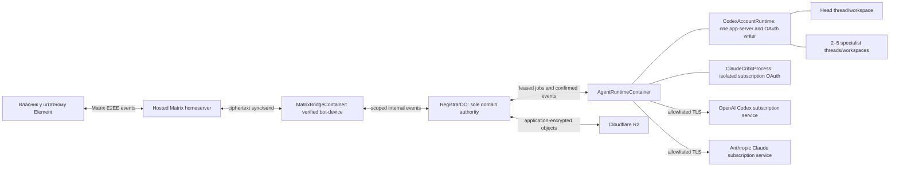

# Architecture

- Продукт: `Personal Consultant`
- Версія: V1 subscription OAuth-only architecture
- Дата: 15.08.2026
- Статус: proposed architecture contract
- `owner_invocation_id`: `2f20ecef-5701-4d1b-b8de-6bfc7535c4d1`

## Source References

Архітектура дотримується порядку істини з `docs/guardrails.md`. Вона деталізує технічні механізми, але не створює нової поведінки, поверхні або дозволу.

| Джерело | SHA-256 | Спожиті рішення |
|---|---|---|
| `docs/product-idea.md` | `627dfdadc2363e1011e3ea0091c598c8f989e43fdf1ec45c512705ca0f9cf902` | Element/Matrix, Candidate B, Cloudflare, subscription OAuth-only, private single-owner, витрати |
| `docs/prd.md` | `0c61a4dd97564f6ba17c2a387e2b420adad4282f3bf778f3b644a3d9c28920b6` | `US-001`–`US-023`, `FR-001`–`FR-036`, `NFR-001`–`NFR-015`, `AC-001`–`AC-011` |
| `docs/project-context.md` | `b7710d6018a19a949cdb7d6b89051b57b765f425bcfb1f0eef2d469d129664f0` | платформи, одноосібна модель, довірчі межі, ризики |
| `docs/canonical-terms.md` | `469ff18d98fc2001cce2e485195bd57c9b19b7603119c026cddcd810dc04d540` | ролі, стани, OAuth, A2A, архів і витрати |
| `docs/guardrails.md` | `45f6003f56462073514928a038ec24630f4a85529328d66ec6ae972945eb0737` | room invariants, stop rules, secret containment, evidence |
| `docs/user-journey.md` | `4fc297e61081690cb7f03e150388b65a32952eaa99bec494008648b6c334d944` | stages 1–10, preflight, reauth, fail-closed і cost paths |
| `docs/screen-map.md` | `3f12f48577b03e26f8d0e1ce51fb9f1f53f5bdbb7dd534c56e1c9c3191766ef3` | `SUR-01`, `MG-01`–`MG-13`, `SS-01`–`SS-29` |
| `docs/wireframes.md` | `49e5ae2421827373c3d3565520d1b548c5d832b3d6c515f4ffb9dc6252f7a700` | native chronology/replies, auth failure and cost structure |
| `docs/design-brief.md` | `c0bc4237b1668cd04262ff8662018b5c9df3aafc866739eab1f10f71acbba60f` | native Element inheritance, Candidate B, no custom auth UI or sound |

Офіційні технічні джерела перевірено 15.08.2026:

- [OpenAI: Using Codex with your ChatGPT plan](https://help.openai.com/en/articles/11369540-codex-and-chatgpt-plan-usage-limits) — Codex входить до відповідних ChatGPT-планів і має plan-dependent usage limits.
- [OpenAI Codex app-server](https://github.com/openai/codex/blob/main/codex-rs/app-server/README.md) — ChatGPT-managed OAuth, browser/device login, automatic refresh, `account/read`, auth mode/plan/rate limits та separate thread/turn contracts.
- [OpenAI Codex Python SDK API reference](https://github.com/openai/codex/blob/main/sdk/python/docs/api-reference.md) — supported ChatGPT login та `thread_start`/`thread_resume`.
- [Anthropic Claude Code authentication](https://code.claude.com/docs/en/authentication) — credential precedence, `claude setup-token`, `CLAUDE_CODE_OAUTH_TOKEN` і bare-mode incompatibility.
- [Anthropic Claude Code CLI](https://code.claude.com/docs/en/cli-usage) — `claude auth status`, login/logout і setup-token lifecycle.
- [Anthropic legal and compliance](https://code.claude.com/docs/en/legal-and-compliance) — OAuth для ordinary subscription use; third-party products/services потребують іншої auth-моделі або vendor approval.
- [Matrix Client-Server API v1.19](https://spec.matrix.org/v1.19/client-server-api/), [Matrix E2EE](https://matrix.org/docs/matrix-concepts/end-to-end-encryption/) і [matrix-rust-sdk](https://github.com/matrix-org/matrix-rust-sdk).
- [Cloudflare Containers](https://developers.cloudflare.com/containers/platform-details/architecture/), [Durable Objects container API](https://developers.cloudflare.com/durable-objects/api/container/), [R2 data security](https://developers.cloudflare.com/r2/reference/data-security/) і [Workers secrets](https://developers.cloudflare.com/workers/configuration/secrets/).
- [A2A v0.3.0](https://a2a-protocol.org/v0.3.0/specification/) — Agent Card, Message, Task, Part and streaming semantics.

## Architecture Overview

V1 — приватна система одного Власника в одній invite-only E2EE Matrix-кімнаті. Один verified bot-device у постійному `MatrixBridgeContainer` приймає й надсилає події. Один fixed-name `RegistrarDO` є єдиним доменним авторитетом для Сесії, дозволів, порядку, A2A, leases, outbox, `Стоп`, deadlines та cost snapshots.

На час однієї Активної сесії запускається один `AgentRuntimeContainer`:

- один trusted `CodexAccountRuntime` керує одним authoritative mutable ChatGPT OAuth state;
- Головний консультант і 2–5 Codex-агентів-спеціалістів мають окремі реальні Codex threads, workspaces, ролі й A2A identities;
- окремий ізольований `ClaudeCriticProcess` використовує лише subscription OAuth token;
- жоден агент не має Matrix credentials, archive keys або права публікувати напряму.

Один OAuth state не означає одного агента. Окремість доводиться thread/process identity, workspace, role, task, lifecycle events і фактичними register-before-route A2A messages.

## Architecture Principles

1. **Один авторитетний запис.** `RegistrarDO` серіалізує доменні переходи.
2. **Один mutable Codex OAuth lineage.** Durable encrypted checkpoint і leased runtime copy утворюють одну versioned lineage; клонування `auth.json` заборонене.
3. **Один active credential writer.** Лише runtime із чинним fenced lease може restore, refresh, mutate і checkpoint state.
4. **Окремі agent contexts.** Codex roles використовують supported app-server/SDK threads та ізольовані workspaces, а не копії credentials.
5. **Fail closed.** Auth mode, eligibility або quota failure зупиняє залежну роботу в `SS-29` без API/PAYG/cloud fallback.
6. **Register before route.** Фактична agent reply стає immutable confirmed message до передачі адресату або Matrix.
7. **E2EE без перебільшення.** E2EE завершується на verified bot-device; Cloudflare, OpenAI та Anthropic бачать переданий їм plaintext.
8. **Нативний UX.** Element/OS володіє chrome, replies, notifications і sound.
9. **Disposable compute, durable truth.** Container filesystem не є єдиною копією crypto, credential, session або archive state.
10. **Private non-SaaS.** Розширення на третіх осіб інвалідовує цю OAuth-архітектуру.

## System Context

## Module And Boundary Map

| Component | Owns | Must not own |
|---|---|---|
| `MatrixBridgeContainer` | `/sync`, E2EE crypto machine, decrypt/encrypt, room gates, native reply relations, send receipts | Session truth, AI OAuth, orchestration |
| Bridge host DO | Cloudflare container lifecycle and bridge lease only | domain state, agent order |
| `RegistrarDO` | Active Session, canonical sequence, permissions, dedupe, A2A, credential/runtime lease metadata, deadlines, outbox, costs | plaintext OAuth, Matrix private keys, model reasoning |
| `RoomInvariantGate` | exact `room_id` + `owner_mxid`, device trust, E2EE, membership and room policy result | silent exceptions |
| `PolicyGate` | secret rejection, sensitive-data/external-action permission, private eligibility | confirmed-body mutation |
| `AgentRuntimeContainer` | one-session compute, supervision, isolated workspaces, cancellation | durable plaintext or direct Matrix publication |
| `CodexAccountRuntime` | one app-server/SDK account context, auth health, threads/turns, exclusive credential writer | clones, Matrix/R2 keys, alternate providers |
| `ClaudeCriticProcess` | critic process/workspace and subscription OAuth health | Codex state, API/cloud credentials, bare mode |
| `A2ARegistrarAdapter` | A2A v0.3 validation and addressed draft normalization | peer bypass, public discovery |
| `CredentialVault` | application-encrypted Codex/Claude credential objects and versions | plaintext at rest, transcript |
| `CryptoArchive` | per-session encryption, integrity manifest, export, verified whole-session delete | OAuth or mutable transcript |
| R2 | ciphertext credential/crypto checkpoints, inputs and archives | plaintext, wrapping keys, domain authority |
| Outbound handlers | destination allowlist, mediation and egress evidence | routing decisions or session state |

## Runtime And Automation Model

### Matrix bridge

- `MatrixBridgeContainer` is always on, restores its application-encrypted crypto checkpoint before accepting work and keeps one sync lease.
- Before protected work it confirms `SS-01`/`SS-27`: exact allowlist, verified non-revoked device, E2EE, invite-only, owner + bot only on one hosted homeserver, no pending invites/guests/bridges/widgets, history `joined` and federation gate.
- `m.federate: false` is required when supported at room creation; otherwise production needs an explicit documented owner exception.
- `matrix.org` is only a conditional PoC default behind `HomeserverAdapter` and capability/policy gates.

### Codex account runtime

1. `RegistrarDO` grants one fenced `CodexCredentialLease`. A second writer/runtime cannot start until release or safe expiry.
2. The holder fetches one versioned ciphertext checkpoint, unwraps it only in runtime memory and materializes the active store in an ephemeral private directory; credential file mode is `0600` and the directory is owner-only.
3. One pinned app-server starts against that store. `account/read` with refresh confirms account type `chatgpt`, eligible plan and managed refresh before any Codex model turn.
4. `OPENAI_API_KEY`, `CODEX_API_KEY`, `CODEX_ACCESS_TOKEN`, personal-access-token mode, Bedrock/provider config and custom API endpoints are absent and rejected. Only auth mode `chatgpt` is accepted.
5. Head and specialists receive separate `thread/start`/`thread/resume` identities and bounded workspaces. Shared OAuth never shares conversation context.
6. Login, refresh, logout, checkpoint and revocation are globally serialized. V1 also serializes Codex provider turns conservatively; bounded cross-thread concurrency requires pinned official-runtime evidence and cannot add a writer or clone.
7. After every observed credential mutation and before the next turn, runtime seals a new checkpoint, writes it with version compare-and-swap, records hash/version in `RegistrarDO` and advances the lease.
8. Clean stop checkpoints before teardown. Crash keeps fencing until expiry; stale/reused refresh rejection becomes `SS-29` and may require reauth.

### Codex bootstrap, reauth and revocation

- Initial browser/device-code login uses the official Codex-managed flow in a trusted one-time bootstrap runtime/channel controlled by the Власник, never Matrix.
- Auth URL, device code, `auth.json`, access/refresh token and credential screenshots never enter `SUR-01`, A2A, prompts, logs, telemetry, archives, repositories or images.
- Bootstrap produces the first sealed version directly in `CredentialVault`; copying `auth.json` between runtimes is forbidden.
- Permanent refresh failure, logout/revocation, plan ineligibility or quota exhaustion revokes the active lease, pauses dependent jobs and emits only safe `SS-29` category/reset instruction.
- Reauth creates a new out-of-band credential version. Work resumes only after fresh `account/read`/plan/quota check; old versions are unusable.

### Claude Code critic

- Critic is a separate supervised process/workspace from all Codex threads.
- Власник runs `claude setup-token` out-of-band. `CLAUDE_CODE_OAUTH_TOKEN` enters `CredentialVault` directly and is exposed only to the isolated critic process for its lifetime.
- The process starts from an allowlisted environment. `ANTHROPIC_API_KEY`, `ANTHROPIC_AUTH_TOKEN`, `apiKeyHelper`, `CLAUDE_CODE_USE_BEDROCK`, `CLAUDE_CODE_USE_VERTEX`, `CLAUDE_CODE_USE_FOUNDRY` and related provider credentials are absent and blocked.
- Bare mode is forbidden because official docs state it does not read `CLAUDE_CODE_OAUTH_TOKEN`.
- Before each critic job, `claude auth status` must report logged-in subscription OAuth. Exit failure, expiry, revocation, scope failure or quota exhaustion transitions to `SS-29`.
- Renewal/replacement is out-of-band; there is no API key, cloud provider, PAYG, extra-credit or model fallback.

### A2A and visible message lifecycle

1. Registrar issues a role-scoped job with minimal context and lease.
2. Real thread/process produces an actual assignment, reply, critique or correction draft.
3. `A2ARegistrarAdapter` validates sender, recipient, task, generation and body.
4. `RegistrarDO` persists unchanged body, assigns canonical sequence/hash and creates target plus Matrix outbox intents atomically.
5. Only then does routing occur. Direct peer channels, hidden shared chat files and public Agent Cards are invalid.
6. Bridge publishes immediately from one bot identity with role + `HH:MM` and native Matrix reply.
7. Correction is a new confirmed message. `Стоп` rejects late drafts; confirmed messages remain immutable.

## Data And State Model

| Object | Authoritative owner | Persistence and invariants |
|---|---|---|
| `SessionState` | `RegistrarDO` | one generation; mode, permissions, deadlines, stop/final/archive state |
| `AgentIdentity` | `RegistrarDO` | role, provider, real thread/process ID, workspace, lease, health |
| `CodexThreadState` | app-server plus registrar ref | distinct head/specialist thread; no credential copy; resumable |
| `ConfirmedEnvelope` | `RegistrarDO` | append-only body, addressed A2A IDs, sequence, predecessor/hash |
| `MatrixOutboxIntent` | `RegistrarDO` | stable transaction ID, reply target, retry and receipt |
| `CredentialCheckpoint` | `CredentialVault` in R2 | AEAD ciphertext, provider, version, hash, created/revoked state |
| `CredentialLease` | `RegistrarDO` | exactly one active writer, fencing generation, expiry, checkpoint version |
| `MatrixCryptoCheckpoint` | bridge boundary in R2 | application-encrypted SDK store/cursor; one bridge writer |
| `CostSnapshot` | `RegistrarDO` | configured fees, actual infrastructure, provider usage/limit/reset or unavailable |
| `ArchiveManifest` | `CryptoArchive` in R2 | encrypted objects, hashes, key version, canonical head, deletion state |

Credential states are `absent → sealed → leased → active`, then `checkpointed`, `reauth-required` or `revoked`. No transition makes plaintext durable.

## Integration Map

| Integration | Direction | Contract and failure boundary |
|---|---|---|
| Element/Matrix | owner ↔ bridge | E2EE events, native replies, verified device; keys/invariant failure stops work |
| Hosted homeserver | bridge ↔ provider | ciphertext sync/send; metadata visible; capability/policy release gate |
| OpenAI Codex | account runtime ↔ provider | ChatGPT-managed OAuth, account/plan/rate-limit health, thread/turn events; non-`chatgpt` fails closed |
| Anthropic Claude Code | critic ↔ provider | `CLAUDE_CODE_OAUTH_TOKEN`, auth-status/exit/usage; higher-priority credential blocks startup |
| A2A v0.3 | agents ↔ registrar | private authenticated envelopes, register-before-route, no public discovery |
| Cloudflare R2 | internal bindings | application-encrypted credentials, crypto checkpoints, inputs, archives; no public bucket |
| DO/Containers | registrar/bridge ↔ compute | fixed identity, leases, lifecycle, durable metadata, on-demand supervision |
| Research gateways | runtime → allowlist | explicit source retrieval only; no arbitrary egress or secret injection |

## Trust Boundaries And Secret Handling

| Boundary | Plaintext exposure | Required control |
|---|---|---|
| Element ↔ homeserver ↔ bot | owner and verified bot; homeserver sees metadata | E2EE, verification/revocation, room gates |
| Bot ↔ Cloudflare runtime | trusted bridge memory | scoped binding, no plaintext durable log |
| Registrar ↔ runtime | minimum job context | authenticated lease, role/context minimization |
| Runtime ↔ OpenAI/Anthropic | content sent to provider | TLS, minimization, first-use consent |
| Vault ↔ leased runtime | leased memory/ephemeral `0600` file only | AEAD, version/CAS, one writer, teardown, no logs |
| Archive ↔ export/delete | authorized transient plaintext | per-session key, manifest, whole-session action |

Worker secrets hold wrapping material and static service credentials, never transcripts. R2 stores only application ciphertext. Wrapping keys are separate for bot crypto, AI credentials and archives.

## Technology Stack And Constraints

- Clients: official Element on Mac, iPhone, Samsung Flip7/Android and Windows.
- Messaging: Matrix Client-Server API and E2EE through `matrix-rust-sdk`.
- Hosting: Cloudflare Worker, DO, Containers and private R2; no own VPS, own Matrix homeserver or local Mac production dependency.
- Agent control: pinned supported Codex app-server/SDK thread/turn interface; separate Claude Code CLI process; private A2A v0.3 adapter.
- Storage: DO for small canonical metadata; application-encrypted R2 for durable objects; ephemeral container filesystem.
- Network: container internet disabled by default; Worker handlers allow only homeserver, OpenAI, Anthropic and approved research endpoints.
- UI: no browser product, custom Element chrome, bot role accounts or product-authored sound.

## Security Privacy And Access Model

- Work starts only for exact `room_id` + `owner_mxid` from a verified, non-revoked device after room invariants pass.
- Room contains exactly Власник + one bot on the same hosted homeserver; guests, bridges, widgets, extra invites and participants block work.
- OAuth and Matrix recovery material are `Секрет` and are rejected before dispatch, canonical log and archive.
- Agent workspaces never receive Matrix tokens, OAuth checkpoint files, R2 keys or archive wrapping keys.
- Private single-owner eligibility is checked with auth/plan health. No client, employee, team member or third party initiates work or receives subscription-backed results.
- Multiuser, client-facing, resale or commercial-service expansion invalidates this architecture and requires API/enterprise authentication or explicit written vendor approval plus new product/billing/security review.

## Failure And Recovery Model

| Failure | Registrar action | Visible result and recovery |
|---|---|---|
| Matrix access/invariant/key failure | reject before protected dispatch | `SS-04`/`SS-25`–`SS-27` or safe exit; native recovery/revocation |
| Codex auth mode not `chatgpt` | block all Codex turns | `SS-29`; remove forbidden mode out-of-band, then fresh preflight |
| Codex refresh/lease/checkpoint failure | fence runtime, pause jobs | `SS-29`; no fabricated reply; out-of-band reauth if needed |
| Claude auth invalid or token expired/revoked | stop critic/dependent synthesis | `SS-29`; replace out-of-band, then fresh status check |
| Codex/Claude quota exhausted | pause dependent provider work | `SS-29` with reset if exposed; wait, never fallback |
| Forbidden API/cloud credential | block entire agent runtime | `SS-29` until environment/config is clean |
| Agent crash/no progress | retain canonical log/outbox; replace/narrow under new lease | `MG-08`/`MG-11`; confirmed messages unchanged |
| Crash after credential mutation | keep fence; restore last sealed version | fail closed on stale refresh; never concurrent writer |
| `Стоп` | cancel leases/processes; reject late drafts | `SS-15`; confirmed messages remain |
| Archive/integrity failure | withhold successful completion | `SS-19` with next verification |

## Capacity And Cost Model

- Capacity is one Власник, one room, one Active Session, one `RegistrarDO`, one `AgentRuntimeContainer` and one Codex credential-writer lease.
- Session may contain one head thread, 2–5 specialist threads and one Claude critic process. Separate identity does not guarantee parallel turns.
- V1 serializes Codex provider turns initially. Only measured safe bounded concurrency inside the same account runtime may later be enabled; a second writer or cloned store is never scaling.
- Bridge remains always on; agent compute is on-demand and stops after checkpoint/archive handoff.
- `Витрати` reports configured monthly ChatGPT/Codex and Claude fees, actual Cloudflare/hosted-Matrix/R2 spend, and provider-reported usage/limit/reset when exposed.
- Session AI marginal cost is `входить у підписку; окремо не атрибутується`. Missing data is `невідомо`. Token estimates, invented session charges, API/PAYG, purchased credits and hard budget claims are forbidden.

## Performance Reliability And Observability

- Drivers remain 5-second acknowledgement, 30-second first confirmed agent reply, no more than 60 seconds without substantive update, and 10-minute consilium or permission to continue.
- Stable Matrix transaction/event IDs provide idempotency; registrar generations/leases reject duplicates and late work.
- Outbox retries never create a second `ConfirmedEnvelope`; delivery needs a Matrix send receipt.
- Content-free telemetry: bridge sync/crypto restore, room gate, registrar transitions, lease age/fence, checkpoint version/age, auth-mode category, quota/reset, thread/process lifecycle, outbox age, timing, archive hashes and deletion.
- Logs/traces exclude bodies, attachments, prompts, OAuth/Matrix tokens, `auth.json`, setup-token, URLs/codes, recovery keys and workspace content.
- Alerts distinguish auth expiry, quota exhaustion, forbidden credential, provider outage, agent failure, integrity failure and delivery failure.

## Deployment And Rollback

1. Provision Worker, fixed `RegistrarDO`, container hosts, private R2 prefixes and wrapping secrets outside production.
2. Create bot/compliant room; verify E2EE, recovery/revocation, membership and restartable crypto checkpoint.
3. Bootstrap Codex ChatGPT OAuth and Claude setup-token out-of-band into separate sealed credential objects.
4. Start dark `CodexAccountRuntime`; verify one writer lease, `account/read` mode/plan, checkpoint mutation and teardown without a model turn.
5. Verify Claude with `claude auth status` under the allowlisted environment and confirm forbidden provider credentials are absent.
6. Enable direct flow, separate Codex threads, Claude critic, A2A, archive and cost snapshots.
7. Promote pinned image, SDK/app-server/CLI, schema and source hashes only after real Element/Matrix evidence.

Rollback stops intake, executes `Стоп`, fences credential writers, seals the last valid checkpoint, retains safe bridge status/export and restores the previous compatible image/schema reader. It never copies an old `auth.json` over a newer lineage. If safe restore is unproven, system stays `SS-29` until out-of-band reauth.

## Architecture Decision Log

| ID | Decision | Source References | Alternatives Considered | Why | Consequences | Open Follow-Up |
|---|---|---|---|---|---|---|
| `AD-01` | Element/Matrix + hosted homeserver + Cloudflare | `FR-001`, `NFR-005`, guardrails | browser/WhatsApp, own VPS/homeserver, local Mac | confirmed surface and low ops burden | provider capability/policy gate | select provider/federation capability |
| `AD-02` | one fixed `RegistrarDO` | `FR-014`–`FR-016`, Candidate B | peer agents, multiple registrars | deterministic order/stop/permission/evidence | single logical authority | measure DO pressure |
| `AD-03` | one sealed mutable Codex OAuth lineage/writer | owner decision, PRD `3.5`, OpenAI app-server | cloned `auth.json`, OAuth per agent, API keys | avoid split-brain in managed refresh | checkpoint complexity, conservative scheduling | pinned concurrency evidence |
| `AD-04` | separate Codex threads/workspaces | `FR-009`, OpenAI thread/turn docs | role-labeled monologue, separate stores | real agents without credential duplication | lifecycle/context isolation evidence | SDK vs direct app-server adapter |
| `AD-05` | isolated Claude process with subscription token | `FR-010`, Anthropic auth/CLI | API/cloud/bare/shared process | independent subscription critic | out-of-band renewal, scrubbed env | confirm plan eligibility |
| `AD-06` | encrypted R2 credentials and archives | `NFR-005`–`NFR-006`, Cloudflare docs | plaintext DO/R2, container-only, VPS vault | durable Cloudflare-only production | key rotation/crash consistency risk | approve key service/cadence |
| `AD-07` | A2A v0.3 register-before-route | `FR-011`–`FR-016`, A2A spec | direct peer/shared chat file | actual visible ordered conversation | registrar latency | pin profile/version |
| `AD-08` | fail-closed `SS-29`, no paid fallback | `FR-030`, `NFR-006` | API/PAYG/credits/provider fallback | protects consent/cost/auth boundary | partial sessions pause | safe reason mapping |
| `AD-09` | subscription + actual infrastructure costs | `FR-033`, `MG-09` | token estimate/session charge/hard cap | truthful attributable cost only | some fields unknown | select billing/usage feeds |
| `AD-10` | private one-owner non-SaaS gate | product idea, PRD `3.1`, Anthropic legal | shared/client service on owner OAuth | ordinary owner-use boundary | expansion needs rearchitecture | periodic terms review |

## Risks And Mitigations

| Risk | Mitigation | Residual |
|---|---|---|
| OAuth split-brain/refresh reuse | fenced writer, version/CAS, no clone | crash before checkpoint may force reauth |
| Credential leakage | AEAD, ephemeral `0600` file, allowlisted env, no-content logs | runtime is trusted plaintext boundary |
| Higher-precedence Claude credential wins | empty allowlisted env, auth status, blocked provider flags | CLI precedence can change |
| Serialized Codex work misses timing | separate threads; measured bounded concurrency only in same runtime | 10-minute target may be hard |
| Subscription quota exhaustion | preflight every call, visible reset, no fallback | precise provider status may be absent |
| Provider rules change | release and periodic eligibility review | vendor approval may be required |
| Homeserver policy/SLA mismatch | adapter, conditional PoC, capability/soak gates | provider not selected |
| Duplicate/reordered messages | sequence/hash, idempotency, outbox receipts | client delivery timing differs |
| R2/archive/key failure | separated keys, manifests, verified whole-session operations | upstream retention cannot be erased here |
| Registrar outage | durable state, replayable outbox, alerts | temporary unavailability over split-brain |

## Traceability

| Area | Primary contracts |
|---|---|
| Matrix access/E2EE/recovery | `FR-001`–`FR-006`, `NFR-005`–`NFR-008`, `SS-01`–`SS-08`, `SS-25`–`SS-27` |
| OAuth/separate agents/private eligibility | `US-006`–`US-007`, `US-018`, `FR-009`–`FR-010`, `FR-030`, `NFR-006`, `SS-28`–`SS-29` |
| live A2A/Candidate B | `FR-011`–`FR-019`, `FR-034`, `MG-06`–`MG-08`, `SS-10`–`SS-12` |
| controls/failure/timing | `FR-020`–`FR-024`, `NFR-001`–`NFR-004`, `MG-08`–`MG-11` |
| final/archive/permissions | `FR-025`–`FR-032`, `FR-035`, `SS-18`–`SS-24` |
| truthful costs | `US-021`, `FR-033`, `NFR-012`, `MG-09`, `SS-14` |
| Element-only presentation | `SUR-01`, `FR-034`, `NFR-013`–`NFR-015`, Candidate B |

## Out Of Scope

- API-key, PAYG, usage-credit, Bedrock, Vertex, Foundry, personal-access-token, custom provider or model fallback.
- Cloned `auth.json`, multiple Codex credential writers, OAuth store per agent or durable plaintext credential volume.
- Third-party, client, employee, shared, resale, public or SaaS use of owner subscriptions.
- Own VPS, own Matrix homeserver, local Mac production dependency or always-on local process.
- Browser product, login dashboard, custom Element chrome/sound or separate agent Matrix accounts.
- Public A2A discovery, direct peer messaging, hidden inter-agent chat or fabricated replies.
- New screens, user stories, visual baseline, DoD/eval gates, QA checklist or implementation tasks.

## Open Questions

1. Which hosted Matrix provider passes bot policy, uptime, E2EE recovery, exactly-two-member room and `m.federate: false` gates? `matrix.org` remains conditional PoC only.
2. Which pinned Codex app-server/SDK and Claude Code versions are production-compatible, and can bounded cross-thread turns be proven safe inside one account runtime without another writer?
3. Which Cloudflare wrapping-key service, rotation cadence and credential-checkpoint retention policy are approved?
4. Which current ChatGPT and Claude plans explicitly permit this exact private cloud automation at release time? Unclear eligibility blocks production pending vendor confirmation.
5. Which provider-supported feeds expose usage, limit and reset without API billing credentials? Missing values remain `невідомо`.
6. What archive retention period and stopped-session lifecycle status are approved?

None permits API/PAYG fallback, credential material in Matrix, a second writer, third-party use, local production hosting or a new product surface.
