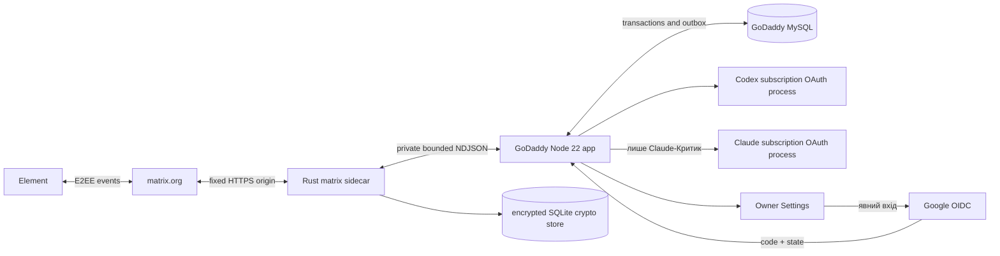

# Архітектура Personal Consultant

## AD-26 — Transactional MySQL Matrix store (PI-MATRIX-MYSQL-20260908)

Current correction target, not implemented/deployed fact. This explicitly supersedes only the SQLite-only, OS-lock-only and “Rust must not access MySQL” statements in §§2–5, 10–12 and AD-16 below; previous paragraphs remain design history. Sources: current product idea/PRD correction, guardrails and existing FR-052 no-Settings journey. Existing visual baseline/frozen bytes and Matrix recovery states are retained; no new dashboard or visual redesign.

### AD-26 ownership and credentials

One GoDaddy Node app remains HTTP host/supervisor and owns settings/registrar/outbox/archive. Rust remains sole Matrix SDK/E2EE/transport owner, directly implementing the pinned SDK storage interfaces against dedicated MySQL tables. No extra host or Node database RPC bridge. Preserve SDK encryption algorithms, bounded NDJSON and fixed Matrix network origins; add only the configured database connection to Rust. Google/AI/archive credentials and agents remain outside this boundary.

Reuse validated `DB_HOST`, `DB_PORT`, `DB_NAME`, `DB_USER`, `DB_PASSWORD` and `MATRIX_STORE_PASSPHRASE` through an explicit Rust-child allowlist; do not duplicate them into new secret groups. `MATRIX_STORE_BACKEND=mysql` selects the new backend; derive the store identity from the existing exact bot/device binding unless a separate `MATRIX_STORE_ID` is technically necessary. Use the existing app-scoped provider credential, limited to the application's required tables in code; prefer table-restricted grants where the provider supports them, without inventing a new account-setup prerequisite. Require TLS certificate/hostname verification for network DB connections, bounded pool/timeouts and parameterized SQL. Additive DDL is an explicit authorized operation, never normal startup. Legacy directory remains a read-only migration input; agents receive no DB/store credentials.

### AD-26 data and transaction contract

Additive application-only InnoDB tables with binary identifiers, explicit schema version and no plaintext sensitive values:

| Table | Key and responsibility |
|---|---|
| `pc_matrix_stores` | `store_id BINARY(16)` primary key; version, identity fingerprint, key ID, encrypted identity metadata, `fence BIGINT UNSIGNED`, owner nonce and lease expiry. |
| `pc_matrix_records` | Primary key `(store_id, namespace VARBINARY(64), record_key BINARY(32))`; versioned encrypted SDK crypto/state values and indexes, revision. Keyed hashes protect sensitive lookup keys. Disposable event/media caches stay in memory; pending accepted media recovery metadata is durable in the inbox/batch. |
| `pc_matrix_inbox` | `(store_id, event_key BINARY(32))`; encrypted pending event, revision/status and durable Node ACK linkage. |
| `pc_matrix_migrations` | `(store_id, migration_id BINARY(16))`; source fingerprint, version, phase, encrypted manifest/count evidence and cutover revision. |

Sensitive values use vetted authenticated encryption, fresh random nonce and authenticated purpose/table/store/key/schema/revision binding; keys stay outside MySQL. Explicitly test row-context binding rather than assume SDK StoreCipher provides it. Preserve the existing external passphrase/key; never generate replacements at startup. Future key rotation must use a separately verified recoverable procedure, not a new MVP settings workflow or full rewrite obligation in this unit. Bounds follow existing protocol/media limits.

Every write transaction locks the store ownership row and verifies current generation and unexpired ownership using database time before committing its entire logical batch. Takeover increments the fence; an obsolete writer cannot write, renew or release its successor's lease. Lease loss stops intake/send and closes that SDK instance. Deterministic Matrix transaction IDs remain required: database fencing cannot undo an HTTP send already accepted by the homeserver. Unknown commit outcomes reconcile by stable operation ID, not a fresh retry identity.

Preserve existing committed-cursor plus durable pending-journal semantics in the smallest adapter seam: cursor advancement cannot lose an event not yet durably represented in the inbox. Preserve complete SDK atomic batch semantics. Sidecar pending events remain until Node commits ingress dedupe/session work and returns ACK; lost ACK replays the same Matrix event ID. Validate checkpoint ordering across the actual SDK save/event callbacks; if this seam cannot meet the invariant, resolve the precise gap before adding another replay store. No raw sync-response archive is prescribed. Pending media source/decryption metadata resides in the encrypted inbox, not a new durable cache.

### AD-26 migration, files and recovery

Inventory crypto/state SQLite, binding/identity, cursor, pending-event journal, ACK records and caches; each maps to MySQL or is proven disposable. A transient media spool is safe only while its source/decryption metadata remains durably recoverable through processing/ACK; preserve existing private-path, size/MIME/hash/symlink/TTL controls. No private durable state may remain beneath public assets.

Explicit migration sequence: stop legacy writer; verify a consistent read-only backup, exact device and key; use a pinned-version, SQLite-schema-aware importer for all required crypto/state/index/journal fields (there is no assumed complete public SDK export); check counts, identity and representative decrypt/replay; atomically record cutover; start only the MySQL writer. An unhandled required field blocks migration pending a tested transfer path. Missing keys block recovery, never authorize logout/reset/new device or an empty store bound to an existing ID. No periodic copying of a running SQLite store.

Before cutover, only isolated candidate rows may be discarded within the authorized operation while legacy state remains untouched. After MySQL writes, legacy SQLite is stale: rollback must use a MySQL-compatible code version or a verified reverse migration from current state. Never run both writers. Backup restore includes current encrypted records, ownership metadata and matching external keys in an isolated namespace, then identity/decrypt/replay verification. No database wipe or legacy cleanup.

Remove folder-binding/timed Preview browser comparison only after the private-file inventory passes. Preview remains stateless and receives no Published Matrix DB/encryption credentials. Startup validates schema/key/identity/fence and starts sync independently of Settings; reuse bounded reconnect and authenticated same-app wake hint. Wake payload never becomes a user command. Liveness is not storage/trust/sync readiness.

### AD-26 verification boundary

Local SDK tests, isolated real-MySQL transaction/crash tests, migration/restore and compatible artifact build are prerequisites, not Published proof. GoDaddy grants/TLS, full SDK serialization and live database behavior remain to be verified. Completion requires the same Published identity after restart/redeploy, Settings closed, real Owner message → consultation → selected Critic → one delivered result, no lost accepted work or duplicates. Relevant controls remain NFR-005–NFR-010, NFR-012 and NFR-019; other security obligations remain active. Missing legacy keys and device verification are operational conditions, not established by this document.

## PI-CONSENSUS-20260908 — Персональні ролі, делегування й автономний Matrix

Джерела: однойменні зміни PRD → контекст/терміни/guardrails → journey/screen-map/wireframes → DB-D21, а також forge/exploration/consensus-20260908/matrix-wake-research.md. Цей AD-25 замінює лише однопрохідний review та пов'язані рольові/мовні/availability припущення. Rust E2EE, один бот, MySQL, Google owner auth і незалежні налаштування провайдерів збережено. Baseline PC-MATRIX-CANDIDATE-B-V2-20260816-R1 має незмінний render hash і вузький DB-D21, без prototype-code reuse.

### AD-25.1 — Мова, ролі й індивідуальне делегування

Session/task state отримує версію workflow, визначену мову та її джерело, roster зі сталими role IDs і display metadata, окремий assignment кожному спеціалісту. Intake Head Consultant повертає структурований поділ: ціль, підпитання, очікуваний результат, потрібні факти, обмеження, залежності й роль-власник. Перевірка схеми відхиляє відсутні/однакові generic assignments, зайві ролі та перевищення 2/3/5 preset cap; пряма відповідь для простого запиту збережена. Нові сім ролей додаються в typed registry, без перейменування наявних internal IDs.

Мова визначається з першого змістовного повідомлення нової задачі; явний вибір пріоритетний. Низька впевненість дає одне уточнення. Подальші цитати/вкладення не змінюють мову; явний user switch версіонує тільки наступні відповіді. Head, specialist, critic prompts і службовий renderer беруть однакове поле, не default українську. Це не зміна SDD working_language. Англійські role labels і emoji відділені від незмінного body; presentation slots DB-D21 збережені в roster.

Особисті ролі мають domain-specific межі: освітня інформація/коучинг, не діагноз, лікування, лікарські призначення чи гарантії багатства. Не просити медичні записи, секрети, державні ідентифікатори. Crisis/safety gate має перевагу над маршрутом до критики; особиста психологічна розмова потребує згоди. Жодного нового зовнішнього API або передачі медичних даних.

### AD-25.2 — Конструктивна критика, версії та консенсус

1. Head реєструє один спільний вступ і персональні assignment messages. Незалежні перші позиції виконуються паралельно в окремих реальних agent contexts, після обов'язкового preflight.
2. State містить поточні версії позицій і спільного proposal, відкриті питання, явні agree/revise/unresolved рішення та durable critique_count за task+specialist. Зберігається стислий висновок/обґрунтування агента, не приховані внутрішні міркування. Critic працює в designated окремому контексті обраного provider, не підміняється Head або іншою моделлю.
3. Кожне Critic-повідомлення має конкретні affected specialists, issue і рекомендоване уточнення або явну згоду з поточним текстом. Загальна/мультиадресна критика враховується кожному зачепленому спеціалісту; адресування лише Head не обходить ліміт критики їхніх позицій. Повтор однієї підтвердженої репліки не витрачає ліміт вдруге; нова восьма репліка не реєструється й не запускається.
4. Резервування допустимого critic dispatch і fencing атомарні; confirmed message + зміна лічильника + canonical outbox фіксуються разом. Failed provider attempt не є повідомленням, але має окремий обмежений retry budget. Crash/replay/parallel replies не обходять count<=7. Stop, часова межа й квота перевіряються до кожного залежного виклику.
5. Спеціаліст відповідає на конкретну критику, не повторює загальний brief. Head синтезує актуальний proposal; всі спеціалісти, Critic і Head явно погоджують цю саму версію. Approval зв'язане з task, actor, proposal digest і актуальними позиціями. Зміна тексту/залежної позиції інвалідує непридатне погодження; для нового фіналу потрібні актуальні погодження всіх, не мовчазне перенесення.
6. Final gate перевіряє approvals, нерозв'язані питання, count bounds, active generation і safety. Згода досягнута → рівно одна публікація погодженого proposal, без нових неперевірених рекомендацій у фінальному переписуванні. Межа досягнута без згоди → partial/unresolved summary, ніколи false consensus. Немає циклу до семи, якщо всі погодились раніше.

Часові паузи, reconnect і Continue зберігають task identity й counts. Сумісне читання старих сесій не вигадує approvals: legacy workflow або безпечно завершується за своєю версією без ярлика нового консенсусу, або явно переходить через новий погоджений task; історію не переписувати. Весь міжагентний обмін проходить через реєстратора та потрапляє в Matrix після канонічної реєстрації; SDK completion не є доказом доставки.

### AD-25.3 — Автономний Matrix та no-extra-host wake

Primary path — автоматичний application.start() і постійний authenticated Rust sync, незалежні від Settings cookies. Зараз store_binding_unavailable згортає різні filesystem failures і прибирає retry timers, а crash circuit не має half-open recovery. Точна причина попередньої live-помилки ще не підтверджена; GoDaddy описує persistent Node, тому «Published засинає» не є доведеним діагнозом.

Ремонт: типізувати transient I/O/network, missing/corrupt binding, identity mismatch і revoked authorization; transient дає bounded exponential backoff із jitter і half-open перевіркою одного fenced worker. Missing/corrupt keys або непідтверджена identity не перетворюються на fresh provisioning. Верифікувати persistence фактичного store path після restart/redeploy; збережена identity, sync cursor і MySQL ingress/outbox мають відновлюватися разом. Немає wipe або заміни ключів, немає дубльованих pollers.

Додатковий same-app wake: account-scoped Matrix HTTP pusher, event_id_only, на Published HTTPS /_matrix/push/v1/notify. Не потребує окремого платного/локального сервера. До приймання необхідно перевірити реальну підтримку pusher, правила для дозволеної encrypted room, GoDaddy/WAF ingress і lifecycle. Continuous sync/recovery лишаються primary; push — додатковий сигнал, не гарантована черга.

Endpoint поза owner browser auth, але не command API: dedicated app_id/high-entropy pushkey, allowlisted room, bounded body/device list, rate limits/coalescing/replay handling, без логування секретів/контенту. Hint лише будить existing validated transport; model call можливий виключно після authenticated sync, E2EE decrypt, owner/room/device checks і durable ingress dedupe. HTTP success — тільки після підтвердженого bounded handoff; transient failure не додає валідний pushkey до rejected. Зберігати чужі pushers/rules; реєстрація/зміна production конфігурації виконується лише у відповідно дозволеній implementation/live фазі.

### AD-25.4 — Перевірка й межа доказів

FR-047/048 → renderer + task locale persistence; FR-049/050 → typed roles + intake assignments + safety; FR-051 → router/registrar/versioned approval/count ledger; FR-052 → Node startup/store binding/supervisor/Rust sync/wake endpoint та live no-Settings acceptance. Існуючі NFR-005/006/007/008/009/010/011/012/017/019 поширюються на ці seams. Provider/token/quota faults не маскувати consensus failure або hosting sleep. Нові реальні тести, browser sessions, restart/redeploy і deployment не виконані; архітектурна можливість pusher не є live готовністю. Якщо same-host шлях не проходить перевірку, блокувати release й назвати обмеження без прихованої покупки, API fallback чи послаблення E2EE.


## Метадані

- `status`: reconciled all-GoDaddy target; implementation and destructive cleanup remain separately gated
- `architecture_owner`: `to-architecture`
- `owner_invocation_id`: `architecture-approved-critic-router-20260906`
- `updated_at`: `2026-09-06`
- `runtime_host`: existing GoDaddy Node 22 application
- `matrix_sdk`: `0.18.0`
- `approved_baseline`: `PC-MATRIX-CANDIDATE-B-V2-20260816-R1` з чинними `DB-D18`/`DB-D19`/`DB-D20` та v2-прив'язкою залежностей

Цей документ задає цільову production-архітектуру, а не твердження про завершене розгортання. Нативні Element/Matrix UX та ізольовані subscription-OAuth контури Codex і Claude збережено. Cloudflare Workers, Durable Objects, R2 і Cloudflare Access не є цільовими production-компонентами; прямий Google OIDC повертається тільки як перевірка особи Власника, не як AI-авторизація.

## 1. Джерела правди (Source References)

Поточне узгодження 06.09.2026 стосується лише PI-CRITIC-20260906; його межі визначено в розділі «Маршрутизатор Критика — узгодження 06.09.2026», поточні спожиті фрагменти та hashes — у manifest. Збережені нижче таблиці джерел і датовані спостереження попередніх переглядів є історією, а не новим full-source, runtime або test evidence.

Хеші історичної таблиці зафіксовано попередньою owner-інвокацією; вони не підміняють поточні section bindings у manifest.

| Джерело | SHA-256 |
|---|---|
| `docs/prd.md` | `a45aa866bd0591ba778b8ddf1528f9789fd954eef86dd2d8109c8db3f0ed23cc` |
| `docs/guardrails.md` | `6b88dcd634b03203f9f8dde93bd4e4abdba3fe57205b5f3bb776106b39bd999b` |
| `docs/user-journey.md` | `ef058d468fde194ff38efe5d209edbdc3f061d90e4f9602671071c1cc28b2c39` |
| `docs/screen-map.md` | `fe25f595f954cb7b04e369aec65066ec31d7a66a3359953c968343713d41039d` |
| `docs/wireframes.md` | `e065b36af6ba851cb79a2028227b4599129da9c3656dc4be1a913d08cba62ed5` |
| `docs/design-brief.md` | `a5feac6981acefb15cc84e827080d72b4b7b3734a1e6487cf4046f611095396e` |
| `docs/project-context.md` | `458da1092f8ac6b10fca6aadc33fab6b9b56aef650fff23e814fe84cb15735a4` |
| `docs/canonical-terms.md` | `dd4a7ef9ee403f941b649247b14eafff044af717d54fb8731b0d2d26665848d3` |
| `docs/product-idea.md` | `852758d725831ebb435da8ffd9a548a6ea1ad70fbab13261885a4793a12ad14e` |
| `README.md` | `540a76cb67521d9f3652ec15604f9dc7657f865af639baf13df506f07288c81b` |
| `forge/google-owner-login-investigation-20260905.md` | `9b0b7e1b925cf5a05abdd83dccc5741594ddd121df653f43c4eb9218e915614f` |
| `forge/design/evidence/candidate-b/v2/approval-render-binding-20260905.json` | `30d4d7665209f591821ed00bdb551789fb560a4056c50c3aa0ee7a64eade7598` |
| `docs/g00-feasibility-receipt-2026-09-03.md` | `352d3974ece6f53877aa8bd3596c004fde4a554fa5eacb60846163c2219c6744` |
| `package.json` | `37c436772007d340d21c4b7b8c5d2c9c384262e758e935c949b6160752674614` |
| `src/godaddy/server.mjs` | `36fc71aa73e2ca505c1a0c51ebd61f7768e22de7ed2ad2d8fd2595713a2506cc` |
| `src/godaddy/mysql-storage.ts` | `1341afa12c0ad04d6463d2bedf54ba813e6d4e4ee07e5d317a11d7c6c8319d1d` |
| `src/godaddy/mysql-archive-storage.ts` | `c00b5c3c7c2c5f2e87324e52e2bf43ddfd03be4a15ce293b21d0b9e3b5b3d60e` |
| `src/godaddy/owner-password-auth.ts` | `aeafa1a2391ed998554270ab366e08df3b79607bf20ab4637b91eb63b1bea354` |
| `src/godaddy/settings-runtime.ts` | `87a41cf31345eef9120a829142e6162d74fd40fa8d3772a2eb40d51eff027d51` |
| `src/godaddy/application-runtime.ts` | `66f4bee22e4e025d34a3c28ee7ad83e29308d622e70bc31bf2e23aacc43b794d` |
| `src/godaddy/codex-app-server-process.ts` | `8a0a990a28c51781e1cf07d354fe7a0c480bb1340f7abd08f0ef4d11a0294b84` |
| `src/godaddy/claude-code-process.ts` | `00c76653fa9234d45bde4049bd85cb2d5670a37561509ace222e543facef04b3` |
| `test/godaddy-owner-password-auth.test.ts` | `8d85b630cbd2819f1e3a582efa441c1aca13b866d55c316cc17a908b049f0158` |
| `scripts/godaddy-state-schema.sql` | `7070d2b83c2521a0994505c17cdec645820bfbcb0beb8014c17a9a09ea5a3e80` |
| `native/matrix-sidecar/Cargo.toml` | `513aeb016de461432fb07fc345e330a14cc8f6d61e113689d4644cef729e06b1` |
| `native/matrix-sidecar/Cargo.lock` | `4a0469995afd74cd03b3095a180cef059ae0feb57008bb7cf6d000e007d55db7` |
| `.github/workflows/matrix-sidecar.yml` | `7d938106d59726180af6951353af8ad5a244948fb1fc13af8f080547e026119e` |

Спожито чинні продукт/access/provider контракти й відповідні технічні фрагменти; незмінні Matrix-рішення збережені. Репозиторій перевірено лише читанням 05.09.2026: `sed`/ `rg -n` для названих auth/runtime файлів, `rg --files native scripts .github src/godaddy test`, SHA-256 точних шляхів. Поточний checkout містить Rust workspace, lockfile й CI workflow; наявність файлів не є доказом Published deployment. Старі code observations і посилання на plan не визначають нові архітектурні рішення.

Первинні Google-джерела, перевірені 05.09.2026: [OIDC](https://developers.google.com/identity/openid-connect/openid-connect), [перевірка ID Token](https://developers.google.com/identity/gsi/web/guides/verify-google-id-token), [оформлення кнопки](https://developers.google.com/identity/branding-guidelines); код `google-auth-library@11.0.2`, Node `>=22`, [зафіксований commit c249594](https://github.com/googleapis/google-cloud-node/tree/c249594c6ef41e4b36f1ef8869341a4c98c092b0/core/packages/google-auth-library-nodejs). `getToken` не перевіряє ID Token; `verifyIdToken` потребує явного `audience` і не виконує прикладні nonce/transaction/owner checks. Пакет ще не встановлено.

Baseline: `PC-MATRIX-CANDIDATE-B-V2-20260816-R1`; `sdd-render-sha256-v2`; aggregate `57d103c5ed17bcc9a9d95a58718f83c33b8257229fc825b756367321eaa33199`; target `07e3675265e8cadef1e65c132f32e3cbbf4d6537cbfd316ea16a6bacd56f1bd6`. Канонічні дві shared-залежності та receipt — у design brief. Це поточна owner-reviewed прив'язка; початковий legacy hash не відтворено, безперервну тотожність точного кореня від 16.08.2026 не доведено; нового approval або visual run немає.

## 2. Архітектурний висновок (Architecture Overview)

V1 має дві поверхні: `SUR-01`, приватну invite-only E2EE Matrix-кімнату в нативному Element; і `SUR-02`, Settings у тому самому GoDaddy Node 22 app, захищені Google OIDC лише дозволеного Власника та окремою серверною сесією застосунку.



GoDaddy Node є єдиним HTTP/runtime host і supervisor. Rust sidecar є єдиним власником Matrix client, E2EE crypto store, sync і Matrix send/receive. MySQL є єдиною durability boundary для settings, registrar state, archive ciphertext і ordered outbox. Preview не має окремого state: через спільну provider DB вона повністю stateless.

## 3. Незмінні межі (Architecture Principles)

1. Один Власник, один bot identity, одна затверджена кімната, одна активна сесія.
2. Element лишається штатним клієнтом; Settings не стає браузерним чатом чи архівом.
3. Codex ChatGPT subscription OAuth і Claude subscription OAuth працюють в окремих процесах і credential domains. API/PAYG/Fast/credits fallback заборонено.
4. Credentials, Matrix plaintext, archive keys і crypto-store passphrase не потрапляють у Git, MySQL plaintext, stdout/stderr чи browser document.
5. Unknown, stale, malformed, unsupported, quota-exhausted або partially verified state fail closed.
6. Settings snapshot незмінний протягом сесії; зміни діють лише на наступну.
7. Ніякого автоматичного DDL, automatic store reset, silent fallback або destructive cleanup.

## 4. Модулі і власність (Module And Boundary Map)

| Компонент | Власність | Не має права |
|---|---|---|
| GoDaddy Node app | HTTP, Settings auth/UI, orchestration, MySQL transactions, sidecar supervision | decrypt Matrix E2EE store; підміняти Matrix readiness liveness-статусом |
| Rust sidecar | Matrix SDK, E2EE, sync, room/device validation, media spool, Matrix transaction IDs | слухати TCP/HTTP; звертатися до MySQL; запускати agent OAuth |
| MySQL | settings versions/snapshots, session/registrar state, ingress receipts, archive ciphertext/tombstones, durable outbox | зберігати Matrix crypto state або archive plaintext |
| Codex process | head/specialists і, за вибором, окремий critic thread under subscription OAuth | бачити Claude credential чи Matrix store secrets |
| Claude process | лише явно вибраний Claude critic under subscription OAuth | бачити Codex credential чи Matrix store secrets |

### 4.1. Rust workspace

```text
native/matrix-sidecar/
  Cargo.toml
  Cargo.lock
  rust-toolchain.toml
  src/
    main.rs
    config.rs
    protocol.rs
    store.rs
    lock.rs
    client.rs
    room_policy.rs
    ingress.rs
    egress.rs
    media_spool.rs
    telemetry.rs
```

`matrix-sdk = "=0.18.0"`, `default-features = false`, features `e2e-encryption` і `bundled-sqlite`; exact dependency graph фіксує committed `Cargo.lock`. Sidecar приймає лише cross-signed trusted, non-revoked devices. History-key sharing вимкнено.

## 5. Стан, порядок і відновлення (Data And State Model)

### 5.1. MySQL

Production role `published` використовує явно створену схему; app не створює і не мігрує її автоматично. MySQL тримає versioned Settings і immutable session snapshots; registrar/session state і cancellation generation; deduplicated inbound receipts; confirmed visible messages; durable ordered outbox; encrypted archive objects і tombstones.

Registrar в одній транзакції створює confirmed visible message і outbox row з monotonic session order та deterministic Matrix transaction ID. Restart відновлює найраніший pending item. Retry використовує той самий transaction ID. Late result за obsolete cancellation generation не може enqueue.

Перед кожним send sidecar заново перевіряє поточну room/device policy; кеш не авторизує відправлення. Outbox state розрізняє `pending`, `accepted` (homeserver повернув Matrix event ID), `device_delivered` (лише за окремого доказового device-level сигналу) і `read` (лише за валідного read receipt Власника). `accepted` ніколи не називається доставленим на пристрій або прочитаним.

Inbound event спочатку отримує локальний pending receipt sidecar, потім передається Node. Лише durable ACK Node очищує receipt. Після crash подія replay-иться з тим самим Matrix event ID, а MySQL dedupe робить повтор безпечним.

### 5.2. Matrix crypto store

Encrypted SQLite crypto store знаходиться під provider-persistent private path поза Git і static/public output. До відкриття store процес бере non-blocking OS lifetime lock на exact store root; другий процес негайно завершується. Після lock store відкриває тільки один SDK process.

Допустимі лише два device/store сценарії:

1. Fresh production bot device створюється з підтверджено порожнім exact production store.
2. Існуючі access token/device ID відновлюються тільки разом з exact encrypted store snapshot, що належить саме цьому device.

Старий token/device з новим, іншим або втраченим store заборонено. Missing/corrupt/wrong-passphrase/migration/device-mismatch переводить readiness у blocked і quarantine; app не logout, не видаляє, не перейменовує і не перестворює store автоматично.

## 6. Приватний bounded NDJSON protocol

Sidecar не відкриває socket або HTTP route. Один supervisor керує stdin/stdout NDJSON; stderr містить лише redacted operational diagnostics. Versioned типи: `hello`, `ready`, `request`, `response`, `event`, `ack`, `status`, `shutdown`. Unknown version/type/field, duplicate ID, malformed UTF-8/JSON або перевищення межі завершує handshake чи конкретний request fail closed. IDs — ASCII до 64 bytes.

Архітектурні defaults, які release evidence може лише зменшити; збільшення потребує load/memory evidence:

| Межа | Default |
|---|---:|
| NDJSON line | 256 KiB |
| concurrent outstanding requests | 32 |
| unacked ingress events | 64 |
| plaintext body | 64 KiB |
| formatted body | 128 KiB |
| handshake/control timeout | 5 s |
| Matrix send timeout | 30 s |
| graceful shutdown | 5 s |
| media objects/request | 4 |
| media object | 20 MiB |
| aggregate media/request | 64 MiB |
| spool TTL | 15 min |

Binary media ніколи не входить у NDJSON. Sidecar пише його у private per-boot spool directory (`0700`; file `0600`) і повертає opaque handle, declared MIME, length та SHA-256. Node може resolve лише handle поточного supervisor instance; повторно перевіряє size, hash і MIME/magic. ACK або TTL видаляє файл тільки з exact spool root. Cleanup не слідує symlink і не приймає caller path.

## 7. Matrix authorization і outbound policy

На кожному ingress і безпосередньо перед кожним send перевіряються exact `room_id`, `owner_mxid`, `bot_mxid`, homeserver `matrix.org`, E2EE, invite-only, рівно owner+bot у joined membership, відсутність pending invites, history visibility `joined`, відсутність public listing/alias, guests, bridges і widgets, а також trusted cross-signed non-revoked owner/bot devices. Unknown або stale стан блокує дію.

Device revocation не відкликає вже розкриті history keys. Якщо exposure правдоподібний, incident recovery вимагає нової verified device/room boundary, а не лише видалення device.

Matrix outbound має fixed production homeserver URL та exact HTTPS-origin allowlist. Caller-controlled discovery, URL, host, downgrade і proxy заборонені. Redirects вимкнено; якщо SDK transport технічно вимагає redirect handling, приймається тільки exact allowlisted HTTPS target після повторної перевірки. Media URL не розширює allowlist.

## 8. Google-вхід, локальна сесія і Settings

### 8.1. Межа особи та OAuth-транзакції

Цільовий `owner-google-auth.ts` замінює лише password identity seam; `settings-runtime.ts` лишається HTTP-адаптером. `FR-038(a)`: явний Google-вхід і точна серверна owner-перевірка; `FR-038(b)`: одноразова браузерна транзакція; `FR-038(c)`: локальна сесія для всіх protected bytes та origin/CSRF для змін; `FR-038(d)`: наявні app/hostname, лише identity scopes `openid email`, без app MFA/password fallback/реєстрації/іншого IdP. `FR-039(a)`: окремі логічні й credential domains Google, local session, Codex та Claude; `FR-039(b)`: Google/AI credentials і login transaction material не виходять у child env, browser payload, Matrix, logs або archive; `FR-039(c)`: вхід/відмова/вихід/relogin не змінюють AI credential state.

| Пункт | Механізм і дозволені межі |
|---|---|
| `NFR-016.a` | Фіксовані HTTPS Google authorization/token/JWKS endpoints, не discovery від клієнта. Authorization-code flow з PKCE S256. Перед прийняттям JWT — bounded compact JWS, `alg=RS256`, без caller-supplied `jku/x5u`; офіційна бібліотека перевіряє trusted Google keys/підпис/строки з явно переданим `audience=GOOGLE_CLIENT_ID`. Додатково точні issuer `https://accounts.google.com` або `accounts.google.com` (нормалізуються до першого), audience лише цей клієнт, `azp` якщо є — цей клієнт, `nonce` і типи claims; `exp>now`, `iat<=now+60s`, `iat>=transaction.createdAt-60s`. Access token не є ID Token. Library default clock tolerance не послаблює ці перевірки. |
| `NFR-016.b` | `email_verified===true`, exact normalized preauthorized Gmail із захищеної конфігурації, без видалення dots/plus aliases; непорожній Google `sub`. Після повної перевірки перший дозволений саме цей email атомарно прив'язує issuer/sub; інший email або інший sub не перебіндовує owner. Display name/login_hint/перший сторонній login не авторизують. Значення email/sub не записуються у Git або публічні відповіді. |
| `NFR-016.c` | `GET /auth/sign-in` показує кнопку; лише її same-origin POST `/auth/google/start` з login-intent CSRF починає flow. HTTP GET start не робить OAuth-переходу. 32 random bytes окремо для state, browser binding, nonce і PKCE verifier; TTL 10 хв. Callback `GET /auth/google/callback` приймає один code+state або error+state, відхиляє duplicates/oversize/зайві protocol values, вимагає відповідну cookie й atomic claim транзакції перед token exchange. Не тримати DB lock під час мережі: pending→claimed→consumed, crash/timeout лишає claimed непридатною для повтору до expiry; повторити можна лише новий flow. Фінальний commit повторно перевіряє строки, config generation, owner binding та claim. Скасування/помилка споживає transaction, очищає cookie, не видає сесії. |
| `NFR-016.d` | Окрема random 256-bit reference session, HMAC-підписана; у MySQL лише hash reference, строки, generation та owner binding. Кожний protected request перевіряє signature, origin, generation і durable registry всередині transaction зі свіжим часом після lock wait. Успішний повторний login атомарно припиняє попередню сесію браузера і видає нову. Google ID/access token не використовується як app cookie. |
| `NFR-016.e` | Зберегти 30 хв idle, 12 год absolute, максимум 16 сесій; після очищення expired entries досягнення межі відхиляє нову, не витісняє інший браузер. Видимий POST `/auth/sign-out` відкликає поточну сесію; захищений POST `/auth/sessions/revoke` відкликає всі через durable generation increment. Зміна allowed identity, client/origin, session key або `SETTINGS_OWNER_ENABLED=false` відразу робить старі сесії непридатними. Logout не є Google logout: provider session може залишитися; `prompt=select_account` дає вибір, не доводить свіжий пароль/MFA. Втративши всі браузерні сесії, Власник може ротувати session key/disable у захищеному GoDaddy config; без пароля застосунку. |
| `NFR-016.f` | Host-only `__Host-` cookies: `Secure; HttpOnly; Path=/; SameSite=Lax` і обмежений Max-Age для transaction/session. Lax потрібен для cross-site top-level GET з Google та повернення з окремого AI authorization; protected GET не змінює Settings. Callback має окрему protocol verification, а не same-origin mutation guard. Усі локальні POST/PUT, включно start/logout/revoke, перевіряють canonical HTTPS Origin, `Sec-Fetch-Site=same-origin`, purpose-bound CSRF, метод/тип/розмір. No-store на auth/protected/error/redirect, restrictive CSP/frame-ancestors, HSTS/nosniff/content-type та `Referrer-Policy: no-referrer`; callback одразу 303 на clean allowlisted local path. Не копіювати query у Location/log. |
| `NFR-016.g` | Durable bounded limiter: для browser binding 5 спроб start/finish за 60с; глобально 60 starts/finishes за 60с, максимум 128 pending transactions. Перевірка до token exchange; нова cookie не скидає глобальну межу, restart не скидає лічильники. 429 з bounded Retry-After, без permanent lockout; browser-bound failure counters не дозволяють іншому браузеру заблокувати чинні сесії. Строки/лічильники очищаються транзакційно; invalid-state flood не пише необмежених ID. Ліміти — target policy до негативної перевірки, не твердження про наявну реалізацію. |
| `NFR-016.h` | Власної MFA немає за чинним винятком PRD; Google login не видається за доказ MFA чи повної ASVS L2-відповідності. Умови перегляду винятку залишаються в PRD, повторного питання Власнику немає. |

### 8.2. Збереження стану, конфігурації та відмов

Використати наявний transactional MySQL adapter без DDL: окремий namespace/key `owner-google-access-v1`, щоб старі `owner-access-v2` password sessions ніколи не приймалися новим verifier. Старі записи не видаляються цією міграцією. Session/config generation — HMAC від versioned purpose, client ID, fixed origin, allowed email та enabled flag; окремий durable revocation counter. Операційне disable завжди поєднується з ротацією session key; re-enable зберігає новий key і не воскресає старі сесії, навіть якщо попередній процес не встиг записати disable у DB.

Pending transaction у MySQL містить лише state/browser/nonce hashes, timestamps/status/config generation та AEAD ciphertext PKCE verifier; AES-256-GCM із fresh nonce, key поза DB, AAD зв'язує transaction ID/generation. Raw code, ID/access/refresh token не зберігаються; `access_type=offline` і refresh token не запитуються. Після exchange токени транзитні у Node memory, не child env/browser storage. Транзакції й expired sessions видаляються тільки з цього namespace; no shared table wipe. 10с network timeout, 64KiB response bound, fixed endpoint, без автоматичного retry token exchange чи redirect. Кеш trusted JWKS bounded його TTL, unknown key — один контрольований refresh; помилка ключів закриває вхід, не вимикає чинну локальну сесію.

Дозволені діагностики: категорія, час, hash correlation, результат; ніколи raw library error/cause/request/response/JWT/code/query/email/sub або secrets. Бібліотека може включати їх у error strings/config, тому помилка відображається лише через allowlisted categories. Protected data не потрапляє навіть у denial/503.

### 8.3. Незалежна готовність та збережені safeguards

Читання коду підтвердило вже наявні MySQL one-use, rotation, logout, restart/concurrency safety, idle/absolute expiry та bounded sessions у `owner-password-auth.ts`; старе твердження про їх відсутність було застарілим. Їхні regression tests зберегти, адаптувавши identity seam; password strength/constant-time password tests стають історією вилученого способу входу.

Auth-ready потребує лише Published/runtime policy, DB та Google/session/CSRF config, не capability catalog, Codex або Claude readiness. Після успішного login — `/operations/runtime`, якщо catalog неготовий, інакше `/settings`. Усі runtime setup routes, Settings APIs/assets, logout/revoke перевіряють одну owner session; наявний protected Codex setup запускається лише своєю окремою явною дією, не самим Google login. CSRF audience змінюється з `local-owner-password` на versioned `owner-google-settings-v1`.

Composition root розрізняє auth-ready, Matrix transport-ready та consultation-ready. Missing Google config закриває лише owner web access; не зупиняє вже незалежно налаштований Matrix transport. Catalog/AI failure блокує нову консультацію, а не owner login. `configured=settings.configured && matrix.configured` не є умовою запуску незалежного Matrix transport; shared pool shutdown order/fencing збережено. Неповна готовність не стає загальним ready.

### 8.4. Незалежні provider settings

`FR-040`, `FR-041`, `FR-042`, `FR-043`: окремі typed model/effort catalogs Codex і Claude, рівно три підтверджені групи. Codex models походять із поточного authenticated app-server runtime; не hardcoded allowlist, що приховує підтверджений Sol. Claude — точні успішно перевірені version IDs, family order Opus→Sonnet→Haiku, новіші підтверджені версії першими; жодна згадка нової версії не створює entitlement. Model-default не передає explicit effort. Зміна одного провайдера не змінює інший; unsupported/stale/unknown combination блокує save/new session без silent downgrade. `FR-044`, `FR-045`, `FR-046`, `NFR-017`, обидві частини `NFR-019`: current/default/effective відокремлені; full-object schema/CAS/idempotency commit або жодного write; active snapshot незмінний, versioned capability mapping відтворюваний. Speed змінює лише дозволену оркестрацію, не billing tier чи safety.

Уточнення `AD-24` нижче є чинним для role settings, catalog readiness і migration: невиконуваний Claude не є глобальною передумовою, параметри Критика незалежні від Codex-агентів навіть за одного провайдера.

## 9. Integration Map: orchestration і archive

Node створює immutable effective settings snapshot перед стартом. Preflight перевіряє Matrix readiness, MySQL, capability catalog, Codex-агентів та явно вибраний subscription-OAuth маршрут Критика без витоку credentials. Видимими є лише дозволені ролі, джерела і фактичні статуси. Source-backed твердження мають пройти source gate до публікації.

Archive формується тільки після закриття сесії, шифрується application-layer key поза MySQL і записується як ciphertext + IV/nonce + authenticated manifest. Export/delete/restore є окремими audited flows. Tombstone і видалення ciphertext атомарні. Preview не читає і не пише state/archive.

## 10. Configuration And Binding Contract

Names only:

- host: `RUNTIME_MODE`, `PORT`, `GODADDY_ALLOWED_ORIGINS`, `GODADDY_TRUSTED_PROXY_MODE`;
- MySQL: `GODADDY_STATE_DATABASE_ROLE`, `DB_HOST`, `DB_PORT`, `DB_NAME`, `DB_USER`, `DB_PASSWORD`;
- Settings/Google: `SETTINGS_PUBLIC_ORIGIN` (точний `https://wy2v0putg6.c35.airoapp.ai`), `GOOGLE_CLIENT_ID`, `GOOGLE_CLIENT_SECRET`, `SETTINGS_OWNER_GOOGLE_EMAIL`, `SETTINGS_OWNER_ENABLED` (лише явні `true|false`), `SETTINGS_SESSION_HMAC_KEY`, `SETTINGS_CSRF_HMAC_KEY`, `SETTINGS_OAUTH_TRANSACTION_KEY` (окремий 256-bit AEAD key);
- catalogs: `CAPABILITY_CATALOG_JSON`, `SPEED_POLICY_CATALOG_JSON`;
- sidecar: `MATRIX_SIDECAR_PATH`, `MATRIX_SIDECAR_SHA256`, `MATRIX_PROTOCOL_VERSION`;
- store/media: `MATRIX_STORE_DIR`, `MATRIX_STORE_PASSPHRASE`, `MATRIX_MEDIA_SPOOL_DIR`;
- Matrix: `MATRIX_HOMESERVER_URL`, `MATRIX_ALLOWED_HTTPS_ORIGINS`, `MATRIX_BOT_MXID`, `MATRIX_BOT_DEVICE_ID`, `MATRIX_ACCESS_TOKEN`, `MATRIX_ROOM_ID`, `MATRIX_OWNER_MXID`;
- archive: `ARCHIVE_ENCRYPTION_KEY`, `ARCHIVE_KEY_ID`;
- agents: isolated provider-owned Codex subscription state; `CLAUDE_CODE_OAUTH_TOKEN` only in Claude process.

Secrets і allowed identity values не входять у Git, logs, health, browser або archive. Callback утворюється тільки як `SETTINGS_PUBLIC_ORIGIN + /auth/google/callback`; request.url у server adapter є внутрішнім `http://godaddy.internal`, тому не є public origin. Host/forwarded headers не задають redirect_uri; вони лише проходять чинну allowlist policy. Missing/invalid Google config повертає безпечний 503 для залежних auth routes, без password fallback. Наявний client/secret, старі Cloudflare origin/callback і стандартний GoDaddy hostname збережені; додавання secret values і live verification — окрема захищена операція. `SETTINGS_OWNER_PASSWORD` більше не читається цільовим auth; його зовнішнє видалення тут не дозволене.

## 11. Build і packaging

CI будує `x86_64-unknown-linux-musl` у pinned toolchain/builder командою `cargo build --release --locked --frozen`, strip-ить binary та публікує immutable artifact, SHA-256 manifest, SBOM і license inventory. Promotion кладе binary у fixed non-public app path. Node до spawn перевіряє exact checksum, executable ownership/mode і protocol version. Runtime compilation/download заборонені.

Історично до U-06 workspace/lockfile/workflow були відсутні. Поточні файли вже існують (джерела §1); їх наявність не доводить Linux artifact, фінальний private path, real-room integration або deployed readiness.

## 12. Production-path gate, readiness і recovery

До provisioning будь-якого Matrix credential exact final production store і spool roots мають пройти non-retrievability gate: контрольний marker у кожному exact path існує для процесу, але повертає `404` і за `/assets/<relative>`, і за `/public/assets/<relative>`. Synthetic path з G-00 довів host feasibility, але не замінює перевірку exact production paths.

`/healthz` означає лише Node process liveness і не заявляє Matrix/MySQL/OAuth readiness. Внутрішня, content-free Matrix readiness окремо вимагає: checksum і protocol handshake; exclusive lock; store decrypt/open; exact device/store match; sync до встановленого freshness threshold; fresh room/device revalidation; MySQL/outbox availability; egress policy pass. Не-ready стан блокує нові сесії, але не запускає crash/restart loop і не reset-ить store.

Backup вважається придатним лише після isolated restore exact encrypted store + matching device material і окремого MySQL reconciliation drill. Невдала перевірка залишає production blocked.

## 13. Спостережуваність і SLO

Логи structured і content-free: correlation ID, event/transaction ID hash, state transition, latency bucket, retry count, SDK/error class. Заборонені message body, media path/content, access token, passphrase, archive key, Google/session і AI OAuth material. Метрики: sync freshness, outbox age/depth, retry rate, lock contention, spool bytes/age, readiness reasons, settings conflict rate. Alert не містить контенту.

## 14. Product-security mapping

`security_coverage`:

| PRD ref | Архітектурне покриття | Release evidence |
|---|---|---|
| `NFR-005` | §§5.2, 7: verified E2EE bot, encrypted SQLite store, device/store binding | real-room encrypt/decrypt/restart/restore and revocation drill |
| `NFR-006` | §§3, 4, 9, 10: secret/OAuth process isolation, no API fallback | process-env and negative fallback tests |
| `NFR-007` | §§5.1, 7: exact event/room/user/device authorization before ingress/send | adversarial wrong-room/member/device tests |
| `NFR-008` | §§6, 9, 13: bounded/minimized context, media and redacted telemetry | protocol limits, log scan and source/privacy gate tests |
| `NFR-009` | §§5.1, 6: event/transaction idempotency, bounded concurrency, replay і cleanup | duplicate/replay, oversized/slow input, retry-storm and resource-cleanup tests |
| `NFR-010` | §5.1: persisted canonical order, transactional confirm/outbox and restart recovery | concurrent append/send, crash/restart, retry and order-correlation tests |
| `NFR-011` | §9: authenticated archive manifest and verification before read/export | ciphertext/manifest tamper, wrong-key and restore-integrity tests |
| `NFR-012` | §§9, 13: truthful provider/cost state, content-free security events and observable failures | log injection/redaction, failure/status and cost-source reconciliation tests |
| `NFR-016` | §8.1–8.3: кожний пункт a–h, Google identity, durable session, cross-site return і local CSRF | positive/denied/recovery для кожного пункту; без app MFA або false assurance |
| `NFR-017` | §§5.1, 8: atomic Settings/snapshot, CAS/idempotency and rollback | concurrency, replay and transaction-failure tests |
| `NFR-019` | §§7, 8.4, 10, 12: відтворюваний capability mapping плюс fixed host/redirect, minimal exposure, stateless Preview | drift/mapping, SSRF/redirect/forwarded-host і Preview write-denial tests |

### 14.1. Clause і journey coverage

Канонічні `UC-*` належать PRD; journey використовує ці самі IDs: `UC-001` — консультація (§§4–9), `UC-002` — керування сесією (§§5, 9), `UC-003` — Google-вхід (§8.1–8.3), `UC-004` — Settings (§8.4), `UC-005` — архів (§9), `UC-006` — витрати (§13). Це технічні реалізації сценаріїв, не нові use cases.

| Journey / PRD clauses | Реалізаційна boundary |
|---|---|
| stages 1–4; `FR-001`–`FR-007`; `NFR-001`, `NFR-005`, `NFR-007`–`NFR-009`, `NFR-013`, `NFR-015` | Rust ingress/room policy/media spool + Node consent/data gates + MySQL dedupe/session transaction |
| stages 5–8; `FR-008`–`FR-025`, `FR-028`–`FR-030`; `NFR-002`–`NFR-004`, `NFR-006`, `NFR-008`–`NFR-010`, `NFR-012` | Node preflight/orchestrator, isolated OAuth processes, registrar transaction, cancellation generation і ordered outbox |
| stage 9; `FR-026`–`FR-030`, `FR-034`–`FR-036`; `NFR-010`, `NFR-012`, `NFR-014` | source/privacy/permission gates + confirmed message registration + Matrix egress formatter |
| stage 10; `FR-031`–`FR-032`; `NFR-011` | MySQL application-encrypted archive, integrity manifest, export/delete/tombstone flows |
| active-session costs; `FR-033`; `NFR-012` | provider-reported usage adapters і Settings-owned declared cost inputs; unknown stays unknown |
| Settings journey; `FR-037`–`FR-046`; `NFR-016`–`NFR-019` | Node Google/local-session auth/CSRF, typed catalog validation, atomic MySQL settings version і immutable session snapshot; responsive/accessibility presentation remains baseline-owned |

## 15. Architecture Decision Log

| ID | Рішення | Статус/наслідок |
|---|---|---|
| AD-01 | Element/Matrix є основною UX boundary | retained |
| AD-02 | один bot identity, verbatim role-labelled conversation | retained |
| AD-03 | Історичний Google OAuth/Cloudflare Access для Settings | старий Access gateway лишається superseded; прямий Google OIDC визначає AD-22 |
| AD-04 | Cloudflare є runtime host | superseded існуючим GoDaddy Node 22 app |
| AD-05 | Durable Objects володіють state/order | superseded MySQL transactions/outbox |
| AD-06 | subscription OAuth domains ізольовані | retained |
| AD-07 | immutable effective settings snapshot | retained |
| AD-08 | fail-closed capability/source/security gates | retained |
| AD-09 | Candidate B і native reply semantics | retained |
| AD-10 | один durable registrar визначає visible order | revised як MySQL transaction + ordered outbox |
| AD-11 | archive encrypted at application layer | retained |
| AD-12 | explicit destructive recovery gate | retained |
| AD-13 | R2 archive | superseded MySQL ciphertext/tombstones |
| AD-14 | Preview | stateless через shared provider DB |
| AD-15 | Історичний password Settings access | superseded AD-22; durable session safeguards збережені |
| AD-16 | Matrix crypto | Rust `matrix-sdk` 0.18.0 sidecar owns encrypted SQLite |
| AD-17 | production private path | exact non-retrievability gate precedes credentials |
| AD-18 | identity recovery | fresh device/empty store або exact device+store restore; no hybrid |
| AD-19 | delivery truth | durable order; accepted, device-delivered і read — різні стани |
| AD-20 | IPC/network | bounded private NDJSON/media spool і fixed outbound allowlist |
| AD-21 | operations | liveness окремо від readiness; no automatic store reset |
| AD-22 | Прямий Google OIDC + окрема durable owner session (§8) | PI-AUTH-20260905/DB-D18; відхилені password fallback, новий Google client та AI-auth coupling; no app MFA за винятком PRD |
| AD-23 | Незалежні provider catalogs і readiness (§8.3–8.4) | DB-D19; уточнено AD-24 для явного вибору провайдера Критика, без скасування окремих capabilities |
| AD-24 | Явний Claude/Codex Critic router, незалежні role settings і designated-identity review receipt | PI-CRITIC-20260906/DB-D20; no fallback, inactive-provider isolation, сумісне читання старих станів; деталі нижче |

## 16. Ризики та пом'якшення (Risks And Mitigations)

1. Exact provider-persistent production store/spool paths ще треба встановити й перевірити до secrets.
2. G-00 не доводить real Matrix E2EE sync, room/device trust, send idempotency чи restore.
3. Втрата або mismatch device/store блокує runtime; потрібен tested isolated restore, не reset.
4. Media spool тимчасово містить plaintext; defaults потребують release memory/disk/cleanup evidence.
5. Shared MySQL робить Preview виключно stateless; будь-який Preview write є release blocker.
6. MySQL schema/outbox lease/index design має формально довести ordering, dedupe і fencing під concurrency/restart.
7. Google implementation, protected credential provisioning і live same-tab login ще не перевірені. App MFA decision визначене PRD; ризик компрометації Google/local session лишається, без претензії на повну ASVS compliance.
8. Revocation device не відкликає історичні keys; incident runbook має передбачити нову room boundary.
9. Pinned SDK/dependencies потребують vulnerability monitoring і контрольованого upgrade path.
10. Frozen demo/старі receipts зберігають історичні auth/model semantics; чинні DB-D18/DB-D19 та явне історичне hash-обмеження не можна підміняти новим runtime/visual доказом.
11. Legacy Git/source, secrets і database cleanup заборонено до immutable rollback, encrypted backup, isolated restore/reconciliation, exact destructive manifest і action-time owner confirmation.

## 17. Відкриті питання (Open Questions)

Перед implementation/release треба визначити: exact private paths; остаточні media limits після evidence; фізичну outbox/lease schema; isolated restore target; точний upstream content-classifier/command allowlist.

## 18. Поза scope (Out Of Scope)

Власний homeserver, VPS, browser chat, multi-owner/multi-room, Matrix bridges/widgets, API/PAYG AI credentials, автоматичний store reset, stateful Preview і destructive legacy cleanup без окремої авторизації не входять у V1.

## Перевірка узгодження — 05.09.2026

Механічне та змістове review: джерела, шість UC, auth-пункти NFR-016.a–h, 11 security parent IDs, конкретні config/route/session boundaries і DB-D18/DB-D19 узгоджені; решта scope збережена. Документ визначає цільовий контракт. Product/security/browser тести не виконувалися; deployment і live Google login не підтверджені.

## Маршрутизатор Критика — узгодження 06.09.2026

Джерела: `PI-CRITIC-20260906`, `UC-001/UC-004`, `FR-010/040–046`, цільова security-оцінка PRD та `DB-D20`. Незмінні baseline ID/target/render aggregate повторно перевірені design owner; original receipt, frozen bytes, Matrix/Rust/MySQL boundary, Google auth та попередні live receipts збережено. Нижче — цільові рішення `AD-24`, не реалізація.

### AD-24.1 — Налаштування, каталог і сумісність

- Versioned Settings document v3: `codex: ProviderSettings` — тільки head/specialists; `critic: { provider: "claude_code" | "codex", claude: ProviderSettings | null, codex: ProviderSettings | null }`; `speedPreset`. Null дозволено тільки для ще не налаштованої неактивної гілки; виконувана гілка мусить бути заповнена й поточно підтверджена. Власник не вводить довільний slug. Попередній вибір іншої гілки не видаляється.
- Каталог має незалежні versioned/trusted/expiring результати Codex і Claude: доступний список або безпечний статус недоступності. Готовність Codex-каталогу не потребує Claude-процесу, probe чи валідного Claude-default. Current/default settings і capability evidence — окремі сутності; недоступні defaults можна показати, але не застосувати. Поточний валідний Codex-маршрут не блокується через недоступний Claude-default.
- `/settings` показує захищений read model і selector навіть за недоступного Claude; не робить безумовний 503 до selector. Якщо всі виконувані capabilities не готові, save/start заблоковані з причиною, але локальний доступ і перегляд збереженого набору зберігаються. Google login незалежний як раніше.
- Codex refresh не запускає Claude. Claude discovery/preflight запускаються лише за явною дією для Claude-гілки; її помилка/403/timeout не стирає Codex receipt. Перед виконанням перевіряються Codex-агенти та selected critic model/effort. Збережені неактивні значення проходять strict structural validation, але не потребують активної підписки й не є доказом її чинності.
- Міграція v1/v2 → v3 читає попередній `claude` як `critic.provider=claude_code`, переносить його model/effort без підміни, зберігає Codex/speed; Codex-critic preference початково null. Legacy shared-depth ambiguity не дозволяє мовчазно понизити effort: відображається несумісність і потрібне явне виправлення. Уже завершені й активні snapshots не переписуються; compatibility reader надає історичну Claude-семантику.
- Document migration виконується однією чинною Settings transaction/CAS з audit `migrate`, без DDL/очищення DB. Зберігаються revision/ETag, idempotency-ledger з історичними документами, request-body identity та попередні audit events. Restart/repeat migration не створює другого перенесення. Старий binary не читає v3 як v2: rollback потребує сумісного reader або exact pre-change state recovery; за невідомої версії відмова, не reset.
- Reset показує source-backed default provider/model/effort перед commit; недоступний default не підмінюється. Початкове налаштування нової інсталяції потребує явного валідного маршруту. Для Codex-гілки пропонується запитаний Astra/xhigh лише після підтвердження; це не автоматична зміна current/head model.

### AD-24.2 — Astra, окремий контекст і маршрутизація

Поточний checkout `ea207ab` містить `@openai/codex=0.152.1`. Офіційний [release 0.153.1](https://github.com/openai/codex/releases/tag/rust-v0.153.1) додає Astra catalog support, але не робить його звичайним picker default. Це мінімальний перевірений кандидат upgrade для окремої implementation-перевірки; тут package/lockfile не змінено.

[Codex app-server](https://learn.chatgpt.com/docs/app-server) визначає `model/list`, `includeHidden`, окремі `thread/start` і `turn/start` з model/effort. [GPT-6 Astra](https://developers.openai.com/api/docs/models/gpt-6-astra) документує `gpt-6-astra` та `xhigh`; API-документація не доводить entitlement цього GoDaddy subscription runtime.

Поточний `codex-app-server.ts` робить `includeHidden:false` і пропускає `item.hidden===true`; це окремий потенційний blocker запитаного Astra. Ціль: отримати поточний paginated model catalog із hidden metadata; звичайні hidden entries не виставляти автоматично. Тільки явно запитаний Astra може бути показаний після перевірки повернутого runtime ID/capabilities і реального дозволеного subscription-виклику. Без цього показати точну недоступність; не вставляти вигаданий available record. Розрізняти `productId` і `runtimeModelId`.

Router створює `ClaudeCodeCriticRuntime` або новий `CodexCriticRuntime`. Codex-критик отримує fresh `thread/start`, власні lease/workspace/context, критичне завдання й повні первинні позиції як дані. Не використовує head thread або `thread/fork` з успадкованою розмовою. Єдиний fenced Codex OAuth writer/credential lineage збережено; auth stores не копіюються. `turn/start` передає саме critic runtime model і `effort=xhigh`, коли це вибрано; model-default опускає effort. Head/specialists використовують власні settings. Явний analysis/read-only policy і відсутність дозволу на побічні зовнішні дії задаються за схемою pinned API, не успадковуються випадково з локального CLI config.

Критик приймає лише відповідну critique-фазу, повертає повну business reply головному через registrar/A2A, а не приховані reasoning/tool logs. Runtime errors/timeouts/cancellation зберігають чинну generation і fail closed, не спричиняють provider/model/effort fallback. Уже розпочаті leases і listeners прибираються на частковій помилці prepare; не лишають фонових модельних викликів.

### AD-24.3 — Доказ критики й production seam

Registrar зберігає versioned designated critic binding: session/generation, agentId, provider, runtimeSessionRef. Review receipt додатково зв'язує ці поля з confirmed eventId та canonical message. A2A перевіряє binding до зарахування критики; рольовий текст або сам `sender.provider=codex` не є authority. Head synthesizer/finalizer перевіряють той самий receipt, актуальну generation і фактичне критичне повідомлення. Інший Codex-specialist/head, неправильний runtime, звичайна reply або old-generation receipt не відкривають фінал.

Legacy review receipts без identity binding не отримують нової довіри через міграцію: immutable archive читається історично, а продовження активного фінального етапу без достатнього binding потребує нової перевіреної критики або чесної зупинки. Не фальсифікувати historical identity fields. Існуючий Cloudflare registrar interface, якщо лишається compatibility/export surface, узгоджується за типами без відновлення Cloudflare deployment.

Read-only огляд 06.09.2026: `settings/types.ts`, `settings/owner-settings-do.ts`, `runtime/capability-catalog.ts`, `runtime/codex-app-server.ts`, `runtime/codex-thread-client.ts`, `consilium/session-launcher.ts`, `consilium/a2a.ts`; `rg` для launcher у `src` знаходить лише визначення. Це означає, що наявний launcher не підключений production caller у поточному source tree; тести не доводять живого запуску з Matrix. Цільовий composition root має явно зв'язати owner settings → immutable snapshot → selected-route preflight/launcher → registrar/outbox/Matrix → critic-gated finalizer. Цей зв'язок не можна назвати готовим на підставі dropdown або fixture.

### AD-24.4 — Покриття й ризики

`NFR-006`: OAuth single writer, optional Claude secret, pinned dependency; `NFR-007/008`: designated identity/authority, strict inputs і read-only isolation; `NFR-009`: bounded calls/timeouts/lease cleanup та жодного inactive Claude probe; `NFR-010`: canonical registration/generation; `NFR-017/019`: strict v3 schema, atomic migration/CAS, independent catalog/readiness і no fallback. `NFR-005/011/012/016` зберігають попередній enforcement, без нових виключень.

Основні ризики — host Astra entitlement ще не доведений; backward reader/idempotency drift; correlated blind spots у same-provider консиліумі; unconnected production seam. Відповідальні — implementation owner для wiring/migration і authorized reviewer для живого доказу; перевірка до прийняття зміни. Дані/секрети/домени/HappyPro не змінювалися. Обидва маршрути потребують окремих доказів; expired Claude не заважає реалізувати й перевірити Codex, але не дозволяє оголосити Claude live-pass.
