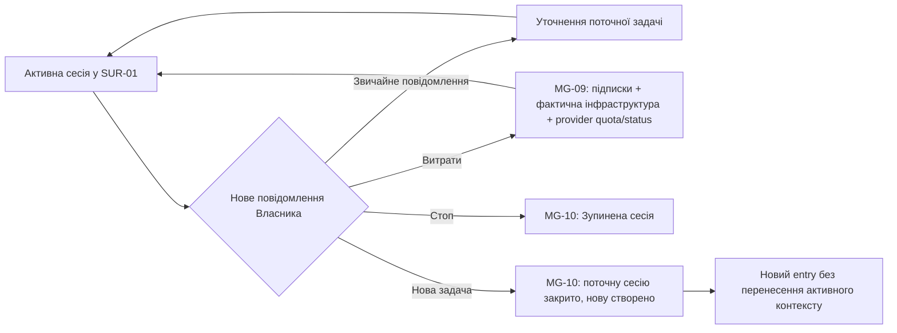
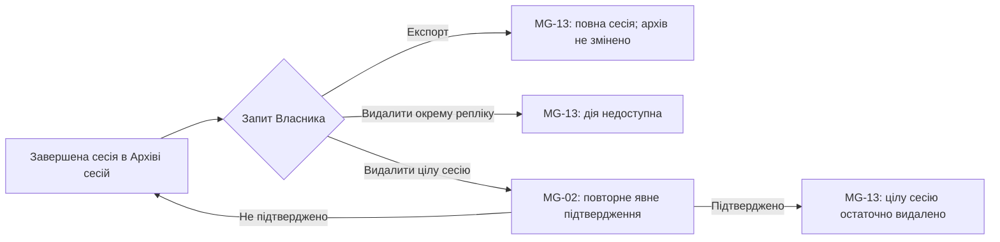
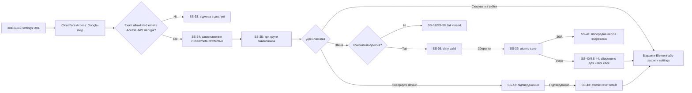

# Screen Map

- Продукт: `Personal Consultant`
- Версія карти: V1
- Дата: 16.08.2026
- owner_invocation_id: `ecf1a01e-95b2-4f6a-94ba-7b1915b4dd34`

V1 має рівно дві поверхні: щоденну приватну invite-only E2EE Matrix-кімнату у штатному Element та єдиний вузький responsive web-виняток `Налаштування власника`. Ця карта визначає їхні межі, стани, входи, виходи й переходи; вона не визначає макет, компоненти, фінальний текст, візуальний стиль або архітектуру.

## Source References

Порядок джерел відповідає `docs/guardrails.md`: актуальне явне рішення Власника має перевагу; `docs/product-idea.md` визначає намір V1; `docs/prd.md` — нормалізовану поведінку; `docs/project-context.md` — підтверджений контекст; `docs/canonical-terms.md` — канонічну мову без зміни поведінки; `docs/user-journey.md` — етапи, розгалуження, входи й виходи.

- `docs/product-idea.md` (`263a5d15949e2ebf70f9fb4fa8ba67ff1e882cb5ae2774ecf218ccff16586ac5`): дві поверхні V1, Element/Matrix, Candidate B, Google-only `Налаштування власника`, subscription OAuth-only межа і фактичні налаштування нової сесії.
- `docs/prd.md` (`2d9546dd7b0f4cd25dea0f225ffa35c0819966e3edb9efaa72f781f3fb70d660`): §3.2–3.5; §4–5; `US-001`–`US-029`; `FR-001`–`FR-046`; `NFR-001`–`NFR-019`; §8–12; `AC-001`–`AC-016`.
- `docs/project-context.md` (`529ee8b70ec81b2a4734cb7580e5bfc84052a9f2552b039cd52bd42dfe4b2fee`): дві поверхні, exact-email Google-вхід, responsive settings, три групи, atomic save, immutable active-session snapshot, OAuth/private-use constraints і risks.
- `docs/canonical-terms.md` (`75e8ab94a47faa0f89a51605543f2f643ce9b53c8513d26ee7d5bb54037f26fc`): Matrix і Candidate B vocabulary; `Налаштування власника`, `Google-вхід`, `Subscription OAuth`, `Моделі`, `Глибина міркування`, `Пресет швидкості`, `Фактичні налаштування сесії` та terms to avoid.
- `docs/guardrails.md` (`54c7ccd20d612e908f1038499c2db101d47e587c141a2d5363e003b2a0dbb3bc`): source order, двоповерхнева межа, Google Access/JWT, рівно три групи, atomic save, immutable snapshot, subscription OAuth containment і stop rules.
- `docs/user-journey.md` (`e4dfa9801ef0eab241c4b768719732628e37aebb068a8fd8067eeedbe1a6d7cd`): stages 1–10 для Element/Matrix, окремий Settings Journey `S1`–`S5`, failure paths, exits і success states.
- `README.md`: лише початкове позиціонування та принцип практичного результату. Історичний browser-preview не використано як поверхню V1.

Скорочення трасування: `PI` — `docs/product-idea.md`; `PRD` — `docs/prd.md`; `PC` — `docs/project-context.md`; `CT` — `docs/canonical-terms.md`; `GR` — `docs/guardrails.md`; `UJ` — `docs/user-journey.md`.

## Screen Inventory

### Поверхні V1

| ID | Поверхня | Розташування | Призначення | Межа | Трасування |
|---|---|---|---|---|---|
| `SUR-01` | Приватна Element/Matrix-кімната | Одна invite-only E2EE Matrix-кімната `Personal Consultant` у штатному Element на Mac, iPhone, Samsung Flip7/Android або Windows PC | Прийняти запит або точну команду, показати дозволи, перебіг роботи, результат, витрати й архівні дії в одному хронологічному потоці | Один Власник, один Matrix-акаунт бота на `matrix.org`, exact allowlist `room_id` + `owner_mxid`, перевірені й не відкликані пристрої, не більше однієї Активної сесії; без браузерного дублювання розмови, dashboard або іншої консультаційної поверхні | `PI: Межі V1`; `PRD: FR-001, FR-034, NFR-005, NFR-007, NFR-013, §8, §11`; `PC: §7, §9–11`; `UJ: Starting Context, Stage 1, Confirmed Facts And Constraints` |
| `SUR-02` | `Налаштування власника` | Зовнішній responsive web URL на desktop і mobile, захищений Cloudflare Access Google IdP та exact-email allowlist | Переглянути й атомарно зберегти рівно три групи налаштувань для нових сесій або повернути значення до default | Єдиний web-виняток; не чат, dashboard, архів, live status чи admin console; Google-вхід не є Subscription OAuth; без credentials, довільних model slug або зміни Активної сесії | `PRD: US-024–US-029, FR-037–FR-046, NFR-016–NFR-019, AC-012–AC-016`; `PC: §7–9, §11–13`; `UJ: Settings Journey S1–S5` |

Нова консультаційна репліка з'являється лише в `SUR-01`. `SUR-02` не дублює розмову, архів, перебіг агентів або витрати.

### Контракти груп повідомлень у `SUR-01`

Ці групи визначають, який змістовний блок існує у розмові та коли він з'являється. Вони не визначають фінальний текст, кількість рядків, візуальну композицію або технічний спосіб доставки.

| ID | Група повідомлень | Контракт | Коли з'являється | Трасування |
|---|---|---|---|---|
| `MG-01` | Запит або дія Власника | Текст, зображення, PDF, звичайне уточнення або користувацька команда в тому самому чаті | На вході до сесії та під час Активної сесії | `PRD: FR-003, FR-020–FR-022, FR-032–FR-033`; `UJ: Stages 1, 3, 7, 10` |
| `MG-02` | Запит згоди або окремого дозволу | Називає конкретну межу та очікує явного рішення Власника; перша згода чесно називає `matrix.org`, Cloudflare, OpenAI, Anthropic і те, що Matrix E2EE завершується на verified Matrix device бота в Cloudflare runtime; загальна згода або мовчання не переносяться на іншу дію | Перше використання; Особливо чутливий документ; продовження понад 10 хвилин; зовнішня чи високоризикова дія; особисте коучингове питання; остаточне видалення цілої сесії | `PRD: FR-002, FR-006, FR-024, FR-032, FR-035, NFR-005`; `GR: When To Ask`; `UJ: Stages 1–3, 8–10` |
| `MG-03` | Повідомлення про межу вхідних даних | Пояснює непідтримуваний тип без запуску аналізу; або повідомляє про зупинку Секрету, не повторюючи його; або переводить документ до очікування окремого підтвердження | Після перевірки вхідного тексту чи вкладення | `PRD: FR-003, FR-005–FR-006, AC-005`; `GR: When To Stop`; `UJ: Stage 3, Failure Path 3–5` |
| `MG-04` | Прийняття запиту й початок сесії | Підтверджує прийняття не пізніше 5 секунд; на початку нової сесії показує дату й час старту; повторна доставка Matrix-події не створює видимого дубля | Після підтвердження exact allowlist, перевіреного не відкликаного пристрою, room invariants, потрібної згоди та допустимості вхідних даних | `PRD: FR-001, FR-007, FR-017, NFR-001, NFR-007, NFR-009`; `UJ: Stages 1, 4` |
| `MG-05` | Пряма відповідь | Дає читабельну відповідь без зайвих агентів; рівень упевненості відповідає доказам, а невідоме не маскується | Після маршрутизації простого запиту в режим `Пряма відповідь` | `PRD: FR-008, FR-028–FR-030, AC-001`; `UJ: Stages 5, 6A` |
| `MG-06` | Склад консиліуму | Показує конкретні предметні ролі 2–5 окремих реальних Codex-сесій/тредів і участь окремого Claude Code-агента-критика. Один захищений Codex OAuth-стан не подається як один агент і не потребує клонування credentials; Claude Code використовує subscription OAuth/setup-token | Після успішного preflight і маршрутизації складного, багатосферного, високоризикового або явно позначеного запиту в `Консиліум` | `PRD: US-006–US-007, FR-008–FR-010, NFR-006, AC-002`; `UJ: Stages 5, 6B` |
| `MG-07` | Живий дослівний перебіг Candidate B | Кожне фактично надіслане агентське доручення, проміжна репліка, критика або виправлення показується в Element одразу, повністю й у канонічному порядку, без редагування, переказу, приховування або пакетування до фіналу. Усі видимі повідомлення надходять від одного Matrix-акаунта бота, містять конкретну роль і час `HH:MM`; адресована дискусія використовує нативні Matrix reply relationships; виправлення — лише новою реплікою | Під час незалежного першого проходу, адресованої A2A-дискусії та критики | `PRD: US-008–US-009, US-022, FR-011–FR-019, FR-034, NFR-002, NFR-010, AC-002–AC-003, AC-010`; `UJ: Stage 6B` |
| `MG-08` | Видимий поступ або пояснення очікування | Дає змістовне оновлення до спливу 60 секунд; правдиво повідомляє про звуження завдання, заміну агента або причину очікування | Під час Активної сесії, коли нової агентської репліки ще немає або агент не демонструє поступу | `PRD: FR-023, NFR-003, NFR-012`; `UJ: Stage 6B, Stage 8, Failure Path 6, 8` |
| `MG-09` | Облік витрат | Окремо показує налаштовані місячні платежі ChatGPT/Codex і Claude, фактичні інфраструктурні витрати та доступний provider-reported usage/ліміт/reset. Subscription AI usage сесії позначається як включене в підписку, недоступне — як `невідомо`; вигадана per-session token-cost, автоматична купівля credits і жорсткий ліміт не створюються | Після точної команди `Витрати` в активній або завершеній сесії | `PRD: US-021, FR-033, NFR-012, AC-009`; `CT: Облік витрат`; `UJ: Stage 7` |
| `MG-10` | Результат керування сесією | Для `Стоп` підтверджує припинення роботи; для `Нова задача` буквально повідомляє, що поточну сесію закрито, а нову створено без змішування контекстів | Після точної команди `Стоп` або `Нова задача` | `PRD: FR-021–FR-022, AC-004`; `CT: User Actions, Open Vocabulary Questions`; `UJ: Stage 7` |
| `MG-11` | Безпечний збій або неповний результат | Називає лише безпечну категорію збою: недоступний агент, неповний консиліум, брак доказів, OAuth expiry/revocation/refresh failure, invalid Claude setup-token, quota exhaustion, forbidden API/PAYG credential, непідтверджена private single-owner eligibility, room/device failure або непідтверджена цілісність. Показує provider-reported reset time, якщо він доступний, та позачатову дію; не містить token, `auth.json`, setup-token, reauth URL/code, не пропонує API/PAYG/credits fallback | Коли preflight або подальша перевірка fail closed, повний шлях недоступний і безпечний статус можна показати в `SUR-01`; інакше access failure завершується без protected data | `PRD: US-018, FR-001, FR-023, FR-028–FR-030, NFR-006–NFR-007, NFR-012, AC-006–AC-007`; `GR: When To Stop`; `UJ: Decision Points, Failure Path 8–11` |
| `MG-12` | Фінальна рекомендація | Послідовність коротких самодостатніх повідомлень: рішення; до трьох дій; критичні ризики, припущення й умова перегляду; за потреби — окрема цілісна Технічна частина | Після прямої роботи або консиліуму, коли є достатній результат або чітко названа наступна перевірка | `PRD: FR-025–FR-028, FR-035, AC-011`; `UJ: Stage 9, Climax Beat` |
| `MG-13` | Архів, експорт і видалення | Повідомляє доступний результат архівної дії: повний експорт без зміни архіву; відмова редагувати чи видаляти окрему репліку; запит повторного підтвердження та результат видалення цілої сесії | Після завершення сесії або явного запиту Власника щодо архіву | `PRD: FR-031–FR-032, AC-008`; `UJ: Stage 10, Exit Points` |

Жодна група не показує системні інструкції, приховані міркування моделей, журнали інструментів, технічні ID, номери повідомлень, секунди або сирі Markdown-маркери як код чату. Повне тіло Підтвердженої репліки агента не скорочується, не згортається й не редагується. Продукт не створює власного звуку; нові репліки використовують лише нативні сповіщення Element та операційної системи, якщо їх увімкнув Власник.

### Контракти груп налаштувань у `SUR-02`

Ці групи визначають лише семантичний контракт. Вони не визначають layout або компоненти.

| ID | Група | Контракт | Заборонено | Трасування |
|---|---|---|---|---|
| `SG-01` | Google-доступ до settings | Вхід лише через Cloudflare Access Google IdP; доступ лише точній allowlisted email Власника після валідації Access JWT | Password, OTP, magic link, інший IdP, публічна реєстрація, credential/OAuth UI; Google-вхід не подається як Subscription OAuth | `FR-037–FR-038`, `NFR-016`, `AC-012`; `UJ: Settings S1` |
| `SG-02` | Моделі | Два окремі typed allowlisted вибори: модель для Codex-агентів і модель для Claude Code-критика | Довільний model slug, спільний селектор, модель поза allowlist | `FR-039`, `NFR-017`, `AC-013`; `UJ: Settings S2–S3` |
| `SG-03` | Глибина міркування | Одна семантична шкала `low` / `medium` / `high` / `xhigh` для обох provider runtimes; сумісність перевіряється до збереження | Тихе пониження, provider-specific вигадане значення | `FR-040, FR-043`, `NFR-017`, `AC-013`; `UJ: Settings S3` |
| `SG-04` | Пресет швидкості | `швидко` / `збалансовано` / `ретельно` змінює лише orchestration budget/pacing нової сесії й не послаблює обов'язкові перевірки | Claude Fast Mode, API/PAYG/usage credits, per-agent/per-unit overrides, sound/motion | `FR-041–FR-042`, `NFR-018`, `AC-014`; `UJ: Settings S2–S3` |
| `SG-05` | Керування змінами й фактичні значення | Показує current, default і effective значення; дозволяє скасувати локальні зміни, атомарно зберегти валідний набір або після підтвердження повернути default; новий snapshot діє лише для наступної сесії | Partial write, зміна фактичних налаштувань Активної сесії, advanced/admin settings | `FR-043–FR-046`, `NFR-017, NFR-019`, `AC-015–AC-016`; `UJ: Settings S2–S5` |

## Surface Closure Matrix

| Потреба або гілка journey | Поверхня й підтримка | Тип замикання | Трасування |
|---|---|---|---|
| Пройти перше приєднання, recovery, verification або revocation | Нативні Element/Matrix-системні стани перед `SS-01`; новий пристрій відновлює доступ за recovery key і проходить перевірку, втрачений або скомпрометований — відкликається | Нативна host-client передумова, не новий продуктовий screen; неперевірений або відкликаний пристрій не запускає роботу | `PRD: US-001–US-002, FR-001, AC-006, AC-010`; `UJ: Stage 1, Failure Path 1–3` |
| Перевірити `room_id` + `owner_mxid`, пристрій і room invariants | Системна перевірка `SS-01` до будь-якої захищеної відповіді; при відмові `SS-04`, агенти не запускаються й активна сесія Власника не змінюється | Системна відповідь без нового screen; безпечний видимий failure використовує `MG-11`, інакше exit без protected data | `PRD: FR-001, NFR-007, AC-006`; `GR: When To Stop`; `UJ: Stage 1` |
| Отримати першу Згоду на обробку даних | `MG-02` → явна згода або припинення звичайної обробки | Група повідомлень і permission-state | `PRD: FR-002`; `UJ: Stage 2` |
| Прийняти текст, зображення або PDF | `MG-01`; перевірка меж даних; `MG-03` для винятків | Вхід у тій самій розмові | `PRD: FR-003–FR-006`; `UJ: Stage 3` |
| Не обробляти непідтримуваний тип, Секрет або непідтверджений чутливий документ | `MG-03` і, для чутливого документа, `MG-02` | Error / permission-state без запуску аналізу | `PRD: AC-005`; `UJ: Failure Path 3–5` |
| Показати, що роботу прийнято, й відокремити нову Сесію | `MG-04` | Стан прийняття та session-start у хронології чату | `PRD: FR-007, FR-017, NFR-001, NFR-009`; `UJ: Stage 4` |
| Вибрати найменший достатній режим | Системне рішення Головного консультанта → `MG-05` або `MG-06` | Розгалуження без окремого меню чи screen | `PRD: FR-008`; `UJ: Stage 5` |
| Перевірити subscription auth, quota й private eligibility до agent launch/model call | `SS-28`; успіх веде до прямої відповіді або консиліуму, невдача — `SS-29` + безпечний `MG-11` | Системний preflight і fail-closed same-chat status; reauth виконується поза Matrix, без credential/code у чаті | `PRD: §3.5, FR-009–FR-010, FR-030, NFR-006, AC-002, AC-007`; `GR: When To Stop`; `UJ: Decision Points, Failure Path 8–11` |
| Дати просту відповідь без зайвих агентів | `MG-05` | Success-state прямої відповіді | `PRD: AC-001`; `UJ: Stage 6A` |
| Показати справжній дослівний консиліум Candidate B, ролі, адресовану дискусію і критику | `MG-06`, `MG-07`, `MG-08`; один Matrix-акаунт бота, роль + `HH:MM` у повідомленні, native Matrix reply relationships для адресування | Long-running conversational state | `PRD: FR-009–FR-019, FR-023, FR-034`; `UJ: Stage 6B` |
| Дозволити уточнення активної задачі | Нове `MG-01` повертає роботу до актуального контексту тієї самої Активної сесії | Return-path без паралельної сесії | `PRD: FR-020`; `UJ: Stage 7` |
| Показати витрати без зупинки основного потоку | `MG-09`, після чого активний потік може тривати | Command response і return-path | `PRD: FR-033, AC-009`; `UJ: Stage 7` |
| Зупинити або замінити задачу | `MG-10` для `Стоп` або `Нова задача` | Exit або перехід до нового entry | `PRD: FR-021–FR-022`; `UJ: Stage 7` |
| Не залишати Власника без видимого поступу | `MG-07` або `MG-08` у межах 60 секунд | Loading / progress-state без custom spinner | `PRD: NFR-003`; `UJ: Stage 6B` |
| Попросити дозвіл продовжити понад 10 хвилин | `MG-02`; дозвіл повертає до `MG-07`/`MG-08`, відсутність дозволу зупиняє продовження | Long-running permission-state | `PRD: FR-024, NFR-004`; `UJ: Stage 8` |
| Чесно показати збій, брак доказів або неповний результат | `MG-11` | Error / partial-state з наступною перевіркою або дією | `PRD: FR-028–FR-030, NFR-012`; `UJ: Stage 8, Failure Path` |
| Перетворити роботу на одне рішення | `MG-12` | Success або чесний evidence-limited result | `PRD: FR-025–FR-028`; `UJ: Stage 9` |
| Запросити дозвіл на зовнішню чи високоризикову дію або особисте коучингове питання | `MG-02`; без дозволу відповідна дія чи питання не переходить межу | Permission-state | `PRD: §3.4, FR-035`; `GR: When To Ask`; `UJ: Stakes And Constraints` |
| Зберегти, експортувати або видалити сесію | Системне архівування після підтвердженого завершення; `MG-13` для запиту експорту, відмови редагувати окрему репліку та підтвердженого видалення | System response і archive-control state без окремої бібліотеки чи dashboard | `PRD: FR-031–FR-032, AC-008`; `UJ: Stage 10` |
| Показати нову репліку | Новий `MG-05`, `MG-07`, `MG-08`, `MG-11` або `MG-12` з'являється в тій самій приватній E2EE Matrix-кімнаті; сповіщення й звук, якщо ввімкнені, належать Element/ОС | Та сама продуктова поверхня, без окремого screen і без власного продуктового звуку | `PRD: FR-034, NFR-015, AC-010`; `UJ: Confirmed Facts And Constraints` |
| Відкрити налаштування й підтвердити особу | `SUR-02`: зовнішній settings URL → Cloudflare Access Google IdP → exact-email policy → origin JWT validation | Окремий web-entry; явне надання або відмова в доступі, без ботового посилання | `FR-037–FR-038`, `NFR-016`, `AC-012`; `UJ: Settings S1` |
| Завантажити current, default і effective значення | `SUR-02`; `SG-05`; `SS-34`–`SS-35` | Loading → read-only current/default/effective contract до редагування | `FR-043, FR-045`; `UJ: Settings S2` |
| Змінити рівно три групи | `SUR-02`; `SG-02`–`SG-04` | Typed вибір моделей, спільна глибина міркування і orchestration preset швидкості | `FR-039–FR-042`, `NFR-017–NFR-018`, `AC-013–AC-014`; `UJ: Settings S2–S3` |
| Заблокувати несумісну комбінацію або capability drift | `SUR-02`; `SS-37`–`SS-38` | Fail closed до збереження і до запуску нової сесії; без тихого downgrade | `FR-043`, `NFR-017`, `AC-013`; `UJ: Settings Failure Path 3` |
| Зберегти валідний набір | `SUR-02`; `SG-05`; `SS-39`–`SS-41` | Одна atomic save-операція: або весь набір прийнято, або попередня версія збережена без partial write | `FR-044`, `NFR-019`, `AC-015`; `UJ: Settings S4` |
| Скасувати або повернути default | `SUR-02`; `SG-05`; `SS-42`–`SS-43` | Cancel відкидає лише незбережені зміни; reset потребує підтвердження й атомарно зберігає default | `FR-044–FR-045`, `AC-015`; `UJ: Settings S4` |
| Зберегти стабільність Активної сесії | `SUR-02`; `SS-44` | Видиме повідомлення: збережене налаштування діє лише для нової сесії; active effective snapshot не мутує | `FR-046`, `AC-016`; `UJ: Settings S4–S5` |
| Працювати з mobile, довгим вмістом або без мережі | `SUR-02`; `SS-45`–`SS-46` | Однаковий контракт desktop/mobile; offline не призводить до partial write | `NFR-016, NFR-019`; `UJ: Settings Channel мобільний доступ, Failure Path 5` |
| Повернутися до консультації | `SUR-02` → відкрити штатний Element / закрити settings | Exit до `SUR-01`; вхід з ботової репліки не є обов'язковим | `UJ: Settings S5, Exit Points` |

Surface closure досягнуто: кожен етап, decision point, failure path і команда з `docs/user-journey.md` замикаються в `SUR-01` або в єдиному дозволеному web-винятку `SUR-02`; третьої поверхні немає.

## Route Map

### Основний шлях

```mermaid
flowchart LR
    A["Native Element: invitation / recovery / device verification"] --> B{"Exact room_id + owner_mxid, verified device та room invariants підтверджено?"}
    B -->|"Recovery потрібен"| R["Native Matrix recovery, потім verification"]
    R --> B
    B -->|"Revocation потрібен"| V["Native Matrix revocation; втрачений пристрій не працює"]
    V --> B
    B -->|"Ні"| X1["SS-04: exit без агентів і захищених даних"]
    B -->|"Так"| C{"Чинна Згода на обробку даних?"}
    C -->|"Ні"| D["MG-02: запит одноразової згоди"]
    D -->|"Не надано"| X2["Exit: звичайна обробка не починається"]
    D -->|"Надано"| E{"Вхід допустимий?"}
    C -->|"Так"| E
    E -->|"Непідтримуваний тип"| X3["MG-03: пояснення без аналізу"]
    E -->|"Секрет"| X4["MG-03: зупинка до агентів і журналу"]
    E -->|"Особливо чутливий або невизначений документ"| F["MG-02: окреме підтвердження"]
    F -->|"Не підтверджено"| X5["Очікування дозволу: документ не обробляється"]
    F -->|"Підтверджено"| G["MG-04: прийняття й Активна сесія"]
    E -->|"Текст, зображення або PDF"| G
    G --> H{"Режим"}
    H --> AU{"SS-28: subscription OAuth + quota + private eligibility preflight"}
    AU -->|"Fail closed"| AX["SS-29 / MG-11: безпечний статус; reauth лише поза Matrix або очікування reset"]
    AX -->|"Provider flow завершено поза Matrix; свіжий preflight"| AU
    AX -->|"Не відновлено"| X7["Exit: без agent launch, model call, API/PAYG/credits fallback"]
    AU -->|"Успіх; Пряма відповідь"| I["MG-05: пряма відповідь"]
    AU -->|"Успіх; Консиліум"| J["MG-06: окремі Codex sessions/threads + Claude Code critic"]
    J --> K["MG-07 / MG-08: Candidate B, live verbatim actual-agent messages"]
    K --> L{"Результат готовий до 10 хвилин?"}
    L -->|"Так"| M["MG-12: Фінальна рекомендація"]
    L -->|"Потрібно більше часу"| N["MG-02: причина і дозвіл продовжити"]
    N -->|"Дозволено"| K
    N -->|"Не дозволено"| X6["Exit: робота не продовжується"]
    K -->|"Збій або брак доказів"| O["MG-11: Збій або неповний результат"]
    I --> P["Завершення й Архів сесій, якщо цілісність підтверджено"]
    M --> P
    O --> Q["Exit: частковий результат і наступна перевірка або дія"]
```

### Втручання під час Активної сесії

### Архівні дії в тій самій розмові

### Налаштування власника

## Navigation Model

- V1 має рівно дві продуктові локації: `SUR-01` для щоденної консультації і `SUR-02` для вузьких налаштувань. Спільного dashboard, app-shell, архівної сторінки, cost-dashboard або consent-center немає.
- Базова навігація — хронологічний потік тієї самої розмови. Підтверджені репліки відображаються в канонічному порядку реєстрації.
- Нове звичайне повідомлення під час Активної сесії є уточненням, а не переходом до паралельної сесії.
- Точні команди `Стоп`, `Нова задача` й `Витрати` доступні в тій самій розмові. Вони не відкривають окремих screen.
- Auth/quota preflight не відкриває login-screen у продукті. Безпечний fail-closed статус з'являється в `SUR-01`, а provider-managed browser/device reauth або `claude setup-token` Власник завершує лише поза Matrix; у чат повертається лише факт готовності до свіжої перевірки, не credential, URL чи code.
- `Стоп` завершує активний маршрут у стані `Зупинена сесія`. `Нова задача` закриває поточний маршрут і повертає Власника до entry нового запиту без успадкування попереднього активного контексту.
- Дозвіл на продовження понад 10 хвилин повертає до живого перебігу. Відмова або відсутність дозволу не дає продовжити відповідну роботу.
- Експорт, запит видалення та його підтвердження відбуваються в `SUR-01`; точні користувацькі формулювання для цих дій джерела не визначають.
- Вхід до `SUR-02` починається із зовнішнього settings URL і проходить через Cloudflare Access Google-вхід. Джерела не вимагають посилання з ботової репліки.
- Вихід з `SUR-02` — закрити settings або відкрити штатний Element. Налаштування не переносять до web-чату, а daily UX не переноситься з Element.
- Усі консультаційні репліки залишаються в `SUR-01`; продукт не додає третьої поверхні, окремих Matrix-акаунтів агентів або власного звуку.

## Journey-To-Screen Trace

| Journey stage або branch | Поверхня / група | Вхід | Вихід або return-path | Вимоги |
|---|---|---|---|---|
| 1. Перше приєднання, пристрій і перевірка доступу | `SUR-01`; `SS-25`/`SS-26` як нативні Element/Matrix-передумови; `SS-01` access-check; `SS-04`/`SS-27` failure | Invitation або новий/втрачений пристрій; далі Matrix-подія з exact `room_id` + `owner_mxid` | Recovery + verification або revocation → повторна перевірка; успіх → до згоди; failure → exit без агентів і protected data | `US-001–US-002`, `FR-001`, `NFR-007`, `AC-006`, `AC-010`; `GR: When To Stop` |
| 2. Перше використання і згода | `MG-02` | Підтверджені exact allowlist, verified device і room invariants без чинної згоди | До перевірки вхідних даних або exit без обробки | `FR-002`, `NFR-005` |
| 3. Підтримуваний звичайний вхід | `MG-01` → `MG-04` | Текст, зображення або PDF | До вибору режиму | `FR-003–FR-004`, `AC-005` |
| 3. Непідтримуваний тип | `MG-03` | Інший тип вкладення | Exit без аналізу | `FR-003` |
| 3. Секрет | `MG-03` | Виявлена заборонена категорія даних | Exit до агентів і журналу | `FR-005`, `AC-005` |
| 3. Особливо чутливий або невизначений документ | `MG-02`, `MG-03` | Документ перетинає безпечну межу | Після дозволу — до `MG-04`; без дозволу — відповідний документ не обробляється | `FR-006`, `AC-005` |
| 4. Прийняття й початок сесії | `MG-04` | Допустимий запит | До вибору режиму; дубль події не дублює видимий потік | `FR-007`, `FR-017`, `NFR-001`, `NFR-009` |
| 5. Вибір режиму | Системне рішення в `SUR-01` | Прийнятий запит | `MG-05` або `MG-06` | `FR-008` |
| 5. Передзапусковий auth/quota/private preflight | `SS-28`; failure → `SS-29` + `MG-11` | Визначено потрібний provider/agent mode, але model call ще не запущено | Subscription OAuth, quota й private eligibility підтверджено → `MG-05` або `MG-06`; failure → безпечний статус і exit/очікування reset/out-of-band reauth | `US-006–US-007`, `US-018`, `FR-009–FR-010`, `FR-030`, `NFR-006`, `AC-002`, `AC-007`; `UJ: Decision Points` |
| 6A. Пряма відповідь | `MG-05` | Простий запит після успішного Codex preflight | Завершення й архів за підтвердженої цілісності | `FR-028–FR-030`, `AC-001`, `AC-007` |
| 6B. Склад і старт консиліуму | `MG-06`, потім `MG-07` | Складний або явно позначений запит після успішного Codex + Claude Code preflight | До живого перебігу; окремі реальні Codex sessions/threads використовують один auth state, критик — Claude subscription OAuth/setup-token; перша агентська репліка до 30 секунд | `US-006–US-007`, `FR-009–FR-015`, `NFR-002`, `NFR-006`, `AC-002` |
| 6B. Живий дослівний перебіг Candidate B | `MG-07`, `MG-08` | Активний консиліум | Усі actual-agent assignments, intermediate replies, critiques і corrections наживо від одного бота; native Matrix replies зберігають адресованість; далі до фіналу, дозволу, уточнення, команди або failure-state | `US-008–US-009`, `US-022`, `FR-011–FR-019`, `FR-023`, `FR-034`, `NFR-003`, `AC-003`, `AC-010` |
| 7. Уточнення | `MG-01` | Звичайне повідомлення під час Активної сесії | Повернення до актуального активного потоку | `FR-020`, `AC-004` |
| 7. `Витрати` | `MG-09` | Точна команда в активній або завершеній сесії | Повернення до поточного контексту | `FR-033`, `AC-009` |
| 7. `Стоп` | `MG-10` | Точна команда під час Активної сесії | `Зупинена сесія`; пізні відповіді не продовжують потік | `FR-021`, `AC-004` |
| 7. `Нова задача` | `MG-10` | Точна команда | Новий entry без змішування контекстів | `FR-022`, `AC-004` |
| 8. Понад 10 хвилин | `MG-02` | До спливу стандартної межі без готового результату | Після дозволу — `MG-07`/`MG-08`; без дозволу — не продовжувати | `FR-024`, `NFR-004`, `AC-007` |
| 8. Збій, заміна або брак доказів | `MG-08`, `MG-11` | Немає поступу, агент/провайдер недоступний або висновок непідтверджений | До активного потоку після заміни або exit із частковим результатом і наступною перевіркою | `FR-023`, `FR-028–FR-030`, `NFR-012`, `AC-007` |
| 8. Auth/quota/private eligibility втрачено | `SS-29`, `MG-11` | Expiry, revocation, refresh failure, invalid setup-token, quota exhaustion, forbidden API/PAYG credential або third-party/ineligible path до запуску чи під час роботи | Зупинити залежні model calls; зберегти вже підтверджені репліки; показати safe status; після reset або out-of-band reauth — свіжий `SS-28`, інакше exit із неповним результатом | `US-018`, `FR-030`, `NFR-006`, `NFR-012`, `AC-007`; `UJ: Failure Path 8–11` |
| 9. Фінальна рекомендація | `MG-12` | Рішення стабілізоване або потрібна зовнішня перевірка | Завершення й архів; окрема дія може перейти в `MG-02` дозволу | `FR-025–FR-028`, `FR-035`, `AC-011` |
| 10. Архівування | Системний стан у `SUR-01` | Нормальне завершення з підтвердженою цілісністю | Завершена сесія в Архіві сесій | `FR-031`, `NFR-010–NFR-011` |
| 10. Видалення | `MG-02`, `MG-13` | Запит видалити цілу сесію | Після підтвердження — остаточне видалення; без нього — архів без змін | `FR-032`, `AC-008` |
| Settings S1. Перехід і Google-вхід | `SUR-02`, `SG-01`, `SS-30`–`SS-33` | Зовнішній settings URL; Google-вхід через Cloudflare Access | Exact allowlisted email і валідний JWT → load settings; wrong email, alternative method або invalid/missing/expired JWT → permission denied | `US-024`, `FR-037–FR-038`, `NFR-016`, `AC-012` |
| Settings S2. Current/default/effective і три групи | `SUR-02`, `SG-02`–`SG-05`, `SS-34`–`SS-35` | Доступ надано | Завантажено окремі Codex/Claude моделі, спільну глибину, orchestration preset та current/default/effective значення | `US-025–US-026`, `FR-039–FR-042, FR-045`, `NFR-017–NFR-018`, `AC-013–AC-014` |
| Settings S3. Зміна і capability validation | `SUR-02`, `SG-02`–`SG-04`, `SS-36`–`SS-38` | Власник змінює дозволене значення | Сумісний dirty set → save available; несумісність, drift або provider unavailable → fail closed, без silent downgrade | `US-027`, `FR-043`, `NFR-017`, `AC-013` |
| Settings S4. Atomic save, cancel або defaults | `SUR-02`, `SG-05`, `SS-39`–`SS-44` | Валідний dirty set, cancel або підтверджений reset | Повний atomic success або попередня версія без змін; збережене не мутує active effective snapshot | `US-028–US-029`, `FR-044–FR-046`, `NFR-019`, `AC-015–AC-016` |
| Settings S5. Повернення до Element | `SUR-02` → `SUR-01` | Збереження, reset, cancel або закриття settings | Відкрити штатний Element або закрити web-поверхню; daily consultation UX не змінено | `FR-046`, `AC-016`; `UJ: Settings S5, Exit Points` |
| Сповіщення про нову репліку | Нативна поведінка Element/ОС для `SUR-01` | Нова вихідна репліка | Відкриття тієї самої Matrix-кімнати засобами Element; власного продуктового звуку немає | `FR-034`, `NFR-015`, `AC-010` |

## Screen States

Усі стани належать `SUR-01`; це стани розмови або системної відповіді, а не окремі екрани.

| ID | Стан | Видимий або системний контракт | Допустимі переходи | Трасування |
|---|---|---|---|---|
| `SS-01` | Перевірка Matrix-доступу й room/device state | До підтвердження Matrix-події, exact allowlist `room_id` + `owner_mxid`, verified/non-revoked device та room invariants агенти не запускаються, захищені дані не повертаються | `SS-02`; `SS-04`; `SS-25`; `SS-26`; `SS-27`; або exit без зміни активної сесії | `US-002`, `FR-001`, `NFR-007`, `AC-006`; `GR: When To Stop` |
| `SS-02` | Очікування Згоди на обробку даних | `MG-02` просить одноразову згоду через `matrix.org`, Cloudflare, OpenAI та Anthropic і чесно пояснює metadata/plaintext trust boundary | Згода → `SS-03`; відмова/відсутність → звичайна обробка не починається | `FR-002`, `NFR-005`; `UJ: Stage 2` |
| `SS-03` | Перевірка вхідних даних | Підтримуваний вхід перевіряється на тип, Секрет і межу Особливо чутливого документа | `SS-05`, `SS-06`, `SS-07` або `SS-08` | `FR-003–FR-006`; `UJ: Stage 3` |
| `SS-04` | Exact Matrix-доступ не підтверджено | Інший `room_id`/`owner_mxid`, підроблена подія або неперевірений чи відкликаний пристрій не запускають агентів, не повертають protected data й не змінюють активну сесію Власника | `SS-25`/`SS-26`, якщо recovery/revocation є доступною нативною дією; інакше exit | `FR-001`, `NFR-007`, `AC-006` |
| `SS-05` | Непідтримуваний тип | `MG-03` зрозуміло повідомляє про межу; аналіз не запускається | Новий допустимий `MG-01` або exit | `FR-003`; `UJ: Failure Path 3` |
| `SS-06` | Секрет зупинено | Секрет не повторюється, не передається агентам і не реєструється | Новий безпечний `MG-01` або exit | `FR-005`; `GR: When To Stop` |
| `SS-07` | Очікування дозволу на чутливий документ | `MG-02` просить окреме підтвердження; відповідний документ не обробляється до рішення | Дозвіл → `SS-08`; без дозволу → документ не обробляється | `FR-006`, `AC-005` |
| `SS-08` | Активна сесія: запит прийнято | `MG-04` показує підтвердження до 5 секунд і, для нової сесії, дату й час старту | Після вибору режиму → `SS-28`; уточнення й команди доступні | `FR-007`–`FR-008`, `FR-017`, `NFR-001` |
| `SS-09` | Пряма відповідь | `MG-05` дає результат без зайвого консиліуму й без псевдовпевненості | `SS-19`, `SS-20` або `SS-21` | `FR-008`, `FR-028–FR-030`, `AC-001` |
| `SS-10` | Формування консиліуму | Після успішного `SS-28` `MG-06` показує конкретні ролі: окремі реальні Codex sessions/threads через один захищений Codex OAuth-стан і окремий Claude Code-критик через subscription OAuth/setup-token; перша Підтверджена репліка агента має з'явитися до 30 секунд | `SS-11`, `SS-12`, `SS-19` або `SS-29` | `FR-009–FR-010`, `NFR-002`, `NFR-006`, `AC-002` |
| `SS-11` | Живий дослівний перебіг Candidate B | `MG-07` показує всі фактично надіслані agent assignments, intermediate replies, critiques і corrections наживо, повністю та в канонічному порядку від одного Matrix-акаунта бота; роль + `HH:MM` містяться всередині повідомлення, native Matrix reply relationship зберігає адресованість | Продовження `SS-11`; `SS-12`; `SS-13`; `SS-14`; `SS-15`; `SS-16`; `SS-19`; `SS-20`; auth/quota/private eligibility failure → `SS-29` | `US-008–US-009`, `US-018`, `US-022`, `FR-011–FR-019`, `FR-030`, `FR-034`, `AC-003`, `AC-007`, `AC-010` |
| `SS-12` | Видимий поступ, пояснення очікування або заміна агента | `MG-08` не залишає понад 60 секунд без змістовного оновлення чи пояснення й правдиво показує зміну агента | Повернення до `SS-11` або `SS-19` | `FR-023`, `NFR-003`, `NFR-012` |
| `SS-13` | Уточнення активної сесії | Новий звичайний `MG-01` додається до поточної задачі без паралельної сесії | Повернення до `SS-09`, `SS-10` або `SS-11` за актуальним режимом | `FR-020`, `AC-004` |
| `SS-14` | Облік витрат показано | `MG-09` окремо містить налаштовані місячні платежі за ChatGPT/Codex і Claude, фактичні інфраструктурні витрати та доступний provider-reported usage/ліміт/reset. AI usage сесії позначено як включене в підписку; недоступне — `невідомо`; per-session token charge не вигадується | Повернення до попереднього active/completed context | `US-021`, `FR-033`, `NFR-012`, `AC-009`; `CT: Облік витрат` |
| `SS-15` | Зупинена сесія | Після `Стоп` немає нових модельних викликів; виконуване скасовується там, де це підтримує провайдер; пізні відповіді не публікуються як продовження | Exit; подальший архівний статус відкритий | `FR-021`, `AC-004`; `CT: Зупинена сесія` |
| `SS-16` | Поточну сесію закрито, нову створено | `MG-10` буквально описує перехід; попередній робочий контекст не стає активним контекстом нової задачі | Новий `SS-01`/`SS-02`/`SS-03` за чинним доступом і згодою | `FR-022`, `AC-004`; `CT: Open Vocabulary Questions` |
| `SS-17` | Очікування дозволу продовжити понад 10 хвилин | `MG-02` до спливу межі називає причину; без явного дозволу робота не продовжується | Дозвіл → `SS-11`; без дозволу → exit без продовження | `FR-024`, `NFR-004`, `AC-007` |
| `SS-18` | Очікування іншого окремого дозволу | `MG-02` чітко обмежує дозвіл конкретною зовнішньою чи високоризиковою дією або особистим коучинговим питанням | Дозвіл → лише названа дія/питання; без дозволу → відповідна межа не переходиться | `PRD: §3.4, FR-035`; `GR: When To Ask` |
| `SS-19` | Збій або неповний результат | `MG-11` правдиво називає збій, недоступність, неповноту, брак доказів або непідтверджену цілісність і дає доступну наступну перевірку чи дію | Повернення до активного потоку лише якщо це прямо випливає з доступної дії; інакше exit | `FR-023`, `FR-028–FR-030`, `NFR-012`; `GR: When To Stop` |
| `SS-20` | Фінальна рекомендація | `MG-12` дає один синтезований результат короткими самодостатніми повідомленнями; не більше трьох дій; Технічна частина лише за потреби | `SS-21` за підтвердженої цілісності; `SS-18` для окремого дозволу на дію | `FR-025–FR-028`, `FR-035`, `AC-011` |
| `SS-21` | Завершена сесія в Архіві сесій | Зашифрований безстроковий запис із незмінним тілом і канонічним порядком; статус успіху не використовується без доказу цілісності | `SS-14`, `SS-22`, `SS-23` або зберігання без дії | `FR-031`, `NFR-010–NFR-011`; `GR: Verification Rules` |
| `SS-22` | Експорт отримано | `MG-13` повертає повну сесію зі збереженням змісту й порядку; архів не змінюється | Повернення до `SS-21` | `FR-032`, `AC-008` |
| `SS-23` | Очікування підтвердження видалення | `MG-02` просить повторне явне підтвердження видалити цілу сесію; окрему репліку видалити не можна | Підтверджено → `SS-24`; не підтверджено → `SS-21` | `FR-032`, `AC-008`; `GR: When To Ask` |
| `SS-24` | Цілу сесію видалено | `MG-13` відображає результат остаточного видалення цілої сесії | Exit | `FR-032`, `AC-008` |
| `SS-25` | Нативне recovery і verification потрібні | Element/Matrix відновлює ключі нового пристрою за recovery key; після цього пристрій має пройти перевірку. Recovery key не показується в `SUR-01`, не журналюється й не передається агентам | Успішно → `SS-01`; неуспішно → exit без розшифрування й обробки нових робочих повідомлень | `US-002`, `FR-001`, `AC-006`; `GR: When To Stop` |
| `SS-26` | Відкликання пристрою потрібне | Втрачений або скомпрометований Matrix-пристрій відкликається нативними засобами; він не може бути активним production-клієнтом | Відкликано й інший пристрій перевірено → `SS-01`; інакше exit | `US-002`, `AC-006`; `GR: When To Stop` |
| `SS-27` | Room invariants не підтверджено | `matrix.org`, E2EE/invite-only, joined membership рівно Власник + бот, no pending invites, history `joined`, no public address/listing, no guests/bridges/widgets або verified devices не підтверджено | Після відновлення інваріантів → `SS-01`; без цього exit | `GR: Forbidden Changes, When To Stop`; `UJ: Stage 1` |
| `SS-28` | Передзапусковий subscription auth/quota/private preflight | До кожного model call і запуску залежного агента система підтверджує дозволений subscription OAuth mode, потрібну квоту, відсутність API/PAYG credentials і private single-owner eligibility. Для Codex перевіряється один захищений managed-refresh auth state; для критика — Claude subscription OAuth/setup-token | Успіх → `SS-09` або `SS-10`; unknown/expired/revoked/refresh failure/invalid setup-token/quota exhausted/forbidden credential/third-party or ineligible path → `SS-29` | `PRD: §3.5, FR-009–FR-010, FR-030, NFR-006, AC-002, AC-007`; `GR: When To Stop`; `UJ: Decision Points` |
| `SS-29` | Fail-closed auth/quota/private boundary | Жодний залежний agent launch або model call не відбувається. `MG-11` показує безпечну категорію причини, provider-reported reset time й позачатову наступну дію, якщо вони відомі; token, setup-token, `auth.json`, reauth URL/code не приймаються в Matrix; API/PAYG/credits fallback не пропонується | Provider reset або Власник завершує provider-managed reauth поза Matrix → свіжий `SS-28`; інакше exit/неповний результат. Уже підтверджені репліки не змінюються | `US-018`, `FR-030`, `NFR-006`, `NFR-012`, `AC-007`; `GR: When To Stop`; `UJ: Failure Path 8–11` |
| `SS-30` | Вхід до `Налаштувань власника` | Власник відкриває зовнішній settings URL; це не посилання на чат, dashboard чи архів | Передати запит Cloudflare Access → `SS-31` | `US-024`, `FR-037`; `UJ: Settings S1` |
| `SS-31` | Google-вхід і Access-перевірка тривають | Cloudflare Access виконує Google-вхід і exact-email policy; продукт не збирає password, OTP, magic link чи Subscription OAuth | Доступ надано → `SS-32`; відмовлено → `SS-33` | `FR-037–FR-038`, `NFR-016`, `AC-012` |
| `SS-32` | Google-доступ надано | Exact allowlisted email підтверджено, origin прийняв валідний Access JWT; Google-вхід лишається окремим від provider Subscription OAuth | `SS-34` | `FR-038`, `NFR-016`, `AC-012` |
| `SS-33` | Доступ до settings відхилено | Wrong email, інший метод/IdP або missing, invalid чи expired JWT не відкривають protected settings і не показують їхніх значень | Повторний дозволений Google-вхід або exit; без fallback | `FR-037–FR-038`, `NFR-016`, `AC-012`; `GR: When To Stop` |
| `SS-34` | Завантаження current/default/effective | Після access grant система отримує узгоджену версію трьох груп, default значення і фактичні налаштування Активної сесії, якщо вона є | Успіх → `SS-35`; offline/provider/config failure → `SS-38`, `SS-45` | `FR-043, FR-045–FR-046`, `NFR-017, NFR-019`; `UJ: Settings S2` |
| `SS-35` | Current/default/effective і рівно три групи завантажені | Доступні лише окремі allowlisted Codex/Claude моделі, спільна глибина `low`/`medium`/`high`/`xhigh` і пресет `швидко`/`збалансовано`/`ретельно`; active effective snapshot показаний окремо від наступних settings | Зміна → `SS-36`/`SS-37`; reset → `SS-42`; exit → Element/закриття | `FR-039–FR-043, FR-045–FR-046`, `AC-013–AC-014, AC-016` |
| `SS-36` | Dirty valid | Незбережений набір відрізняється від current і пройшов capability validation для обох runtimes; mandatory guards не послаблені | Зберегти → `SS-39`; скасувати → `SS-35`; нова несумісність → `SS-37` | `FR-039–FR-043`, `NFR-017–NFR-018`, `AC-013–AC-014` |
| `SS-37` | Несумісний набір | Невідома або несумісна model/effort/preset комбінація позначена як невалідна; save і запуск нової сесії з цим набором заблоковані | Вибрати сумісний набір → `SS-36`; скасувати → `SS-35` | `FR-043`, `NFR-017`, `AC-013` |
| `SS-38` | Capability drift або provider unavailable | Система не може підтвердити allowlist/capability або provider status; save й нова сесія fail closed, без тихої заміни моделі чи глибини | Після відновлення і свіжої перевірки → `SS-35`/`SS-36`; інакше exit | `FR-043`, `NFR-017`, `AC-013`; `GR: When To Stop` |
| `SS-39` | Atomic save in progress | Валідний повний набір зберігається як одна версійна операція; повторне save не створює partial/duplicate write | Успіх → `SS-40`; збій/конфлікт версії/offline → `SS-41`/`SS-45` | `FR-044`, `NFR-019`, `AC-015` |
| `SS-40` | Atomic save succeeded | Увесь валідний набір став current для нових сесій; partial success немає | `SS-44`; потім `SS-35` або exit до Element | `FR-044, FR-046`, `NFR-019`, `AC-015–AC-016` |
| `SS-41` | Atomic save failed | Жодне з трьох значень не змінено; попередня узгоджена версія залишається current, а active snapshot не змінюється | Виправити/reload/retry після свіжої перевірки або exit | `FR-044`, `NFR-019`, `AC-015`; `UJ: Settings Failure Path 4–5` |
| `SS-42` | Підтвердження reset to defaults | Повернення рівно трьох груп до default вимагає явного підтвердження; до нього current не змінюється | Підтверджено → atomic reset й `SS-43`; скасовано → `SS-35`/`SS-36` | `FR-045`, `AC-015` |
| `SS-43` | Reset result | Успішний reset атомарно робить default новим current для наступної сесії; збій залишає попередню версію без partial write | Успіх → `SS-44`; збій → `SS-41` | `FR-044–FR-046`, `NFR-019`, `AC-015–AC-016` |
| `SS-44` | Повідомлення про active-session snapshot | Якщо є Активна сесія, settings явно показують: збережена версія застосується лише до нової сесії; фактичні налаштування поточної незмінні | `SS-35` або exit до Element | `FR-046`, `AC-016` |
| `SS-45` | Settings offline | Без мережі current/effective значення не вважаються свіжими, save/reset не завершуються успішно і partial write не виникає | Відновлення мережі → свіжий `SS-31`/`SS-34`; або exit | `NFR-016, NFR-019`; `UJ: Settings Failure Path 5` |
| `SS-46` | Mobile або long-content settings | На desktop і mobile доступний той самий повний семантичний контракт: три групи, current/default/effective, validation, atomic save/reset і active snapshot; довгі назви чи пояснення не вилучають зміст | Залишається в актуальному settings-state або exit; layout визначає downstream design | `NFR-016`; `UJ: Settings Channel, Accessibility Needs` |

### Обов'язкові загальні state-категорії

| Категорія | Контракт поверхні |
|---|---|
| Empty | Окремого продуктового empty-screen немає. До першого запиту Власник перебуває у штатній Element/Matrix-кімнаті; invitation, recovery, verification і revocation належать нативним клієнтським станам, а джерела не визначають custom welcome або onboarding-layout. |
| Loading / in progress | Custom spinner або progress-screen немає. Прийняття показує `MG-04`; консиліум показує `MG-07` або `MG-08`, щоб не було понад 60 секунд без змістовного оновлення чи пояснення. |
| Error | Вхідні межі показує `MG-03`; робочий збій, неповноту або брак доказів — `MG-11`. Жоден error-state не маскується успішним статусом. |
| Success | Підтверджені success-states: пряма відповідь, Фінальна рекомендація, Завершена сесія з підтвердженою цілісністю, повний експорт і підтверджене видалення цілої сесії. |
| Permission required / denied | Окремими станами є перша згода, чутливий документ, продовження понад 10 хвилин, зовнішня чи високоризикова дія, особисте коучингове питання та видалення. Відмова або мовчання не дозволяють відповідну дію й не переносяться на іншу межу. |
| Offline / native delivery | Окремого продуктового offline-screen джерела не визначають. Стан мережі, надсилання, доставки й нативні сповіщення показує штатний Element/ОС; продукт не додає власного chrome, звуку або непідтвердженої поведінки. |
| Long content | Повне тіло Підтвердженої репліки агента не скорочується, не згортається й не редагується. Нативне відображення довгого змісту та Matrix replies належить Element/Matrix; конкретна presentation-структура належить downstream design/wireframes. |
| Same-chat delivery | Кожна нова вихідна репліка з'являється в `SUR-01`; окрема поверхня для цієї репліки не створюється; `SUR-02` залишається лише settings-винятком. |
| `SUR-02` Loading | `SS-31` і `SS-34` відокремлюють Access-перевірку від завантаження current/default/effective; `SS-39` окремо показує atomic save in progress. |
| `SUR-02` Permission denied | `SS-33` не показує protected values і не пропонує іншого login method; дозволений лише новий Google-вхід точного email. |
| `SUR-02` Error / fail closed | `SS-37`, `SS-38`, `SS-41` і `SS-45` блокують save або нову сесію без silent downgrade, partial write чи зміни active snapshot. |
| `SUR-02` Success | `SS-40` або успішна гілка `SS-43` підтверджують лише повне атомарне збереження; `SS-44` пояснює застосування лише до нової сесії. |
| `SUR-02` Offline | `SS-45` не вважає stale values свіжими й не підтверджує save/reset; після відновлення потрібна свіжа Access/config перевірка. |
| `SUR-02` Mobile / long content | `SS-46` зберігає повний контракт трьох груп на mobile і desktop; композицію визначає downstream design. |

## Transition Notes

1. До `SUR-01` допускається лише exact `room_id` + `owner_mxid` із verified, non-revoked Matrix-пристрою після підтвердження room invariants. Native recovery, verification і revocation не створюють окремого продуктового screen.
2. У `SUR-01` може бути не більше однієї Активної сесії. Звичайне нове повідомлення під час неї є уточненням; паралельна сесія не створюється.
3. Повторна доставка тієї самої Matrix-події не створює дубля сесії, агентської роботи, видимої репліки або облікованої вартості.
4. Головний консультант є єдиним реєстратором. `MG-07` може містити лише фактично надіслані й підтверджено зареєстровані agent assignments, intermediate replies, critiques і corrections у канонічному порядку; native Matrix reply relationships зберігають адресованість.
5. Після реєстрації тіло репліки незмінне. Виправлення додається новою Підтвердженою реплікою агента й не змінює попередню.
6. `Стоп` має пріоритет над поточною роботою: нові модельні виклики не запускаються, а пізні відповіді не продовжують зупинену сесію.
7. `Нова задача` закриває поточну сесію й створює нову без перенесення попереднього робочого контексту. До словникового рішення не використовується вигаданий lifecycle-термін.
8. `Витрати` є переривним read-only маршрутом: після відповіді активна робота може продовжитися; команда відокремлює configured subscription fees, actual infrastructure spend і provider-reported quota/status, не створює per-session token charge або ліміт.
9. `SS-28` передує кожному model call і залежному agent launch. `SS-29` ніколи не переходить до агентів через API/PAYG/credits; відновлення можливе лише після provider reset або позачатової reauth і нового успішного preflight.
10. Під час консиліуму `MG-07` і `MG-08` утворюють видимий progress-loop. Якщо агент не демонструє поступу, його завдання звужується або агент замінюється з правдивим повідомленням.
11. До спливу 10 хвилин без готової Фінальної рекомендації маршрут переходить у `SS-17`. Явний дозвіл повертає до progress-loop; без дозволу робота не продовжується.
12. Окремий дозвіл стосується лише названої межі. Згода на обробку даних не дозволяє чутливий документ чи зовнішню дію; мовчання не є дозволом.
13. Якщо доказів недостатньо або потрібна зовнішня перевірка, маршрут переходить у `SS-19`, а не до впевненої рекомендації.
14. Перехід у `SS-21` дозволений лише коли повноту, порядок, відсутність дублів і незмінність запису підтверджено. Інакше показується частковий статус і наступна перевірка.
15. Видалення окремої репліки не має переходу до success-state. Видаляється лише ціла сесія після повторного явного підтвердження.
16. Нова консультаційна репліка належить лише `SUR-01`; `SUR-02` не приймає запитів і не показує agent/live/archive data. Продукт не створює власного звуку.
17. `SUR-02` відкривається із зовнішнього settings URL і допускає лише Cloudflare Access Google-вхід точного email Власника; origin не покладається лише на наявність cookie, а потребує валідного Access JWT.
18. У `SUR-02` є рівно три конфігуровані групи. Жодна з них не може послабити critic, A2A, E2EE, visible verbatim, research, safety, privacy або permission guards.
19. Будь-яка несумісність, capability drift, provider unavailability або непідтверджена версія fail closed до збереження й запуску нової сесії; silent downgrade заборонений.
20. Save і reset змінюють лише увесь валідний версійний набір; після збою, offline або version conflict попередня версія залишається current.
21. Кожна Активна сесія зберігає незмінний effective snapshot. Збереження в `SUR-02` діє лише для наступної сесії й не мутує поточну.

## Entry And Exit Points

| Тип | Точка | Умова | Наступний стан або результат |
|---|---|---|---|
| Entry | Перше приєднання або новий пристрій | Власник приймає native Matrix invitation; за потреби проходить recovery, verification або revocation | `SS-25`/`SS-26`, потім `SS-01`; без підтвердженої довіри exit |
| Entry | Новий запит | Власник надсилає текст, зображення або PDF у `SUR-01` з точної `Дозволеної Matrix-пари` на перевіреному, не відкликаному пристрої | Перевірка room/device state, згоди й меж даних |
| Entry | Уточнення | Власник надсилає звичайне повідомлення під час Активної сесії | Оновлений контекст тієї самої сесії |
| Entry | `Витрати` | Команда в активній або завершеній сесії; налаштовані subscription fees, фактична інфраструктура й provider status можуть бути частково недоступними | `MG-09` показує доступне, недоступне позначає `невідомо`, потім повернення до поточного контексту |
| Entry | `Стоп` | Команда під час Активної сесії | `Зупинена сесія` |
| Entry | `Нова задача` | Команда за наявності поточного контексту | Поточну сесію закрито; нову створено без змішування контекстів |
| Entry | Архівна дія | Запит експорту, видалення репліки або видалення цілої сесії | `MG-13` або `MG-02` підтвердження видалення |
| Entry | Зовнішній settings URL | Власник відкриває responsive `SUR-02`; посилання з ботової репліки не є передумовою | `SS-30` → `SS-31` |
| Entry | Google-доступ до settings | Cloudflare Access підтвердив exact email, origin — валідний JWT | `SS-32` → `SS-34`; інакше `SS-33` |
| Exit | Доступ не підтверджено | Інший `room_id`/`owner_mxid`, підроблена Matrix-подія, неперевірений або відкликаний пристрій | Без агентів, захищених даних і впливу на активну сесію Власника |
| Exit | Room invariants не підтверджено | E2EE/invite-only/membership/history/guest/bridge/widget/federation gate не відповідають guardrails | Без обробки робочих повідомлень до відновлення інваріантів або явного дозволеного security exception |
| Exit | Згоду не надано | Перше використання без одноразової згоди | Звичайна обробка не починається |
| Exit | Вхід не можна обробити | Непідтримуваний тип або Секрет | Пояснення межі без запуску аналізу |
| Exit / pause | Немає окремого дозволу | Чутливий документ, продовження понад 10 хвилин, зовнішня/високоризикова дія або особисте коучингове питання | Відповідна дія не продовжується |
| Exit / pause | Auth/quota/private preflight не пройдено | OAuth expiry/revocation/refresh failure, invalid setup-token, quota exhausted, forbidden API/PAYG credential або third-party/ineligible path | `SS-29`: без agent launch/model call і fallback; reset або reauth лише поза Matrix, потім свіжий `SS-28` |
| Exit | Пряма відповідь | Простий запит отримав достатній результат або наступну перевірку | Завершення та архів за підтвердженої цілісності |
| Exit | Фінальна рекомендація | Консиліум завершив синтез | Завершення та архів за підтвердженої цілісності |
| Exit | `Стоп` | Власник припинив активну роботу | `Зупинена сесія`; архівний статус відкритий |
| Exit / restart | `Нова задача` | Власник переходить до іншої проблеми | Новий entry; lifecycle-термін попередньої сесії відкритий |
| Exit | Збій або неповний результат | Повний успішний шлях недоступний | Чесний частковий результат і доступна наступна перевірка або дія |
| Exit | Експорт | Повну сесію отримано | Архівний запис не змінюється |
| Exit | Видалення | Власник повторно підтвердив видалення цілої сесії | Цілу сесію остаточно видалено |
| Exit | Settings access denied | Wrong email, інший IdP/метод або missing/invalid/expired JWT | `SS-33`; protected settings не показано |
| Exit / return | Settings закрито | Після save, reset, cancel або без змін | Відкрити штатний Element або закрити web-поверхню; daily UX залишається в `SUR-01` |

## Edge Paths

| Edge path | Поведінка в `SUR-01` | Заборонений результат | Трасування |
|---|---|---|---|
| Інший `room_id`/`owner_mxid` або підроблена Matrix-подія | Не запускати агентів, не повертати захищені дані, не змінювати активну сесію Власника | Видимість архіву або запуск роботи | `FR-001`, `NFR-007`, `AC-006`; `GR: When To Stop` |
| Неперевірений або відкликаний пристрій | Перейти до native recovery/verification або revocation; до успіху не розшифровувати й не обробляти робочі повідомлення | Обхід device trust або показ protected data | `US-002`, `AC-006`; `UJ: Failure Path 1, 3` |
| Room invariant порушено | `SS-27`; не обробляти до відновлення E2EE, invite-only, exact two joined, no pending invites, history `joined`, no guests/bridges/widgets і federation gate | Часткова робота в небезпечній кімнаті або новий custom screen | `GR: When To Stop`; `UJ: Failure Path 2` |
| Немає першої згоди | Не починати звичайну обробку | Мовчазна передача даних провайдерам | `FR-002` |
| Непідтримуване вкладення | `MG-03` пояснює межу; аналіз не запускається | Спроба обробити непідтверджений тип | `FR-003` |
| Виявлено Секрет | Зупинити до агентів і журналу; не повторювати в повідомленні | Потрапляння Секрету в репліку, архів або експорт | `FR-005`, `AC-005` |
| Чутливість документа невизначена | Застосувати безпечну межу й перейти в `SS-07` | Мовчазна обробка | `GR: When To Ask`; `UJ: Stage 3` |
| Matrix-подія доставлена повторно | Не дублювати сесію, роботу, репліку або витрати | Подвійний видимий перебіг | `NFR-009` |
| Subscription auth/quota/private preflight не пройдено | `SS-29` + `MG-11`: safe status, відомий reset або позачатова reauth instruction; credential/code у Matrix не приймається | Agent launch/model call, вигадана репліка, API/PAYG/credits fallback або third-party use | `FR-030`, `NFR-006`, `NFR-012`, `AC-007`; `GR: When To Stop`; `UJ: Failure Path 8–11` |
| Агент не показує поступу | Звузити завдання або замінити агента й показати це через `MG-08` | Прихована заміна або мовчання понад 60 секунд | `FR-023`, `NFR-003` |
| Агент чи справжній консиліум недоступні | `MG-11` називає неповноту, наслідок і наступну дію | Імітація ролі або вигадана репліка | `FR-030`, `AC-007` |
| 60 секунд без агентської репліки | До межі показати змістовне оновлення або пояснення очікування | Мовчазний active-state | `NFR-003` |
| Потрібно понад 10 хвилин | До межі пояснити причину й попросити дозвіл; без нього не продовжувати | Приховане продовження | `FR-024`, `NFR-004`, `AC-007` |
| Доказів недостатньо | `MG-11` відділяє невідоме й називає перевірку, що може змінити рішення | Псевдовпевнена Фінальна рекомендація | `FR-028–FR-030` |
| `Стоп` під час роботи | Перейти в `SS-15`; не публікувати пізні відповіді як продовження | Нові виклики або видимий «хвіст» зупиненої роботи | `FR-021`, `AC-004` |
| `Нова задача` під час роботи | Буквально повідомити про закриття поточної та створення нової сесії | Паралельна сесія або змішування контекстів | `FR-022`, `AC-004` |
| Запит зовнішньої чи високоризикової дії | `SS-18`; виконати лише конкретно дозволену дію | Автоматичне виконання на підставі рекомендації | `FR-035`; `GR: When To Ask` |
| Запит видалити окрему репліку | `MG-13` повідомляє, що дія недоступна | Зміна незмінного запису | `FR-032`, `AC-008` |
| Видалення цілої сесії не підтверджено | Залишити `SS-21` без змін | Видалення на підставі першого запиту або мовчання | `FR-032`; `GR: When To Ask` |
| Цілісність запису не доведено | `SS-19`; не називати сесію успішно завершеною чи коректно заархівованою | Непідтверджений success-state | `GR: When To Stop, Evidence Requirements` |
| Wrong Google email або інший login method | `SS-33`; не показувати current/default/effective і не пропонувати fallback | Доступ до `SUR-02`, password/OTP/magic-link/other IdP | `FR-037–FR-038`, `NFR-016`, `AC-012` |
| Access JWT missing, invalid або expired | `SS-33`; origin не довіряє cookie без валідації й не віддає protected values | Частковий доступ або обхід Access policy | `FR-038`, `NFR-016`, `AC-012` |
| Довільний model slug або unknown capability | Не приймати free text; `SS-37`/`SS-38` блокують save і нову сесію | Тиха заміна моделі, effort downgrade або stale capability launch | `FR-039, FR-043`, `NFR-017`, `AC-013` |
| Провайдер недоступний або capability drift | `SS-38`; зберегти попередній current і вимагати свіжу перевірку | Save/launch неперевіреної комбінації | `FR-043`, `NFR-017`, `AC-013` |
| Save/reset перервано, offline або version conflict | `SS-41`/`SS-45`; жодного partial write, попередня версія лишається current | Частково застосовані значення або false success | `FR-044`, `NFR-019`, `AC-015` |
| Налаштування змінено під час Активної сесії | `SS-44` показує, що зміни діють лише на нову сесію | Мутація effective model/effort/preset поточної сесії | `FR-046`, `AC-016` |
| Mobile або довгий settings content | `SS-46`; зберегти ті самі групи, значення, validation і atomic semantics | Вилучення полів або послаблення контракту на mobile | `NFR-016`; `UJ: Settings Channel` |

## Out Of Scope Screens

- Будь-яка web-поверхня, крім вузького responsive `SUR-02`: браузерний чат, live-preview, dashboard, archive, live agent status або admin console.
- Клієнтський кабінет, onboarding-app, consent-center, cost-dashboard, archive-browser, download-center або notification-center.
- Список чи перемикач паралельних сесій, оскільки V1 допускає не більше однієї Активної сесії.
- Користувацькі поверхні Telegram, Slack, iMessage або стороннього конструктора чатботів.
- WhatsApp і Meta WhatsApp Cloud API як актуальна поверхня або канал; вони лишаються лише superseded historical evidence.
- Власний VPS, власний Matrix homeserver або локальний Mac як production-сервер чи продуктовий UI.
- Окремі Matrix-акаунти для ролей агентів, bridge, widget або власний звук повідомлень.
- Окремі продуктові screens для агентів, A2A, журналів, інструментів, системних інструкцій або прихованих міркувань.
- Поверхні для голосових повідомлень, аудіо, відео та інших непідтверджених типів вкладень.
- Білінг користувачів, монетизація, жорсткі грошові ліміти, командні ролі або багатокористувацьке адміністрування.
- Продуктовий login/reauth-screen, форма для OAuth token/setup-token/`auth.json`, API/PAYG/credits upsell або credential/code у Matrix; provider-managed reauth лишається захищеною позачатовою дією Власника.
- У `SUR-02`: password, OTP, magic link, інший IdP, публічна реєстрація, credential UI, довільний model slug, спільний селектор моделі, Claude Fast Mode, API/PAYG/usage credits, sound/motion, per-agent/per-unit overrides або advanced/admin settings.
- Детальний layout, компоненти, кольори, типографіка, design tokens, кастомний Element chrome, архітектура, QA-кроки й implementation tasks.

## Open Questions

1. Яка точна видима поведінка потрібна для іншого `owner_mxid`, іншого `room_id`, підробленої події або непідтвердженого пристрою: мовчазна відмова чи безпечне повідомлення без захищених деталей? Джерела визначають лише те, що агенти не запускаються, захищені дані не повертаються, а Активна сесія Власника не змінюється.
2. Який один lifecycle-термін має попередня сесія після `Нова задача`: `Зупинена сесія` чи окрема `Закрита сесія`? До рішення `MG-10` буквально повідомляє, що поточну сесію закрито, а нову створено.
3. Чи зберігається `Зупинена сесія` після `Стоп` в `Архіві сесій`, і якщо так, яким підтвердженим статусом? До відповіді карта не переводить `SS-15` автоматично в `SS-21`.
4. Які точні користувацькі формулювання запускають експорт, запит видалення цілої сесії та відмову від цих дій? Підтверджено самі можливості, але не команди або intent-словник.
5. Які формулювання однозначно вважаються явним підтвердженням або відмовою для кожного `MG-02`? До уточнення карта фіксує лише вимогу окремого явного рішення й не винаходить кнопки, quick replies або текст команд.
6. Яка точна policy-класифікація визначає `Особливо чутливий документ`? До затвердження невизначений документ переходить у `SS-07` і потребує окремого підтвердження.
7. Чи доступний на дату release безкоштовний план `matrix.org`, чи виконано live room/device/invariant test? Це не додає screen; без доказу production не готовий.

Жодне відкрите питання не дозволяє додати третю користувацьку поверхню, паралельну сесію, новий тип вкладення, додаткову settings-групу або автоматичну зовнішню дію до V1.
